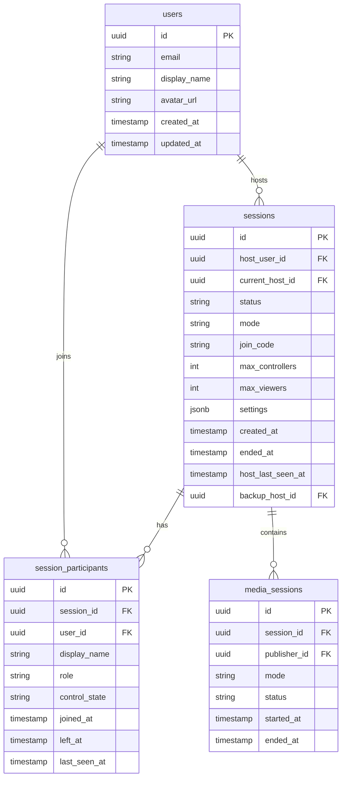

# SquadX Live API & Database Schema

## Overview

This document details the Supabase database schema, API contracts, and real-time channel specifications for SquadX Live.

---

## Database Schema

### Entity Relationship Diagram



### Tables

#### users (Supabase Auth Extension)

Supabase Auth handles user management. We extend with a `profiles` table:

```sql
-- profiles table (extends auth.users)
CREATE TABLE public.profiles (
  id UUID PRIMARY KEY REFERENCES auth.users(id) ON DELETE CASCADE,
  display_name TEXT,
  avatar_url TEXT,
  created_at TIMESTAMPTZ DEFAULT NOW(),
  updated_at TIMESTAMPTZ DEFAULT NOW()
);

-- Enable RLS
ALTER TABLE public.profiles ENABLE ROW LEVEL SECURITY;

-- Policies
CREATE POLICY "Users can view own profile"
  ON public.profiles FOR SELECT
  USING (auth.uid() = id);

CREATE POLICY "Users can update own profile"
  ON public.profiles FOR UPDATE
  USING (auth.uid() = id);

-- Trigger to create profile on signup
CREATE OR REPLACE FUNCTION public.handle_new_user()
RETURNS TRIGGER AS $$
BEGIN
  INSERT INTO public.profiles (id, display_name)
  VALUES (NEW.id, NEW.raw_user_meta_data->>'display_name');
  RETURN NEW;
END;
$$ LANGUAGE plpgsql SECURITY DEFINER;

CREATE TRIGGER on_auth_user_created
  AFTER INSERT ON auth.users
  FOR EACH ROW EXECUTE FUNCTION public.handle_new_user();
```

#### sessions

```sql
CREATE TABLE public.sessions (
  id UUID PRIMARY KEY DEFAULT gen_random_uuid(),
  host_user_id UUID NOT NULL REFERENCES auth.users(id) ON DELETE CASCADE,
  -- Current active host (may differ from creator if transferred)
  current_host_id UUID REFERENCES auth.users(id) ON DELETE SET NULL,
  status TEXT NOT NULL DEFAULT 'created' CHECK (status IN ('created', 'active', 'paused', 'ended')),
  mode TEXT NOT NULL DEFAULT 'p2p' CHECK (mode IN ('p2p', 'sfu')),
  join_code TEXT UNIQUE DEFAULT encode(gen_random_bytes(4), 'hex'),
  max_controllers INTEGER NOT NULL DEFAULT 3,
  max_viewers INTEGER NOT NULL DEFAULT 25,
  settings JSONB DEFAULT '{}',
  created_at TIMESTAMPTZ DEFAULT NOW(),
  ended_at TIMESTAMPTZ,
  -- Host disconnection tracking
  host_last_seen_at TIMESTAMPTZ DEFAULT NOW(),
  host_status TEXT DEFAULT 'online' CHECK (host_status IN ('online', 'reconnecting', 'offline', 'transferred')),
  backup_host_id UUID REFERENCES auth.users(id) ON DELETE SET NULL,
  host_transferred_at TIMESTAMPTZ,
  -- Grace period configuration (stored in settings, defaults shown here)
  -- settings.gracePeriodMs: 300000 (5 minutes)
  -- settings.allowControllerPromotion: true
  -- settings.autoCloseOnHostTimeout: false
);

-- Indexes
CREATE INDEX idx_sessions_host ON public.sessions(host_user_id);
CREATE INDEX idx_sessions_current_host ON public.sessions(current_host_id);
CREATE INDEX idx_sessions_status ON public.sessions(status);
CREATE INDEX idx_sessions_mode ON public.sessions(mode);
CREATE INDEX idx_sessions_join_code ON public.sessions(join_code);
CREATE INDEX idx_sessions_host_status ON public.sessions(host_status);

-- Enable RLS
ALTER TABLE public.sessions ENABLE ROW LEVEL SECURITY;

-- Policies
CREATE POLICY "Hosts can manage own sessions"
  ON public.sessions FOR ALL
  USING (auth.uid() = host_user_id OR auth.uid() = current_host_id);

CREATE POLICY "Participants can view joined sessions"
  ON public.sessions FOR SELECT
  USING (
    EXISTS (
      SELECT 1 FROM public.session_participants
      WHERE session_id = sessions.id
      AND user_id = auth.uid()
    )
  );

CREATE POLICY "Anyone can view session by join code"
  ON public.sessions FOR SELECT
  USING (join_code IS NOT NULL AND status IN ('created', 'active', 'paused'));
```

#### session_participants

```sql
CREATE TABLE public.session_participants (
  id UUID PRIMARY KEY DEFAULT gen_random_uuid(),
  session_id UUID NOT NULL REFERENCES public.sessions(id) ON DELETE CASCADE,
  user_id UUID REFERENCES auth.users(id) ON DELETE SET NULL,
  display_name TEXT NOT NULL,
  role TEXT NOT NULL DEFAULT 'viewer' CHECK (role IN ('host', 'viewer')),
  control_state TEXT NOT NULL DEFAULT 'view-only' CHECK (control_state IN ('view-only', 'requested', 'granted')),
  joined_at TIMESTAMPTZ DEFAULT NOW(),
  left_at TIMESTAMPTZ,

  UNIQUE(session_id, user_id)
);

-- Indexes
CREATE INDEX idx_participants_session ON public.session_participants(session_id);
CREATE INDEX idx_participants_user ON public.session_participants(user_id);

-- Enable RLS
ALTER TABLE public.session_participants ENABLE ROW LEVEL SECURITY;

-- Policies
CREATE POLICY "Hosts can manage participants"
  ON public.session_participants FOR ALL
  USING (
    EXISTS (
      SELECT 1 FROM public.sessions
      WHERE id = session_participants.session_id
      AND host_user_id = auth.uid()
    )
  );

CREATE POLICY "Participants can view co-participants"
  ON public.session_participants FOR SELECT
  USING (
    EXISTS (
      SELECT 1 FROM public.session_participants p
      WHERE p.session_id = session_participants.session_id
      AND p.user_id = auth.uid()
    )
  );

CREATE POLICY "Users can update own participation"
  ON public.session_participants FOR UPDATE
  USING (user_id = auth.uid());
```

#### media_sessions

Media sessions are ephemeral and track active screen sharing. They are separate from the room (session) to allow rooms to persist when media stops.

```sql
CREATE TABLE public.media_sessions (
  id UUID PRIMARY KEY DEFAULT gen_random_uuid(),
  session_id UUID NOT NULL REFERENCES public.sessions(id) ON DELETE CASCADE,
  publisher_id UUID NOT NULL REFERENCES auth.users(id) ON DELETE CASCADE,
  mode TEXT NOT NULL DEFAULT 'p2p' CHECK (mode IN ('p2p', 'sfu')),
  status TEXT NOT NULL DEFAULT 'active' CHECK (status IN ('active', 'paused', 'ended')),
  started_at TIMESTAMPTZ DEFAULT NOW(),
  ended_at TIMESTAMPTZ,
  -- Metadata
  video_codec TEXT DEFAULT 'H264',
  max_bitrate INTEGER DEFAULT 4000000,
  resolution TEXT DEFAULT '1920x1080',
  frame_rate INTEGER DEFAULT 30
);

-- Indexes
CREATE INDEX idx_media_sessions_session ON public.media_sessions(session_id);
CREATE INDEX idx_media_sessions_publisher ON public.media_sessions(publisher_id);
CREATE INDEX idx_media_sessions_status ON public.media_sessions(status);

-- Enable RLS
ALTER TABLE public.media_sessions ENABLE ROW LEVEL SECURITY;

-- Policies
CREATE POLICY "Publisher can manage own media sessions"
  ON public.media_sessions FOR ALL
  USING (auth.uid() = publisher_id);

CREATE POLICY "Participants can view media sessions"
  ON public.media_sessions FOR SELECT
  USING (
    EXISTS (
      SELECT 1 FROM public.session_participants
      WHERE session_id = media_sessions.session_id
      AND user_id = auth.uid()
    )
  );
```

### Database Functions

#### Create Session

```sql
CREATE OR REPLACE FUNCTION public.create_session(
  p_mode TEXT DEFAULT 'p2p',
  p_max_controllers INTEGER DEFAULT 3,
  p_max_viewers INTEGER DEFAULT NULL,
  p_settings JSONB DEFAULT '{}'
)
RETURNS public.sessions AS $$
DECLARE
  v_session public.sessions;
  v_max_viewers INTEGER;
BEGIN
  -- Set max_viewers based on mode if not provided
  IF p_max_viewers IS NULL THEN
    v_max_viewers := CASE WHEN p_mode = 'sfu' THEN 100 ELSE 25 END;
  ELSE
    v_max_viewers := p_max_viewers;
  END IF;

  -- Create session
  INSERT INTO public.sessions (host_user_id, mode, max_controllers, max_viewers, settings)
  VALUES (auth.uid(), p_mode, p_max_controllers, v_max_viewers, p_settings)
  RETURNING * INTO v_session;

  -- Add host as participant
  INSERT INTO public.session_participants (session_id, user_id, display_name, role)
  SELECT v_session.id, auth.uid(), p.display_name, 'host'
  FROM public.profiles p
  WHERE p.id = auth.uid();

  RETURN v_session;
END;
$$ LANGUAGE plpgsql SECURITY DEFINER;
```

#### Join Session

```sql
CREATE OR REPLACE FUNCTION public.join_session(
  p_join_code TEXT,
  p_display_name TEXT DEFAULT NULL
)
RETURNS public.session_participants AS $$
DECLARE
  v_session public.sessions;
  v_participant public.session_participants;
  v_display_name TEXT;
BEGIN
  -- Find session
  SELECT * INTO v_session
  FROM public.sessions
  WHERE join_code = p_join_code
  AND status IN ('created', 'active', 'paused');

  IF v_session IS NULL THEN
    RAISE EXCEPTION 'Session not found or not joinable';
  END IF;

  -- Get display name
  IF p_display_name IS NOT NULL THEN
    v_display_name := p_display_name;
  ELSIF auth.uid() IS NOT NULL THEN
    SELECT display_name INTO v_display_name
    FROM public.profiles
    WHERE id = auth.uid();
  ELSE
    v_display_name := 'Guest';
  END IF;

  -- Create or update participant
  INSERT INTO public.session_participants (session_id, user_id, display_name, role)
  VALUES (v_session.id, auth.uid(), v_display_name, 'viewer')
  ON CONFLICT (session_id, user_id)
  DO UPDATE SET
    left_at = NULL,
    joined_at = NOW()
  RETURNING * INTO v_participant;

  RETURN v_participant;
END;
$$ LANGUAGE plpgsql SECURITY DEFINER;
```

#### End Session

```sql
CREATE OR REPLACE FUNCTION public.end_session(
  p_session_id UUID
)
RETURNS public.sessions AS $$
DECLARE
  v_session public.sessions;
BEGIN
  -- Verify ownership
  SELECT * INTO v_session
  FROM public.sessions
  WHERE id = p_session_id
  AND host_user_id = auth.uid();

  IF v_session IS NULL THEN
    RAISE EXCEPTION 'Session not found or not authorized';
  END IF;

  -- Update session
  UPDATE public.sessions
  SET status = 'ended', ended_at = NOW()
  WHERE id = p_session_id
  RETURNING * INTO v_session;

  -- Mark all participants as left
  UPDATE public.session_participants
  SET left_at = NOW()
  WHERE session_id = p_session_id
  AND left_at IS NULL;

  RETURN v_session;
END;
$$ LANGUAGE plpgsql SECURITY DEFINER;
```

#### Update Control State

```sql
CREATE OR REPLACE FUNCTION public.update_control_state(
  p_session_id UUID,
  p_participant_id UUID,
  p_control_state TEXT
)
RETURNS public.session_participants AS $$
DECLARE
  v_participant public.session_participants;
BEGIN
  -- Verify host ownership
  IF NOT EXISTS (
    SELECT 1 FROM public.sessions
    WHERE id = p_session_id
    AND host_user_id = auth.uid()
  ) THEN
    RAISE EXCEPTION 'Not authorized';
  END IF;

  -- Update control state
  UPDATE public.session_participants
  SET control_state = p_control_state
  WHERE id = p_participant_id
  AND session_id = p_session_id
  RETURNING * INTO v_participant;

  RETURN v_participant;
END;
$$ LANGUAGE plpgsql SECURITY DEFINER;
```

#### Update Host Heartbeat

Called periodically by the host to indicate they're still connected.

```sql
CREATE OR REPLACE FUNCTION public.update_host_heartbeat(
  p_session_id UUID
)
RETURNS public.sessions AS $$
DECLARE
  v_session public.sessions;
BEGIN
  -- Verify current host
  UPDATE public.sessions
  SET
    host_last_seen_at = NOW(),
    host_status = 'online'
  WHERE id = p_session_id
  AND (current_host_id = auth.uid() OR host_user_id = auth.uid())
  RETURNING * INTO v_session;

  IF v_session IS NULL THEN
    RAISE EXCEPTION 'Session not found or not authorized';
  END IF;

  RETURN v_session;
END;
$$ LANGUAGE plpgsql SECURITY DEFINER;
```

#### Mark Host Offline

Called when host disconnection is detected (e.g., by another participant or server-side job).

```sql
CREATE OR REPLACE FUNCTION public.mark_host_offline(
  p_session_id UUID
)
RETURNS public.sessions AS $$
DECLARE
  v_session public.sessions;
BEGIN
  UPDATE public.sessions
  SET host_status = 'reconnecting'
  WHERE id = p_session_id
  AND status IN ('created', 'active', 'paused')
  RETURNING * INTO v_session;

  -- End active media session
  UPDATE public.media_sessions
  SET status = 'paused', ended_at = NOW()
  WHERE session_id = p_session_id
  AND status = 'active';

  RETURN v_session;
END;
$$ LANGUAGE plpgsql SECURITY DEFINER;
```

#### Transfer Host

Transfer host role to another participant.

```sql
CREATE OR REPLACE FUNCTION public.transfer_host(
  p_session_id UUID,
  p_new_host_id UUID
)
RETURNS public.sessions AS $$
DECLARE
  v_session public.sessions;
  v_participant public.session_participants;
BEGIN
  -- Verify caller is current host
  SELECT * INTO v_session
  FROM public.sessions
  WHERE id = p_session_id
  AND (current_host_id = auth.uid() OR host_user_id = auth.uid());

  IF v_session IS NULL THEN
    RAISE EXCEPTION 'Not authorized to transfer host';
  END IF;

  -- Verify new host is a participant
  SELECT * INTO v_participant
  FROM public.session_participants
  WHERE session_id = p_session_id
  AND user_id = p_new_host_id
  AND left_at IS NULL;

  IF v_participant IS NULL THEN
    RAISE EXCEPTION 'New host must be an active participant';
  END IF;

  -- Update session
  UPDATE public.sessions
  SET
    current_host_id = p_new_host_id,
    host_status = 'transferred',
    host_transferred_at = NOW()
  WHERE id = p_session_id
  RETURNING * INTO v_session;

  -- Update participant roles
  UPDATE public.session_participants
  SET role = 'viewer'
  WHERE session_id = p_session_id
  AND role = 'host';

  UPDATE public.session_participants
  SET role = 'host'
  WHERE session_id = p_session_id
  AND user_id = p_new_host_id;

  RETURN v_session;
END;
$$ LANGUAGE plpgsql SECURITY DEFINER;
```

#### Set Backup Host

Designate a backup host for automatic failover.

```sql
CREATE OR REPLACE FUNCTION public.set_backup_host(
  p_session_id UUID,
  p_backup_host_id UUID
)
RETURNS public.sessions AS $$
DECLARE
  v_session public.sessions;
BEGIN
  -- Verify caller is current host
  UPDATE public.sessions
  SET backup_host_id = p_backup_host_id
  WHERE id = p_session_id
  AND (current_host_id = auth.uid() OR host_user_id = auth.uid())
  RETURNING * INTO v_session;

  IF v_session IS NULL THEN
    RAISE EXCEPTION 'Not authorized';
  END IF;

  RETURN v_session;
END;
$$ LANGUAGE plpgsql SECURITY DEFINER;
```

#### Start Media Session

Create a new media session when host starts sharing.

```sql
CREATE OR REPLACE FUNCTION public.start_media_session(
  p_session_id UUID,
  p_mode TEXT DEFAULT 'p2p'
)
RETURNS public.media_sessions AS $$
DECLARE
  v_media_session public.media_sessions;
BEGIN
  -- End any existing active media session
  UPDATE public.media_sessions
  SET status = 'ended', ended_at = NOW()
  WHERE session_id = p_session_id
  AND status = 'active';

  -- Create new media session
  INSERT INTO public.media_sessions (session_id, publisher_id, mode)
  VALUES (p_session_id, auth.uid(), p_mode)
  RETURNING * INTO v_media_session;

  -- Update session status
  UPDATE public.sessions
  SET
    status = 'active',
    host_status = 'online',
    host_last_seen_at = NOW()
  WHERE id = p_session_id;

  RETURN v_media_session;
END;
$$ LANGUAGE plpgsql SECURITY DEFINER;
```

#### End Media Session

End the current media session (room stays open).

```sql
CREATE OR REPLACE FUNCTION public.end_media_session(
  p_media_session_id UUID
)
RETURNS public.media_sessions AS $$
DECLARE
  v_media_session public.media_sessions;
BEGIN
  UPDATE public.media_sessions
  SET status = 'ended', ended_at = NOW()
  WHERE id = p_media_session_id
  AND publisher_id = auth.uid()
  RETURNING * INTO v_media_session;

  -- Update session to paused (not ended - room stays open)
  IF v_media_session IS NOT NULL THEN
    UPDATE public.sessions
    SET status = 'paused'
    WHERE id = v_media_session.session_id;
  END IF;

  RETURN v_media_session;
END;
$$ LANGUAGE plpgsql SECURITY DEFINER;
```

---

## REST API

### Authentication

All API calls require authentication via Supabase Auth JWT token:

```typescript
const supabase = createClient(SUPABASE_URL, SUPABASE_ANON_KEY);

// Sign in
const { data, error } = await supabase.auth.signInWithPassword({
  email: 'user@example.com',
  password: 'password',
});

// Sign up
const { data, error } = await supabase.auth.signUp({
  email: 'user@example.com',
  password: 'password',
  options: {
    data: { display_name: 'John Doe' },
  },
});

// OAuth
const { data, error } = await supabase.auth.signInWithOAuth({
  provider: 'google',
});
```

### Sessions API

#### Create Session

```typescript
// POST /rest/v1/rpc/create_session
const { data: session, error } = await supabase
  .rpc('create_session', {
    p_mode: 'p2p',  // or 'sfu' for broadcast mode
    p_max_controllers: 3,
    p_max_viewers: 25,  // defaults to 100 for SFU mode
    p_settings: {
      quality: 'high',
      allowControl: true
    }
  });

// Response
{
  "id": "uuid",
  "host_user_id": "uuid",
  "status": "created",
  "mode": "p2p",
  "join_code": "a1b2c3d4",
  "max_controllers": 3,
  "max_viewers": 25,
  "settings": { "quality": "high", "allowControl": true },
  "created_at": "2024-01-01T00:00:00Z",
  "ended_at": null
}
```

#### Get Session

```typescript
// GET /rest/v1/sessions?id=eq.{session_id}
const { data: session, error } = await supabase
  .from('sessions')
  .select('*, session_participants(*)')
  .eq('id', sessionId)
  .single();
```

#### Join Session

```typescript
// POST /rest/v1/rpc/join_session
const { data: participant, error } = await supabase
  .rpc('join_session', {
    p_join_code: 'a1b2c3d4',
    p_display_name: 'Guest User'
  });

// Response
{
  "id": "uuid",
  "session_id": "uuid",
  "user_id": "uuid",
  "display_name": "Guest User",
  "role": "viewer",
  "control_state": "view-only",
  "joined_at": "2024-01-01T00:00:00Z",
  "left_at": null
}
```

#### Update Session Status

```typescript
// PATCH /rest/v1/sessions?id=eq.{session_id}
const { data, error } = await supabase
  .from('sessions')
  .update({ status: 'active' })
  .eq('id', sessionId)
  .select()
  .single();
```

#### End Session

```typescript
// POST /rest/v1/rpc/end_session
const { data: session, error } = await supabase.rpc('end_session', {
  p_session_id: sessionId,
});
```

#### Update Control State

```typescript
// POST /rest/v1/rpc/update_control_state
const { data: participant, error } = await supabase.rpc('update_control_state', {
  p_session_id: sessionId,
  p_participant_id: participantId,
  p_control_state: 'granted',
});
```

#### Host Heartbeat

Called periodically (every 30s) by the host to indicate they're still connected.

```typescript
// POST /rest/v1/rpc/update_host_heartbeat
const { data: session, error } = await supabase.rpc('update_host_heartbeat', {
  p_session_id: sessionId,
});
```

#### Transfer Host

Transfer host role to another participant.

```typescript
// POST /rest/v1/rpc/transfer_host
const { data: session, error } = await supabase.rpc('transfer_host', {
  p_session_id: sessionId,
  p_new_host_id: newHostUserId,
});
```

#### Set Backup Host

Designate a backup host for automatic failover.

```typescript
// POST /rest/v1/rpc/set_backup_host
const { data: session, error } = await supabase.rpc('set_backup_host', {
  p_session_id: sessionId,
  p_backup_host_id: backupHostUserId,
});
```

#### Start Media Session

Create a new media session when host starts sharing.

```typescript
// POST /rest/v1/rpc/start_media_session
const { data: mediaSession, error } = await supabase.rpc('start_media_session', {
  p_session_id: sessionId,
  p_mode: 'p2p', // or 'sfu'
});

// Response
{
  "id": "uuid",
  "session_id": "uuid",
  "publisher_id": "uuid",
  "mode": "p2p",
  "status": "active",
  "started_at": "2024-01-01T00:00:00Z",
  "ended_at": null
}
```

#### End Media Session

End the current media session (room stays open).

```typescript
// POST /rest/v1/rpc/end_media_session
const { data: mediaSession, error } = await supabase.rpc('end_media_session', {
  p_media_session_id: mediaSessionId,
});
```

### Profiles API

#### Get Profile

```typescript
// GET /rest/v1/profiles?id=eq.{user_id}
const { data: profile, error } = await supabase
  .from('profiles')
  .select('*')
  .eq('id', userId)
  .single();
```

#### Update Profile

```typescript
// PATCH /rest/v1/profiles?id=eq.{user_id}
const { data, error } = await supabase
  .from('profiles')
  .update({
    display_name: 'New Name',
    avatar_url: 'https://...',
  })
  .eq('id', userId)
  .select()
  .single();
```

---

## Realtime Channels

### Channel Naming Convention

| Channel                 | Purpose              | Subscribers    |
| ----------------------- | -------------------- | -------------- |
| `session:{session_id}`  | WebRTC signaling     | Host + Viewers |
| `presence:{session_id}` | Participant presence | Host + Viewers |

### Session Channel

Used for WebRTC signaling and control messages.

```typescript
// Subscribe to session channel
const channel = supabase.channel(`session:${sessionId}`, {
  config: {
    broadcast: { self: false },
  },
});

// Listen for signaling messages
channel.on('broadcast', { event: 'signal' }, (payload) => {
  const { type, data, senderId } = payload.payload;

  switch (type) {
    case 'offer':
      handleOffer(data.sdp, senderId);
      break;
    case 'answer':
      handleAnswer(data.sdp, senderId);
      break;
    case 'ice-candidate':
      handleIceCandidate(data.candidate, senderId);
      break;
  }
});

// Listen for control messages
channel.on('broadcast', { event: 'control' }, (payload) => {
  const { type, participantId } = payload.payload;

  switch (type) {
    case 'request':
      handleControlRequest(participantId);
      break;
    case 'grant':
      handleControlGrant(participantId);
      break;
    case 'revoke':
      handleControlRevoke(participantId);
      break;
  }
});

// Subscribe
await channel.subscribe();
```

### Signaling Message Types

```typescript
// WebRTC Offer
interface OfferMessage {
  type: 'offer';
  senderId: string;
  data: {
    sdp: string;
  };
}

// WebRTC Answer
interface AnswerMessage {
  type: 'answer';
  senderId: string;
  data: {
    sdp: string;
  };
}

// ICE Candidate
interface IceCandidateMessage {
  type: 'ice-candidate';
  senderId: string;
  data: {
    candidate: RTCIceCandidateInit;
  };
}

// Control Request
interface ControlRequestMessage {
  type: 'control-request';
  participantId: string;
}

// Control Response
interface ControlResponseMessage {
  type: 'control-response';
  participantId: string;
  granted: boolean;
}

// Control Revoke
interface ControlRevokeMessage {
  type: 'control-revoke';
  participantId: string;
}
```

### Sending Signaling Messages

```typescript
// Send offer
await channel.send({
  type: 'broadcast',
  event: 'signal',
  payload: {
    type: 'offer',
    senderId: myUserId,
    data: { sdp: offer.sdp },
  },
});

// Send answer
await channel.send({
  type: 'broadcast',
  event: 'signal',
  payload: {
    type: 'answer',
    senderId: myUserId,
    data: { sdp: answer.sdp },
  },
});

// Send ICE candidate
await channel.send({
  type: 'broadcast',
  event: 'signal',
  payload: {
    type: 'ice-candidate',
    senderId: myUserId,
    data: { candidate: candidate.toJSON() },
  },
});
```

### Presence Channel

Track online participants in a session.

```typescript
// Subscribe with presence
const presenceChannel = supabase.channel(`presence:${sessionId}`);

// Track own presence
presenceChannel.subscribe(async (status) => {
  if (status === 'SUBSCRIBED') {
    await presenceChannel.track({
      id: myUserId,
      displayName: myDisplayName,
      role: myRole,
      online_at: new Date().toISOString(),
    });
  }
});

// Listen for presence changes
presenceChannel.on('presence', { event: 'sync' }, () => {
  const state = presenceChannel.presenceState();
  updateParticipantList(state);
});

presenceChannel.on('presence', { event: 'join' }, ({ key, newPresences }) => {
  console.log('User joined:', newPresences);
});

presenceChannel.on('presence', { event: 'leave' }, ({ key, leftPresences }) => {
  console.log('User left:', leftPresences);
});
```

---

## TypeScript Types

### Shared Types Package

```typescript
// packages/shared-types/src/database.ts

export interface Database {
  public: {
    Tables: {
      profiles: {
        Row: Profile;
        Insert: ProfileInsert;
        Update: ProfileUpdate;
      };
      sessions: {
        Row: Session;
        Insert: SessionInsert;
        Update: SessionUpdate;
      };
      session_participants: {
        Row: SessionParticipant;
        Insert: SessionParticipantInsert;
        Update: SessionParticipantUpdate;
      };
      media_sessions: {
        Row: MediaSession;
        Insert: MediaSessionInsert;
        Update: MediaSessionUpdate;
      };
    };
    Functions: {
      create_session: {
        Args: {
          p_mode?: SessionMode;
          p_max_controllers?: number;
          p_max_viewers?: number;
          p_settings?: SessionSettings;
        };
        Returns: Session;
      };
      join_session: {
        Args: { p_join_code: string; p_display_name?: string };
        Returns: SessionParticipant;
      };
      end_session: {
        Args: { p_session_id: string };
        Returns: Session;
      };
      update_control_state: {
        Args: {
          p_session_id: string;
          p_participant_id: string;
          p_control_state: ControlState;
        };
        Returns: SessionParticipant;
      };
      update_host_heartbeat: {
        Args: { p_session_id: string };
        Returns: Session;
      };
      mark_host_offline: {
        Args: { p_session_id: string };
        Returns: Session;
      };
      transfer_host: {
        Args: { p_session_id: string; p_new_host_id: string };
        Returns: Session;
      };
      set_backup_host: {
        Args: { p_session_id: string; p_backup_host_id: string };
        Returns: Session;
      };
      start_media_session: {
        Args: { p_session_id: string; p_mode?: SessionMode };
        Returns: MediaSession;
      };
      end_media_session: {
        Args: { p_media_session_id: string };
        Returns: MediaSession;
      };
    };
  };
}

export interface Profile {
  id: string;
  display_name: string | null;
  avatar_url: string | null;
  created_at: string;
  updated_at: string;
}

export interface Session {
  id: string;
  host_user_id: string;
  current_host_id: string | null;
  status: SessionStatus;
  mode: SessionMode;
  join_code: string;
  max_controllers: number;
  max_viewers: number;
  settings: SessionSettings;
  created_at: string;
  ended_at: string | null;
  // Host disconnection tracking
  host_last_seen_at: string;
  host_status: HostStatus;
  backup_host_id: string | null;
  host_transferred_at: string | null;
}

export interface MediaSession {
  id: string;
  session_id: string;
  publisher_id: string;
  mode: SessionMode;
  status: MediaSessionStatus;
  started_at: string;
  ended_at: string | null;
  video_codec?: string;
  max_bitrate?: number;
  resolution?: string;
  frame_rate?: number;
}

export interface SessionParticipant {
  id: string;
  session_id: string;
  user_id: string | null;
  display_name: string;
  role: ParticipantRole;
  control_state: ControlState;
  joined_at: string;
  left_at: string | null;
}

export type SessionStatus = 'created' | 'active' | 'paused' | 'ended';
export type SessionMode = 'p2p' | 'sfu';
export type ParticipantRole = 'host' | 'viewer';
export type ControlState = 'view-only' | 'requested' | 'granted';
export type HostStatus = 'online' | 'reconnecting' | 'offline' | 'transferred';
export type MediaSessionStatus = 'active' | 'paused' | 'ended';

export interface SessionSettings {
  quality?: 'low' | 'medium' | 'high';
  allowControl?: boolean;
  maxParticipants?: number;
  // Host disconnection settings
  gracePeriodMs?: number; // Default: 300000 (5 minutes)
  allowControllerPromotion?: boolean; // Default: true
  autoCloseOnHostTimeout?: boolean; // Default: false
}
```

### Signaling Types

```typescript
// packages/shared-types/src/signaling.ts

export type SignalMessage = OfferMessage | AnswerMessage | IceCandidateMessage;

export interface OfferMessage {
  type: 'offer';
  senderId: string;
  data: {
    sdp: string;
  };
}

export interface AnswerMessage {
  type: 'answer';
  senderId: string;
  data: {
    sdp: string;
  };
}

export interface IceCandidateMessage {
  type: 'ice-candidate';
  senderId: string;
  data: {
    candidate: RTCIceCandidateInit;
  };
}

export type ControlMessage = ControlRequestMessage | ControlGrantMessage | ControlRevokeMessage;

export interface ControlRequestMessage {
  type: 'control-request';
  participantId: string;
}

export interface ControlGrantMessage {
  type: 'control-grant';
  participantId: string;
}

export interface ControlRevokeMessage {
  type: 'control-revoke';
  participantId: string;
}
```

---

## Error Handling

### Error Codes

| Code                | Description             | HTTP Status |
| ------------------- | ----------------------- | ----------- |
| `session_not_found` | Session does not exist  | 404         |
| `session_ended`     | Session has ended       | 410         |
| `not_authorized`    | User not authorized     | 403         |
| `already_joined`    | User already in session | 409         |
| `invalid_join_code` | Join code invalid       | 400         |
| `control_denied`    | Control request denied  | 403         |

### Error Response Format

```typescript
interface ApiError {
  code: string;
  message: string;
  details?: Record<string, any>;
}

// Example error handling
const { data, error } = await supabase.rpc('join_session', { p_join_code: code });

if (error) {
  switch (error.code) {
    case 'P0001': // Custom exception
      if (error.message.includes('not found')) {
        showError('Session not found');
      }
      break;
    case '23505': // Unique violation
      showError('Already joined this session');
      break;
    default:
      showError('An error occurred');
  }
}
```

---

## Rate Limiting

### Supabase Rate Limits

| Endpoint             | Limit          |
| -------------------- | -------------- |
| Auth endpoints       | 30 req/min     |
| REST API             | 1000 req/min   |
| Realtime connections | 200 concurrent |
| Realtime messages    | 100 msg/sec    |

### Application-Level Limits

```typescript
// Implement client-side rate limiting for signaling
class RateLimiter {
  private timestamps: number[] = [];
  private readonly maxRequests: number;
  private readonly windowMs: number;

  constructor(maxRequests: number, windowMs: number) {
    this.maxRequests = maxRequests;
    this.windowMs = windowMs;
  }

  canMakeRequest(): boolean {
    const now = Date.now();
    this.timestamps = this.timestamps.filter((t) => now - t < this.windowMs);

    if (this.timestamps.length < this.maxRequests) {
      this.timestamps.push(now);
      return true;
    }

    return false;
  }
}

// Usage: Max 10 signaling messages per second
const signalingLimiter = new RateLimiter(10, 1000);

async function sendSignal(message: SignalMessage) {
  if (!signalingLimiter.canMakeRequest()) {
    console.warn('Rate limited');
    return;
  }

  await channel.send({
    type: 'broadcast',
    event: 'signal',
    payload: message,
  });
}
```

---

## Migration Scripts

### Initial Migration

```sql
-- migrations/001_initial_schema.sql

-- Enable required extensions
CREATE EXTENSION IF NOT EXISTS "uuid-ossp";

-- Create profiles table
CREATE TABLE public.profiles (
  id UUID PRIMARY KEY REFERENCES auth.users(id) ON DELETE CASCADE,
  display_name TEXT,
  avatar_url TEXT,
  created_at TIMESTAMPTZ DEFAULT NOW(),
  updated_at TIMESTAMPTZ DEFAULT NOW()
);

-- Create sessions table
CREATE TABLE public.sessions (
  id UUID PRIMARY KEY DEFAULT gen_random_uuid(),
  host_user_id UUID NOT NULL REFERENCES auth.users(id) ON DELETE CASCADE,
  status TEXT NOT NULL DEFAULT 'created' CHECK (status IN ('created', 'active', 'paused', 'ended')),
  mode TEXT NOT NULL DEFAULT 'p2p' CHECK (mode IN ('p2p', 'sfu')),
  join_code TEXT UNIQUE DEFAULT encode(gen_random_bytes(4), 'hex'),
  max_controllers INTEGER NOT NULL DEFAULT 3,
  max_viewers INTEGER NOT NULL DEFAULT 25,
  settings JSONB DEFAULT '{}',
  created_at TIMESTAMPTZ DEFAULT NOW(),
  ended_at TIMESTAMPTZ
);

-- Create session_participants table
CREATE TABLE public.session_participants (
  id UUID PRIMARY KEY DEFAULT gen_random_uuid(),
  session_id UUID NOT NULL REFERENCES public.sessions(id) ON DELETE CASCADE,
  user_id UUID REFERENCES auth.users(id) ON DELETE SET NULL,
  display_name TEXT NOT NULL,
  role TEXT NOT NULL DEFAULT 'viewer',
  control_state TEXT NOT NULL DEFAULT 'view-only',
  joined_at TIMESTAMPTZ DEFAULT NOW(),
  left_at TIMESTAMPTZ,
  UNIQUE(session_id, user_id)
);

-- Create indexes
CREATE INDEX idx_sessions_host ON public.sessions(host_user_id);
CREATE INDEX idx_sessions_status ON public.sessions(status);
CREATE INDEX idx_sessions_mode ON public.sessions(mode);
CREATE INDEX idx_sessions_join_code ON public.sessions(join_code);
CREATE INDEX idx_participants_session ON public.session_participants(session_id);
CREATE INDEX idx_participants_user ON public.session_participants(user_id);

-- Enable RLS
ALTER TABLE public.profiles ENABLE ROW LEVEL SECURITY;
ALTER TABLE public.sessions ENABLE ROW LEVEL SECURITY;
ALTER TABLE public.session_participants ENABLE ROW LEVEL SECURITY;

-- RLS Policies (see above for full definitions)
-- ...
```

### Running Migrations

```bash
# Using Supabase CLI
supabase db push

# Or apply manually
psql $DATABASE_URL -f migrations/001_initial_schema.sql
```
