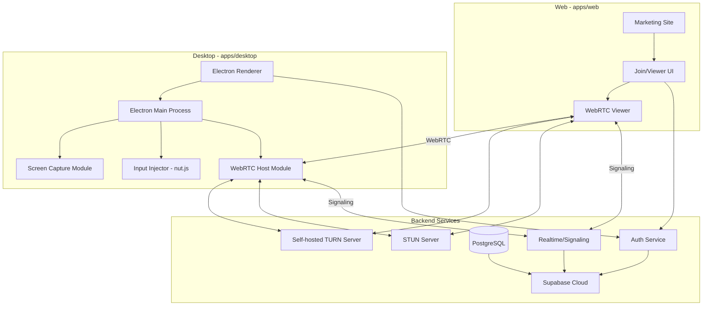
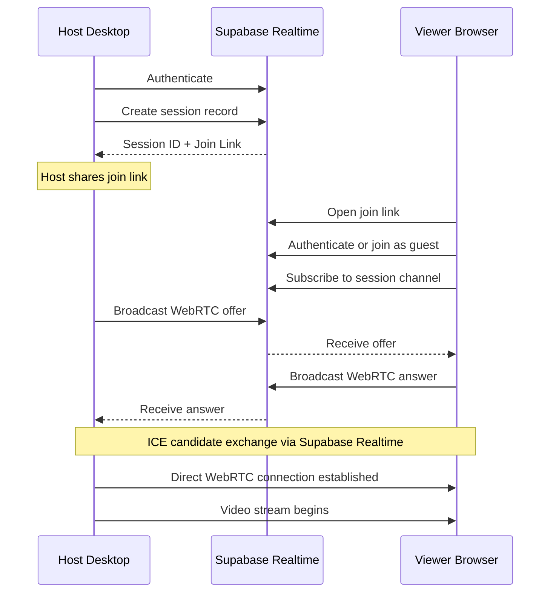
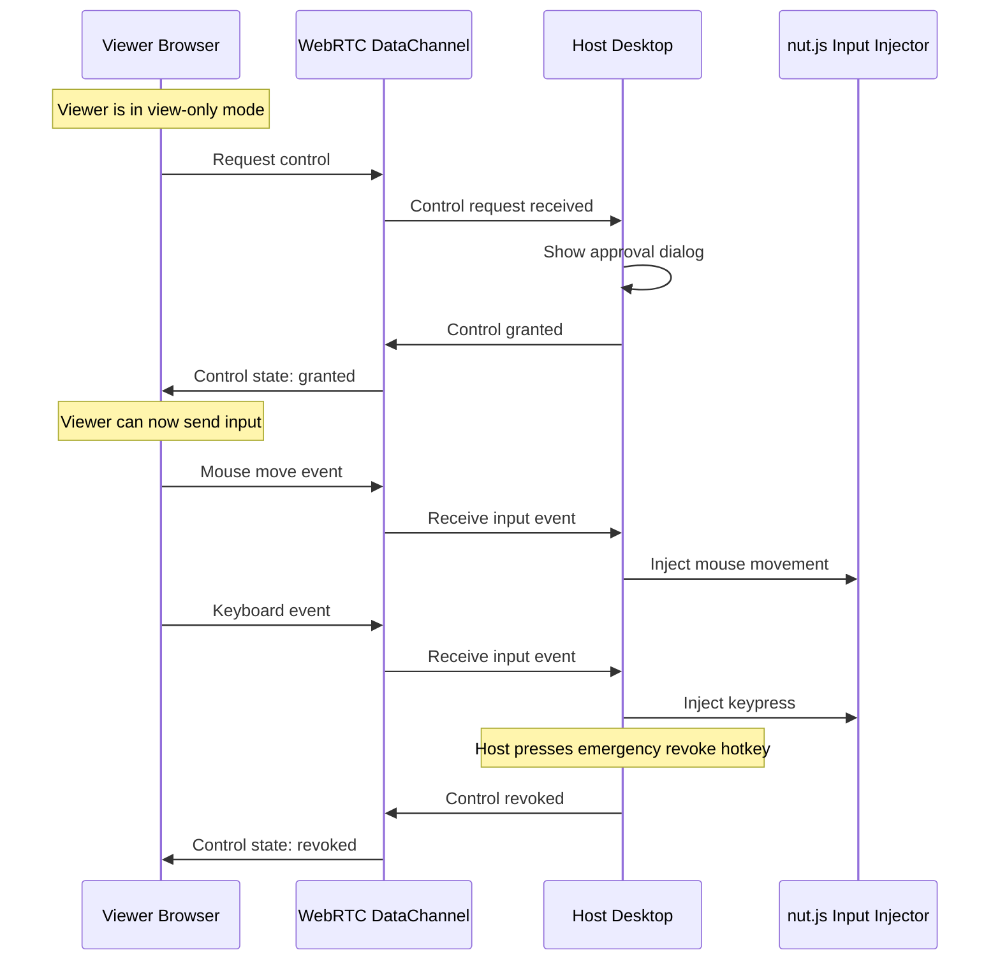
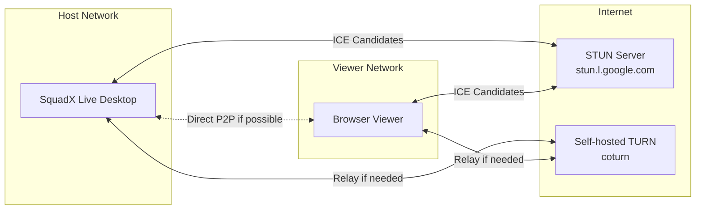
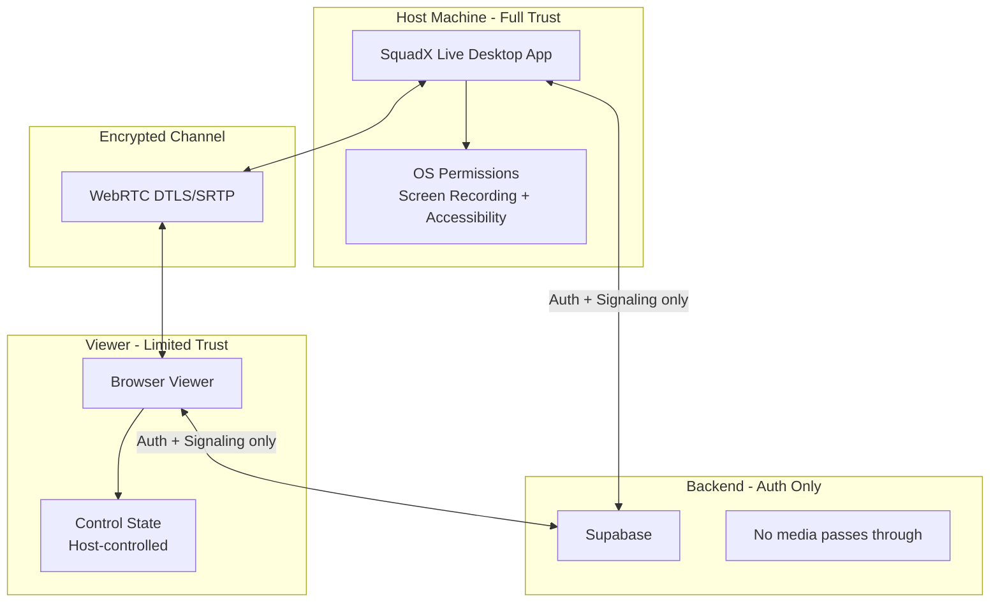

# SquadX Live Architecture

## Overview

SquadX Live is a cross-platform collaborative screen sharing application with simultaneous local and remote mouse/keyboard control. This document describes the high-level system architecture.

## System Components



## Monorepo Structure

```
squadx-live/
├── apps/
│   ├── web/                    # Next.js marketing + join UI
│   │   ├── src/
│   │   │   ├── app/            # Next.js App Router
│   │   │   ├── components/     # React components
│   │   │   └── lib/            # Utilities
│   │   ├── public/
│   │   └── package.json
│   │
│   └── desktop/                # Electron desktop app
│       ├── src/
│       │   ├── main/           # Electron main process
│       │   ├── renderer/       # Electron renderer
│       │   └── preload/        # Preload scripts
│       ├── resources/          # App icons, assets
│       └── package.json
│
├── packages/                   # Shared packages
│   ├── shared-types/           # TypeScript types
│   ├── shared-ui/              # Shared React components
│   └── webrtc-core/            # WebRTC utilities
│
├── docs/                       # Documentation
├── .github/
│   └── workflows/              # CI/CD pipelines
├── package.json                # Root workspace config
├── pnpm-workspace.yaml
└── turbo.json                  # Turborepo config
```

## Data Flow Architecture

### Session Establishment Flow



### Remote Control Flow



## Component Responsibilities

### Desktop App - Electron Main Process

| Component              | Responsibility                                       |
| ---------------------- | ---------------------------------------------------- |
| `SessionManager`       | Create/end sessions, manage session state            |
| `ScreenCaptureManager` | Handle screen/window selection, capture frames       |
| `WebRTCManager`        | Manage peer connections, media tracks, data channels |
| `InputInjector`        | Receive remote input, inject via nut.js              |
| `PermissionManager`    | Request/verify OS permissions                        |
| `ControlStateManager`  | Manage control grants/revokes per participant        |

### Desktop App - Electron Renderer

| Component         | Responsibility                     |
| ----------------- | ---------------------------------- |
| `HostUI`          | Main host interface                |
| `ScreenSelector`  | Screen/window picker UI            |
| `ParticipantList` | Show connected participants        |
| `ControlPanel`    | Grant/revoke control UI            |
| `StatusIndicator` | Show connection and control status |

### Web App - Marketing

| Component      | Responsibility                     |
| -------------- | ---------------------------------- |
| `LandingPage`  | Hero, value proposition            |
| `FeaturesPage` | Feature showcase                   |
| `DownloadPage` | OS detection, install instructions |
| `DocsPage`     | FAQ, documentation                 |

### Web App - Viewer/Join UI

| Component          | Responsibility                            |
| ------------------ | ----------------------------------------- |
| `JoinPage`         | Session join flow                         |
| `ViewerCanvas`     | Render remote screen                      |
| `InputCapture`     | Capture mouse/keyboard for remote control |
| `CursorOverlay`    | Show multi-cursor positions               |
| `ControlRequestUI` | Request/status of control                 |

## Network Architecture



## Security Boundaries



## Key Design Decisions

1. **Electron for Desktop**: Required for native screen capture and input injection. No pure web alternative exists for host functionality.

2. **WebRTC for Media**: Industry standard for low-latency peer-to-peer video. Provides built-in encryption.

3. **Supabase Realtime for Signaling**: Eliminates need for custom signaling server. Provides auth integration.

4. **nut.js for Input Injection**: Cross-platform input automation. Handles mouse, keyboard, and screen coordinates.

5. **Self-hosted TURN**: Full control over relay infrastructure. Required for NAT traversal in restrictive networks.

6. **Monorepo with Turborepo**: Shared code between web and desktop. Unified CI/CD. Better developer experience.

## Performance Targets

| Metric             | Target        | Measurement                                    |
| ------------------ | ------------- | ---------------------------------------------- |
| End-to-end latency | <150ms        | Time from host screen change to viewer display |
| Input latency      | <100ms        | Time from viewer input to host injection       |
| Video quality      | 1080p @ 30fps | Adaptive based on bandwidth                    |
| Connection time    | <10s          | From join click to video display               |
| Reconnection time  | <5s           | After network interruption                     |

## Next Steps

See the following documents for detailed specifications:

- [FEATURES.md](./FEATURES.md) - Feature specifications
- [TECH-STACK.md](./TECH-STACK.md) - Technology choices
- [WEBRTC-FLOW.md](./WEBRTC-FLOW.md) - WebRTC implementation details
- [SCALING-ARCHITECTURE.md](./SCALING-ARCHITECTURE.md) - Scaling strategy and cost implications
- [REMOTE-CONTROL.md](./REMOTE-CONTROL.md) - Input injection system
- [SECURITY.md](./SECURITY.md) - Security model
- [DISTRIBUTION.md](./DISTRIBUTION.md) - Package distribution
- [CI-CD.md](./CI-CD.md) - CI/CD pipelines
