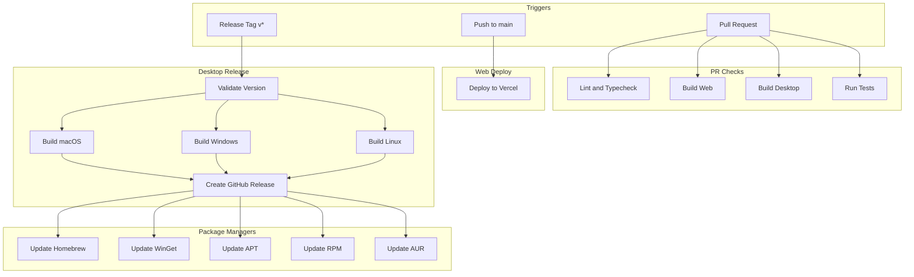

# SquadX Live CI/CD Pipeline

## Overview

This document details the GitHub Actions workflows for SquadX Live, covering PR checks, web deployment, desktop builds, and package manager publishing.

---

## Workflow Summary

| Workflow         | Trigger                   | Purpose                            |
| ---------------- | ------------------------- | ---------------------------------- |
| PR Checks        | Pull request              | Lint, build, test                  |
| Web Deploy       | Push to main, release tag | Deploy marketing site              |
| Desktop Release  | Release tag (v\*)         | Build, sign, publish desktop app   |
| Package Managers | After desktop release     | Update Homebrew, WinGet, APT, etc. |

---

## 1. PR Checks Workflow

**File**: `.github/workflows/pr-checks.yml`

```yaml
name: PR Checks

on:
  pull_request:
    branches: [main]
  push:
    branches: [main]

concurrency:
  group: ${{ github.workflow }}-${{ github.ref }}
  cancel-in-progress: true

jobs:
  lint:
    name: Lint
    runs-on: ubuntu-latest
    steps:
      - name: Checkout
        uses: actions/checkout@v4

      - name: Setup pnpm
        uses: pnpm/action-setup@v2
        with:
          version: 8

      - name: Setup Node.js
        uses: actions/setup-node@v4
        with:
          node-version: 24
          cache: 'pnpm'

      - name: Install dependencies
        run: pnpm install --frozen-lockfile

      - name: Lint
        run: pnpm lint

      - name: Type check
        run: pnpm typecheck

  build-web:
    name: Build Web
    runs-on: ubuntu-latest
    steps:
      - name: Checkout
        uses: actions/checkout@v4

      - name: Setup pnpm
        uses: pnpm/action-setup@v2
        with:
          version: 8

      - name: Setup Node.js
        uses: actions/setup-node@v4
        with:
          node-version: 24
          cache: 'pnpm'

      - name: Install dependencies
        run: pnpm install --frozen-lockfile

      - name: Build web app
        run: pnpm --filter @squadx-live/web build

      - name: Upload build artifact
        uses: actions/upload-artifact@v4
        with:
          name: web-build
          path: apps/web/.next
          retention-days: 7

  build-desktop:
    name: Build Desktop (${{ matrix.os }})
    runs-on: ${{ matrix.os }}
    strategy:
      fail-fast: false
      matrix:
        os: [ubuntu-latest, macos-latest, windows-latest]
    steps:
      - name: Checkout
        uses: actions/checkout@v4

      - name: Setup pnpm
        uses: pnpm/action-setup@v2
        with:
          version: 8

      - name: Setup Node.js
        uses: actions/setup-node@v4
        with:
          node-version: 24
          cache: 'pnpm'

      - name: Install dependencies
        run: pnpm install --frozen-lockfile

      - name: Build desktop app
        run: pnpm --filter @squadx-live/desktop build
        env:
          # Skip signing for PR checks
          CSC_IDENTITY_AUTO_DISCOVERY: false

  test:
    name: Test
    runs-on: ubuntu-latest
    steps:
      - name: Checkout
        uses: actions/checkout@v4

      - name: Setup pnpm
        uses: pnpm/action-setup@v2
        with:
          version: 8

      - name: Setup Node.js
        uses: actions/setup-node@v4
        with:
          node-version: 24
          cache: 'pnpm'

      - name: Install dependencies
        run: pnpm install --frozen-lockfile

      - name: Run tests
        run: pnpm test

      - name: Upload coverage
        uses: codecov/codecov-action@v3
        with:
          files: ./coverage/lcov.info
          fail_ci_if_error: false
```

---

## 2. Web Deploy Workflow

**File**: `.github/workflows/web-deploy.yml`

```yaml
name: Web Deploy

on:
  push:
    branches: [main]
    paths:
      - 'apps/web/**'
      - 'packages/**'
      - 'pnpm-lock.yaml'
  release:
    types: [published]
  workflow_dispatch:

jobs:
  deploy:
    name: Deploy to Vercel
    runs-on: ubuntu-latest
    steps:
      - name: Checkout
        uses: actions/checkout@v4

      - name: Setup pnpm
        uses: pnpm/action-setup@v2
        with:
          version: 8

      - name: Setup Node.js
        uses: actions/setup-node@v4
        with:
          node-version: 24
          cache: 'pnpm'

      - name: Install dependencies
        run: pnpm install --frozen-lockfile

      - name: Build
        run: pnpm --filter @squadx-live/web build
        env:
          NEXT_PUBLIC_SUPABASE_URL: ${{ secrets.NEXT_PUBLIC_SUPABASE_URL }}
          NEXT_PUBLIC_SUPABASE_ANON_KEY: ${{ secrets.NEXT_PUBLIC_SUPABASE_ANON_KEY }}

      - name: Deploy to Vercel
        uses: amondnet/vercel-action@v25
        with:
          vercel-token: ${{ secrets.VERCEL_TOKEN }}
          vercel-org-id: ${{ secrets.VERCEL_ORG_ID }}
          vercel-project-id: ${{ secrets.VERCEL_PROJECT_ID }}
          working-directory: apps/web
          vercel-args: ${{ github.event_name == 'release' && '--prod' || '' }}

  # Alternative: Build artifact for manual deploy
  build-artifact:
    name: Build Artifact
    runs-on: ubuntu-latest
    if: github.event_name == 'workflow_dispatch'
    steps:
      - name: Checkout
        uses: actions/checkout@v4

      - name: Setup pnpm
        uses: pnpm/action-setup@v2
        with:
          version: 8

      - name: Setup Node.js
        uses: actions/setup-node@v4
        with:
          node-version: 24
          cache: 'pnpm'

      - name: Install dependencies
        run: pnpm install --frozen-lockfile

      - name: Build
        run: pnpm --filter @squadx-live/web build

      - name: Export static
        run: pnpm --filter @squadx-live/web export
        continue-on-error: true

      - name: Upload artifact
        uses: actions/upload-artifact@v4
        with:
          name: web-dist
          path: apps/web/out
          retention-days: 30
```

---

## 3. Desktop Release Workflow

**File**: `.github/workflows/desktop-release.yml`

````yaml
name: Desktop Release

on:
  push:
    tags:
      - 'v*'
  workflow_dispatch:
    inputs:
      version:
        description: 'Version to release (e.g., 1.0.0)'
        required: true

permissions:
  contents: write

jobs:
  validate:
    name: Validate Release
    runs-on: ubuntu-latest
    outputs:
      version: ${{ steps.version.outputs.version }}
    steps:
      - name: Checkout
        uses: actions/checkout@v4

      - name: Get version
        id: version
        run: |
          if [ "${{ github.event_name }}" == "workflow_dispatch" ]; then
            echo "version=${{ github.event.inputs.version }}" >> $GITHUB_OUTPUT
          else
            echo "version=${GITHUB_REF#refs/tags/v}" >> $GITHUB_OUTPUT
          fi

      - name: Validate version consistency
        run: |
          VERSION=${{ steps.version.outputs.version }}
          PKG_VERSION=$(node -p "require('./apps/desktop/package.json').version")
          if [ "$VERSION" != "$PKG_VERSION" ]; then
            echo "Version mismatch: tag=$VERSION, package.json=$PKG_VERSION"
            exit 1
          fi

  build-macos:
    name: Build macOS
    needs: validate
    runs-on: macos-latest
    strategy:
      matrix:
        arch: [x64, arm64]
    steps:
      - name: Checkout
        uses: actions/checkout@v4

      - name: Setup pnpm
        uses: pnpm/action-setup@v2
        with:
          version: 8

      - name: Setup Node.js
        uses: actions/setup-node@v4
        with:
          node-version: 24
          cache: 'pnpm'

      - name: Install dependencies
        run: pnpm install --frozen-lockfile

      - name: Import certificates
        env:
          MACOS_CERTIFICATE: ${{ secrets.MACOS_CERTIFICATE }}
          MACOS_CERTIFICATE_PWD: ${{ secrets.MACOS_CERTIFICATE_PWD }}
          KEYCHAIN_PASSWORD: ${{ secrets.KEYCHAIN_PASSWORD }}
        run: |
          echo $MACOS_CERTIFICATE | base64 --decode > certificate.p12
          security create-keychain -p "$KEYCHAIN_PASSWORD" build.keychain
          security default-keychain -s build.keychain
          security unlock-keychain -p "$KEYCHAIN_PASSWORD" build.keychain
          security import certificate.p12 -k build.keychain -P "$MACOS_CERTIFICATE_PWD" -T /usr/bin/codesign
          security set-key-partition-list -S apple-tool:,apple:,codesign: -s -k "$KEYCHAIN_PASSWORD" build.keychain

      - name: Build and sign
        run: pnpm --filter @squadx-live/desktop build:mac --${{ matrix.arch }}
        env:
          CSC_LINK: ${{ secrets.MACOS_CERTIFICATE }}
          CSC_KEY_PASSWORD: ${{ secrets.MACOS_CERTIFICATE_PWD }}
          APPLE_ID: ${{ secrets.APPLE_ID }}
          APPLE_APP_SPECIFIC_PASSWORD: ${{ secrets.APPLE_APP_SPECIFIC_PASSWORD }}
          APPLE_TEAM_ID: ${{ secrets.APPLE_TEAM_ID }}

      - name: Upload artifacts
        uses: actions/upload-artifact@v4
        with:
          name: macos-${{ matrix.arch }}
          path: |
            apps/desktop/dist/*.dmg
            apps/desktop/dist/*.pkg
            apps/desktop/dist/*.zip
          retention-days: 7

  build-windows:
    name: Build Windows
    needs: validate
    runs-on: windows-latest
    strategy:
      matrix:
        arch: [x64, arm64]
    steps:
      - name: Checkout
        uses: actions/checkout@v4

      - name: Setup pnpm
        uses: pnpm/action-setup@v2
        with:
          version: 8

      - name: Setup Node.js
        uses: actions/setup-node@v4
        with:
          node-version: 24
          cache: 'pnpm'

      - name: Install dependencies
        run: pnpm install --frozen-lockfile

      - name: Build and sign
        run: pnpm --filter @squadx-live/desktop build:win --${{ matrix.arch }}
        env:
          # Azure Key Vault signing
          AZURE_KEY_VAULT_URI: ${{ secrets.AZURE_KEY_VAULT_URI }}
          AZURE_CLIENT_ID: ${{ secrets.AZURE_CLIENT_ID }}
          AZURE_CLIENT_SECRET: ${{ secrets.AZURE_CLIENT_SECRET }}
          AZURE_CERT_NAME: ${{ secrets.AZURE_CERT_NAME }}
          AZURE_TENANT_ID: ${{ secrets.AZURE_TENANT_ID }}

      - name: Upload artifacts
        uses: actions/upload-artifact@v4
        with:
          name: windows-${{ matrix.arch }}
          path: |
            apps/desktop/dist/*.msi
            apps/desktop/dist/*.exe
          retention-days: 7

  build-linux:
    name: Build Linux
    needs: validate
    runs-on: ubuntu-latest
    strategy:
      matrix:
        arch: [x64, arm64]
    steps:
      - name: Checkout
        uses: actions/checkout@v4

      - name: Setup pnpm
        uses: pnpm/action-setup@v2
        with:
          version: 8

      - name: Setup Node.js
        uses: actions/setup-node@v4
        with:
          node-version: 24
          cache: 'pnpm'

      - name: Install dependencies
        run: pnpm install --frozen-lockfile

      - name: Install Linux dependencies
        run: |
          sudo apt-get update
          sudo apt-get install -y rpm

      - name: Build
        run: pnpm --filter @squadx-live/desktop build:linux --${{ matrix.arch }}

      - name: Import GPG key
        env:
          GPG_PRIVATE_KEY: ${{ secrets.GPG_PRIVATE_KEY }}
          GPG_PASSPHRASE: ${{ secrets.GPG_PASSPHRASE }}
        run: |
          echo "$GPG_PRIVATE_KEY" | gpg --batch --import
          echo "$GPG_PASSPHRASE" | gpg --batch --passphrase-fd 0 --pinentry-mode loopback --sign --armor /dev/null

      - name: Sign packages
        run: |
          # Sign .deb
          dpkg-sig -k ${{ secrets.GPG_KEY_ID }} --sign builder apps/desktop/dist/*.deb

          # Sign .rpm
          rpm --addsign apps/desktop/dist/*.rpm
        env:
          GPG_TTY: $(tty)

      - name: Upload artifacts
        uses: actions/upload-artifact@v4
        with:
          name: linux-${{ matrix.arch }}
          path: |
            apps/desktop/dist/*.deb
            apps/desktop/dist/*.rpm
            apps/desktop/dist/*.AppImage
            apps/desktop/dist/*.tar.gz
          retention-days: 7

  create-release:
    name: Create Release
    needs: [validate, build-macos, build-windows, build-linux]
    runs-on: ubuntu-latest
    steps:
      - name: Checkout
        uses: actions/checkout@v4

      - name: Download all artifacts
        uses: actions/download-artifact@v4
        with:
          path: artifacts

      - name: Flatten artifacts
        run: |
          mkdir -p release
          find artifacts -type f \( -name "*.dmg" -o -name "*.pkg" -o -name "*.msi" -o -name "*.exe" -o -name "*.deb" -o -name "*.rpm" -o -name "*.AppImage" -o -name "*.tar.gz" -o -name "*.zip" \) -exec cp {} release/ \;

      - name: Generate checksums
        run: |
          cd release
          sha256sum * > SHA256SUMS.txt

      - name: Sign checksums
        env:
          GPG_PRIVATE_KEY: ${{ secrets.GPG_PRIVATE_KEY }}
          GPG_PASSPHRASE: ${{ secrets.GPG_PASSPHRASE }}
        run: |
          echo "$GPG_PRIVATE_KEY" | gpg --batch --import
          cd release
          echo "$GPG_PASSPHRASE" | gpg --batch --passphrase-fd 0 --pinentry-mode loopback --armor --detach-sign SHA256SUMS.txt

      - name: Create GitHub Release
        uses: softprops/action-gh-release@v1
        with:
          tag_name: v${{ needs.validate.outputs.version }}
          name: SquadX Live v${{ needs.validate.outputs.version }}
          draft: true
          prerelease: ${{ contains(needs.validate.outputs.version, '-') }}
          files: release/*
          body: |
            ## SquadX Live v${{ needs.validate.outputs.version }}

            ### Installation

            **macOS (Homebrew)**
            ```bash
            brew install --cask squadx-live
            ```

            **Windows (WinGet)**
            ```powershell
            winget install SquadX Live.SquadX Live
            ```

            **Linux (Debian/Ubuntu)**
            ```bash
            sudo apt install squadx-live
            ```

            **Linux (Fedora)**
            ```bash
            sudo dnf install squadx-live
            ```

            **Linux (Arch)**
            ```bash
            yay -S squadx-live-bin
            ```

            ### Checksums

            See `SHA256SUMS.txt` for file checksums.
            Verify signature: `gpg --verify SHA256SUMS.txt.asc SHA256SUMS.txt`
        env:
          GITHUB_TOKEN: ${{ secrets.GITHUB_TOKEN }}

  notify:
    name: Notify
    needs: create-release
    runs-on: ubuntu-latest
    if: always()
    steps:
      - name: Notify on success
        if: needs.create-release.result == 'success'
        run: |
          echo "Release created successfully!"
          # Add Slack/Discord notification here

      - name: Notify on failure
        if: needs.create-release.result == 'failure'
        run: |
          echo "Release failed!"
          # Add Slack/Discord notification here
````

---

## 4. Package Manager Update Workflow

**File**: `.github/workflows/package-managers.yml`

```yaml
name: Update Package Managers

on:
  release:
    types: [published]
  workflow_dispatch:
    inputs:
      version:
        description: 'Version to publish'
        required: true

jobs:
  get-release-info:
    name: Get Release Info
    runs-on: ubuntu-latest
    outputs:
      version: ${{ steps.info.outputs.version }}
      checksums: ${{ steps.info.outputs.checksums }}
    steps:
      - name: Get release info
        id: info
        run: |
          if [ "${{ github.event_name }}" == "workflow_dispatch" ]; then
            VERSION="${{ github.event.inputs.version }}"
          else
            VERSION="${GITHUB_REF#refs/tags/v}"
          fi
          echo "version=$VERSION" >> $GITHUB_OUTPUT

          # Download checksums
          curl -sL "https://github.com/${{ github.repository }}/releases/download/v${VERSION}/SHA256SUMS.txt" -o checksums.txt
          echo "checksums<<EOF" >> $GITHUB_OUTPUT
          cat checksums.txt >> $GITHUB_OUTPUT
          echo "EOF" >> $GITHUB_OUTPUT

  update-homebrew:
    name: Update Homebrew Cask
    needs: get-release-info
    runs-on: ubuntu-latest
    steps:
      - name: Checkout tap repository
        uses: actions/checkout@v4
        with:
          repository: squadx-live/homebrew-tap
          token: ${{ secrets.TAP_GITHUB_TOKEN }}
          path: homebrew-tap

      - name: Update cask formula
        run: |
          VERSION=${{ needs.get-release-info.outputs.version }}
          CHECKSUMS="${{ needs.get-release-info.outputs.checksums }}"

          # Extract checksums
          ARM64_SHA=$(echo "$CHECKSUMS" | grep "arm64.dmg" | awk '{print $1}')
          X64_SHA=$(echo "$CHECKSUMS" | grep "x64.dmg" | awk '{print $1}')

          # Update cask
          cat > homebrew-tap/Casks/squadx-live.rb << EOF
          cask "squadx-live" do
            version "$VERSION"
            
            on_arm do
              sha256 "$ARM64_SHA"
              url "https://github.com/squadx/squadx-live/releases/download/v#{version}/SquadX Live-#{version}-arm64.dmg"
            end
            
            on_intel do
              sha256 "$X64_SHA"
              url "https://github.com/squadx/squadx-live/releases/download/v#{version}/SquadX Live-#{version}-x64.dmg"
            end
            
            name "SquadX Live"
            desc "Collaborative screen sharing with remote control"
            homepage "https://squadx.live"
            
            livecheck do
              url :url
              strategy :github_latest
            end
            
            auto_updates true
            depends_on macos: ">= :monterey"
            
            app "SquadX Live.app"
            
            zap trash: [
              "~/Library/Application Support/SquadX Live",
              "~/Library/Caches/com.squadx-live.app",
              "~/Library/Preferences/com.squadx-live.app.plist",
            ]
          end
          EOF

      - name: Commit and push
        run: |
          cd homebrew-tap
          git config user.name "GitHub Actions"
          git config user.email "actions@github.com"
          git add Casks/squadx-live.rb
          git commit -m "Update squadx-live to ${{ needs.get-release-info.outputs.version }}"
          git push

  update-winget:
    name: Update WinGet
    needs: get-release-info
    runs-on: ubuntu-latest
    steps:
      - name: Checkout
        uses: actions/checkout@v4

      - name: Create WinGet manifest
        run: |
          VERSION=${{ needs.get-release-info.outputs.version }}
          CHECKSUMS="${{ needs.get-release-info.outputs.checksums }}"

          X64_SHA=$(echo "$CHECKSUMS" | grep "x64.msi" | awk '{print $1}')
          ARM64_SHA=$(echo "$CHECKSUMS" | grep "arm64.msi" | awk '{print $1}')

          mkdir -p winget-manifests

          # Version manifest
          cat > winget-manifests/SquadX Live.SquadX Live.yaml << EOF
          PackageIdentifier: SquadX Live.SquadX Live
          PackageVersion: $VERSION
          DefaultLocale: en-US
          ManifestType: version
          ManifestVersion: 1.4.0
          EOF

          # Installer manifest
          cat > winget-manifests/SquadX Live.SquadX Live.installer.yaml << EOF
          PackageIdentifier: SquadX Live.SquadX Live
          PackageVersion: $VERSION
          Platform:
            - Windows.Desktop
          MinimumOSVersion: 10.0.17763.0
          InstallerType: msi
          Scope: user
          InstallModes:
            - interactive
            - silent
            - silentWithProgress
          Installers:
            - Architecture: x64
              InstallerUrl: https://github.com/squadx/squadx-live/releases/download/v${VERSION}/SquadX Live-${VERSION}-x64.msi
              InstallerSha256: $X64_SHA
            - Architecture: arm64
              InstallerUrl: https://github.com/squadx/squadx-live/releases/download/v${VERSION}/SquadX Live-${VERSION}-arm64.msi
              InstallerSha256: $ARM64_SHA
          ManifestType: installer
          ManifestVersion: 1.4.0
          EOF

          # Locale manifest
          cat > winget-manifests/SquadX Live.SquadX Live.locale.en-US.yaml << EOF
          PackageIdentifier: SquadX Live.SquadX Live
          PackageVersion: $VERSION
          PackageLocale: en-US
          Publisher: SquadX Live
          PublisherUrl: https://squadx.live
          PackageName: SquadX Live
          PackageUrl: https://squadx.live
          License: MIT
          ShortDescription: Collaborative screen sharing with remote control
          ManifestType: defaultLocale
          ManifestVersion: 1.4.0
          EOF

      - name: Create PR to winget-pkgs
        uses: peter-evans/create-pull-request@v5
        with:
          token: ${{ secrets.WINGET_GITHUB_TOKEN }}
          repository: microsoft/winget-pkgs
          branch: squadx-live-${{ needs.get-release-info.outputs.version }}
          title: 'SquadX Live version ${{ needs.get-release-info.outputs.version }}'
          body: |
            ## SquadX Live ${{ needs.get-release-info.outputs.version }}

            Automated update from release workflow.
          commit-message: 'Add SquadX Live version ${{ needs.get-release-info.outputs.version }}'
          add-paths: |
            manifests/p/SquadX Live/SquadX Live/${{ needs.get-release-info.outputs.version }}/*

  update-apt-repo:
    name: Update APT Repository
    needs: get-release-info
    runs-on: ubuntu-latest
    steps:
      - name: Checkout apt repo
        uses: actions/checkout@v4
        with:
          repository: squadx-live/apt-repo
          token: ${{ secrets.APT_REPO_TOKEN }}
          path: apt-repo

      - name: Download .deb files
        run: |
          VERSION=${{ needs.get-release-info.outputs.version }}
          mkdir -p apt-repo/pool/main/p/squadx-live
          curl -sL "https://github.com/squadx/squadx-live/releases/download/v${VERSION}/squadx-live_${VERSION}_amd64.deb" \
            -o "apt-repo/pool/main/p/squadx-live/squadx-live_${VERSION}_amd64.deb"

      - name: Import GPG key
        env:
          GPG_PRIVATE_KEY: ${{ secrets.GPG_PRIVATE_KEY }}
        run: echo "$GPG_PRIVATE_KEY" | gpg --batch --import

      - name: Update repository
        run: |
          cd apt-repo

          # Generate Packages
          dpkg-scanpackages pool/main /dev/null > dists/stable/main/binary-amd64/Packages
          gzip -k -f dists/stable/main/binary-amd64/Packages

          # Generate Release
          cd dists/stable
          apt-ftparchive release . > Release

          # Sign
          gpg --default-key ${{ secrets.GPG_KEY_ID }} -abs -o Release.gpg Release
          gpg --default-key ${{ secrets.GPG_KEY_ID }} --clearsign -o InRelease Release

      - name: Commit and push
        run: |
          cd apt-repo
          git config user.name "GitHub Actions"
          git config user.email "actions@github.com"
          git add .
          git commit -m "Update to ${{ needs.get-release-info.outputs.version }}"
          git push

  update-rpm-repo:
    name: Update RPM Repository
    needs: get-release-info
    runs-on: ubuntu-latest
    steps:
      - name: Checkout rpm repo
        uses: actions/checkout@v4
        with:
          repository: squadx-live/rpm-repo
          token: ${{ secrets.RPM_REPO_TOKEN }}
          path: rpm-repo

      - name: Download .rpm files
        run: |
          VERSION=${{ needs.get-release-info.outputs.version }}
          mkdir -p rpm-repo/Packages
          curl -sL "https://github.com/squadx/squadx-live/releases/download/v${VERSION}/squadx-live-${VERSION}-1.x86_64.rpm" \
            -o "rpm-repo/Packages/squadx-live-${VERSION}-1.x86_64.rpm"

      - name: Import GPG key
        env:
          GPG_PRIVATE_KEY: ${{ secrets.GPG_PRIVATE_KEY }}
        run: echo "$GPG_PRIVATE_KEY" | gpg --batch --import

      - name: Update repository
        run: |
          cd rpm-repo

          # Sign RPM
          rpm --addsign Packages/*.rpm

          # Create repo metadata
          createrepo_c .

          # Sign metadata
          gpg --default-key ${{ secrets.GPG_KEY_ID }} --detach-sign --armor repodata/repomd.xml

      - name: Commit and push
        run: |
          cd rpm-repo
          git config user.name "GitHub Actions"
          git config user.email "actions@github.com"
          git add .
          git commit -m "Update to ${{ needs.get-release-info.outputs.version }}"
          git push

  update-aur:
    name: Update AUR
    needs: get-release-info
    runs-on: ubuntu-latest
    steps:
      - name: Checkout AUR package
        run: |
          git clone ssh://aur@aur.archlinux.org/squadx-live-bin.git aur-package
        env:
          SSH_PRIVATE_KEY: ${{ secrets.AUR_SSH_KEY }}

      - name: Update PKGBUILD
        run: |
          VERSION=${{ needs.get-release-info.outputs.version }}
          CHECKSUMS="${{ needs.get-release-info.outputs.checksums }}"

          X64_SHA=$(echo "$CHECKSUMS" | grep "linux-x64.tar.gz" | awk '{print $1}')

          cat > aur-package/PKGBUILD << EOF
          # Maintainer: SquadX Live <support@squadx.live>
          pkgname=squadx-live-bin
          pkgver=$VERSION
          pkgrel=1
          pkgdesc="Collaborative screen sharing with remote control"
          arch=('x86_64')
          url="https://squadx.live"
          license=('MIT')
          depends=('gtk3' 'libnotify' 'nss' 'libxss' 'libxtst' 'xdg-utils' 'at-spi2-core' 'util-linux-libs')
          provides=('squadx-live')
          conflicts=('squadx-live')
          source=("https://github.com/squadx/squadx-live/releases/download/v\${pkgver}/squadx-live-\${pkgver}-linux-x64.tar.gz")
          sha256sums=('$X64_SHA')

          package() {
              cd "\$srcdir"
              install -dm755 "\$pkgdir/opt/squadx-live"
              cp -r * "\$pkgdir/opt/squadx-live/"
              install -dm755 "\$pkgdir/usr/bin"
              ln -s /opt/squadx-live/squadx-live "\$pkgdir/usr/bin/squadx-live"
              install -Dm644 "\$pkgdir/opt/squadx-live/squadx-live.desktop" "\$pkgdir/usr/share/applications/squadx-live.desktop"
              install -Dm644 "\$pkgdir/opt/squadx-live/resources/icon.png" "\$pkgdir/usr/share/pixmaps/squadx-live.png"
          }
          EOF

      - name: Generate .SRCINFO
        run: |
          cd aur-package
          makepkg --printsrcinfo > .SRCINFO

      - name: Commit and push
        run: |
          cd aur-package
          git config user.name "GitHub Actions"
          git config user.email "actions@github.com"
          git add PKGBUILD .SRCINFO
          git commit -m "Update to ${{ needs.get-release-info.outputs.version }}"
          git push
        env:
          SSH_PRIVATE_KEY: ${{ secrets.AUR_SSH_KEY }}
```

---

## 5. Secrets Configuration

### Required GitHub Secrets

| Secret                          | Purpose              | Where to Get       |
| ------------------------------- | -------------------- | ------------------ |
| `VERCEL_TOKEN`                  | Vercel deployment    | Vercel dashboard   |
| `VERCEL_ORG_ID`                 | Vercel organization  | Vercel dashboard   |
| `VERCEL_PROJECT_ID`             | Vercel project       | Vercel dashboard   |
| `MACOS_CERTIFICATE`             | Code signing base64  | Apple Developer    |
| `MACOS_CERTIFICATE_PWD`         | Certificate password | Your password      |
| `KEYCHAIN_PASSWORD`             | Temp keychain        | Generate random    |
| `APPLE_ID`                      | Notarization         | Apple ID email     |
| `APPLE_APP_SPECIFIC_PASSWORD`   | Notarization         | appleid.apple.com  |
| `APPLE_TEAM_ID`                 | Notarization         | Apple Developer    |
| `AZURE_KEY_VAULT_URI`           | Windows signing      | Azure Portal       |
| `AZURE_CLIENT_ID`               | Windows signing      | Azure Portal       |
| `AZURE_CLIENT_SECRET`           | Windows signing      | Azure Portal       |
| `AZURE_CERT_NAME`               | Windows signing      | Azure Portal       |
| `AZURE_TENANT_ID`               | Windows signing      | Azure Portal       |
| `GPG_PRIVATE_KEY`               | Linux signing        | gpg export         |
| `GPG_PASSPHRASE`                | GPG passphrase       | Your passphrase    |
| `GPG_KEY_ID`                    | GPG key ID           | gpg list-keys      |
| `TAP_GITHUB_TOKEN`              | Homebrew tap         | GitHub PAT         |
| `WINGET_GITHUB_TOKEN`           | WinGet PR            | GitHub PAT         |
| `APT_REPO_TOKEN`                | APT repo             | GitHub PAT         |
| `RPM_REPO_TOKEN`                | RPM repo             | GitHub PAT         |
| `AUR_SSH_KEY`                   | AUR push             | SSH key            |
| `NEXT_PUBLIC_SUPABASE_URL`      | Supabase URL         | Supabase dashboard |
| `NEXT_PUBLIC_SUPABASE_ANON_KEY` | Supabase key         | Supabase dashboard |

---

## 6. Workflow Diagram



---

## 7. Local Development Scripts

### Root Package.json Scripts

```json
{
  "scripts": {
    "dev": "turbo run dev",
    "build": "turbo run build",
    "lint": "turbo run lint",
    "typecheck": "turbo run typecheck",
    "test": "turbo run test",
    "clean": "turbo run clean && rm -rf node_modules"
  }
}
```

### Desktop Build Scripts

```json
{
  "scripts": {
    "dev": "vite",
    "build": "vite build && electron-builder",
    "build:mac": "vite build && electron-builder --mac",
    "build:win": "vite build && electron-builder --win",
    "build:linux": "vite build && electron-builder --linux"
  }
}
```

---

## 8. Release Process

### Automated Release Flow

1. Bump version in apps/desktop/package.json
2. Update CHANGELOG.md
3. Create tag: `git tag v1.0.0`
4. Push tag: `git push origin v1.0.0`
5. CI builds and uploads artifacts
6. Review draft release on GitHub
7. Publish the release
8. Package manager workflows trigger

### Manual Release Commands

```bash
# Ensure clean working directory
git status

# Update version
cd apps/desktop
npm version patch  # or minor, major

# Commit and tag
git add .
git commit -m "chore: release v1.0.1"
git tag v1.0.1
git push origin main --tags
```

---

## 9. Troubleshooting

### Common Issues

| Issue                 | Cause               | Solution                 |
| --------------------- | ------------------- | ------------------------ |
| macOS signing fails   | Certificate expired | Renew in Apple Developer |
| Windows signing fails | Azure access        | Check service principal  |
| Linux build fails     | Missing deps        | Add to apt-get install   |
| Notarization fails    | Hardened runtime    | Check entitlements       |
| AUR push fails        | SSH key             | Regenerate and update    |

### Debug Commands

```bash
# Test macOS signing
codesign --verify --deep --strict --verbose=2 SquadX Live.app

# Test notarization status
xcrun notarytool history --apple-id YOUR_ID --team-id TEAM_ID

# Verify Windows signature
signtool verify /pa /v SquadX Live.msi

# Verify Linux packages
dpkg-sig --verify squadx-live.deb
rpm -K squadx-live.rpm
```
