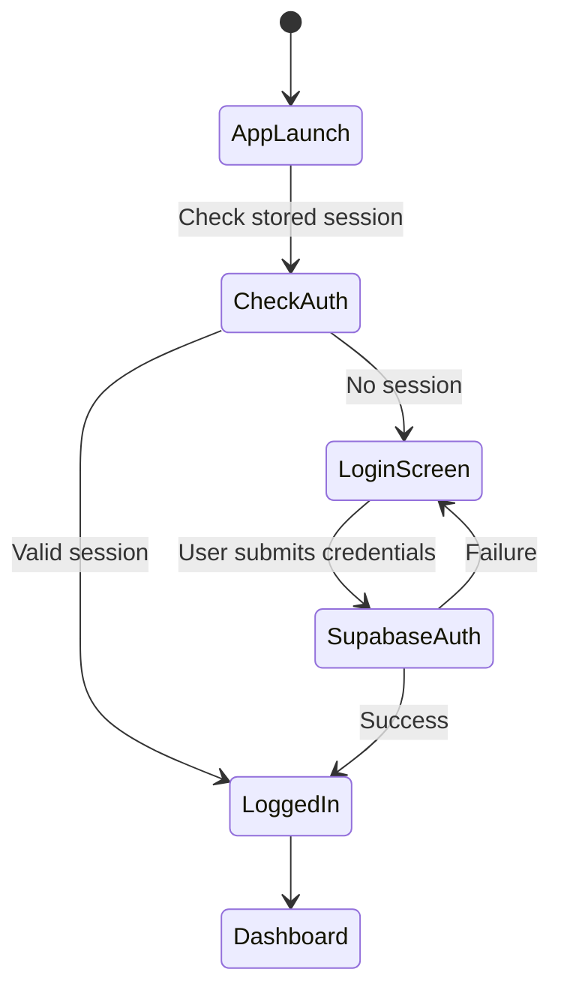
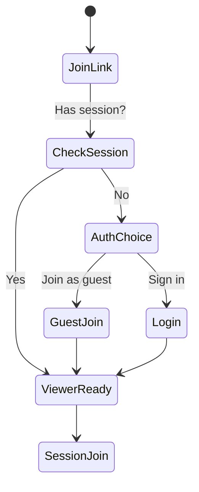
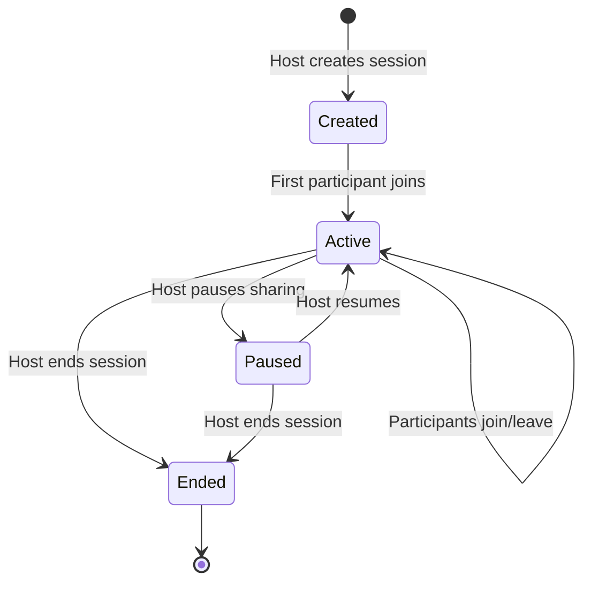
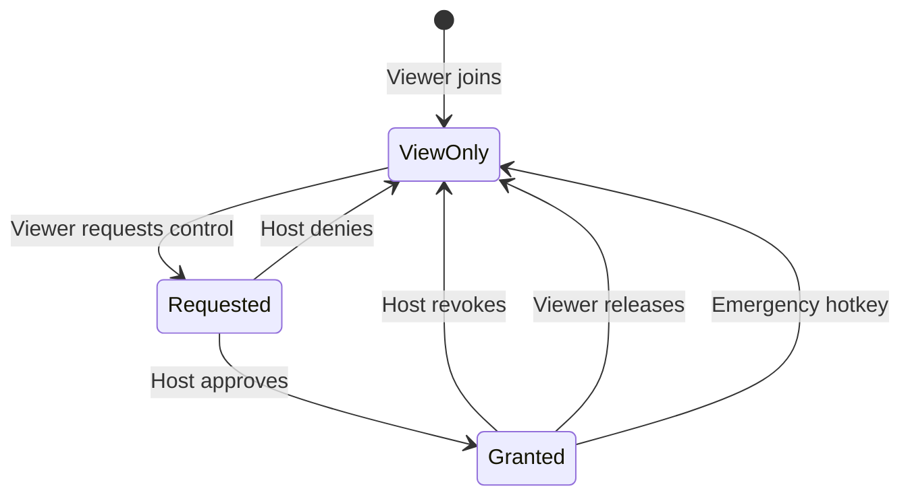
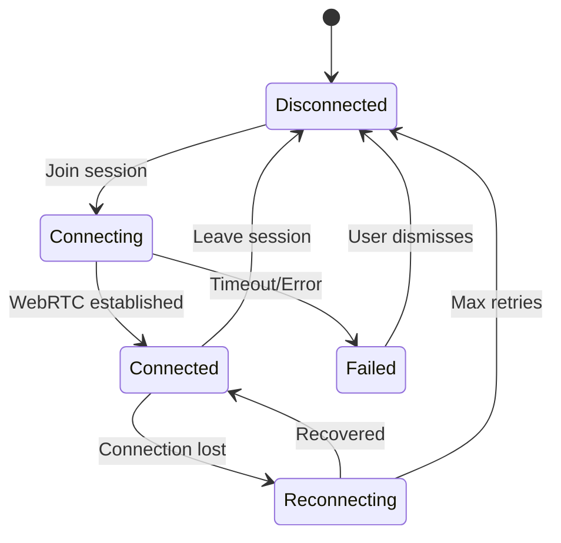

# PairUX Features Specification

## Overview

This document details all features for PairUX v1 (MVP) and outlines future enhancements.

---

## 1. Marketing Website

### 1.1 Landing Page

**Purpose**: Convert visitors to downloads

**Components**:

- Hero section with value proposition
- Animated demo/screenshot carousel
- Key benefits (3-4 bullet points)
- CTA: Download button with OS detection
- Social proof section (testimonials placeholder)
- Footer with links

**Requirements**:

- Mobile responsive
- Fast LCP (<2.5s)
- Clear call-to-action above fold

### 1.2 Features Page

**Purpose**: Detailed feature showcase

**Sections**:

- Screen sharing capabilities
- Remote control with consent
- Multi-cursor collaboration
- Cross-platform support
- Security & privacy
- Comparison table vs competitors

### 1.3 How It Works Page

**Purpose**: Explain the user journey

**Content**:

1. Download & install
2. Start a session
3. Share the link
4. Collaborate together

**Visual**: Step-by-step illustrations or animated GIFs

### 1.4 Download Page

**Purpose**: Get users to install the app

**Features**:

- OS detection (auto-recommend)
- Manual OS selection tabs
- Package manager commands:

  ```bash
  # macOS
  brew install --cask pairux

  # Windows
  winget install PairUX.PairUX

  # Ubuntu/Debian
  sudo apt install pairux

  # Fedora/RHEL
  sudo dnf install pairux

  # Arch Linux
  yay -S pairux-bin
  ```

- Direct download links (DMG, MSI, AppImage)
- System requirements
- SHA256 checksums

### 1.5 Docs/FAQ Page

**Purpose**: Self-service support

**Sections**:

- Getting started guide
- Troubleshooting
- FAQ
- Privacy policy
- Terms of service

### 1.6 SEO Requirements

- Meta titles and descriptions per page
- OpenGraph tags for social sharing
- Twitter Card tags
- Structured data (JSON-LD)
- Sitemap.xml
- Robots.txt
- Canonical URLs

---

## 2. Authentication

### 2.1 Auth Methods

| Method         | Host | Viewer | Notes                |
| -------------- | ---- | ------ | -------------------- |
| Email/Password | ✅   | ✅     | Primary method       |
| Magic Link     | ✅   | ✅     | Passwordless option  |
| OAuth (Google) | ✅   | ✅     | Social login         |
| OAuth (GitHub) | ✅   | ✅     | Developer-friendly   |
| Guest Join     | ❌   | ✅     | View-only by default |

### 2.2 Auth Flows

**Host Authentication (Desktop)**:



**Viewer Authentication (Web)**:



### 2.3 Session Tokens

- Supabase JWT tokens
- Stored securely:
  - Desktop: Electron safeStorage
  - Web: httpOnly cookies
- Auto-refresh before expiry
- Logout clears all tokens

---

## 3. Session Management

### 3.1 Session Lifecycle



### 3.2 Session States

| State     | Description                | Host Actions              | Viewer Actions           |
| --------- | -------------------------- | ------------------------- | ------------------------ |
| `created` | Session exists, no sharing | Start sharing             | Cannot join yet          |
| `active`  | Screen being shared        | Pause, End, Grant control | View, Request control    |
| `paused`  | Sharing paused             | Resume, End               | Wait screen shown        |
| `ended`   | Session terminated         | N/A                       | Redirected to end screen |

### 3.3 Join Links

**Format**: `https://pairux.com/join/{session_id}`

**Properties**:

- Session ID: UUID v4
- Optional password protection (v2)
- Expiry: When session ends
- Single-use option (v2)

### 3.4 Participant Limits (MVP)

- 1 host + 1 viewer per session
- Future: Multi-viewer support

---

## 4. Screen Sharing

### 4.1 Source Selection

**Supported Sources**:

- Entire screen (single or multi-monitor)
- Individual application window
- Browser tab (via Electron desktopCapturer)

**Selection UI**:

```
┌─────────────────────────────────────────┐
│  Select what to share                   │
├─────────────────────────────────────────┤
│  🖥️ Screens                             │
│  ┌─────────┐  ┌─────────┐               │
│  │ Screen 1│  │ Screen 2│               │
│  └─────────┘  └─────────┘               │
│                                         │
│  📱 Windows                             │
│  ┌─────────┐  ┌─────────┐  ┌─────────┐  │
│  │ VS Code │  │ Chrome  │  │ Slack   │  │
│  └─────────┘  └─────────┘  └─────────┘  │
│                                         │
│  [Cancel]              [Share Selected] │
└─────────────────────────────────────────┘
```

### 4.2 Capture Settings

| Setting    | Default  | Options             |
| ---------- | -------- | ------------------- |
| Resolution | Native   | Native, 1080p, 720p |
| Frame rate | 30 fps   | 15, 30, 60 fps      |
| Cursor     | Included | Included, Hidden    |
| Audio      | Off      | Off, System audio   |

### 4.3 Stream Quality

**Adaptive Bitrate**:

- Monitors network conditions
- Adjusts quality automatically
- Target: 2-8 Mbps for 1080p30

**Quality Presets**:
| Preset | Resolution | Bitrate | Use Case |
|--------|------------|---------|----------|
| Low | 720p | 1-2 Mbps | Poor connection |
| Medium | 1080p | 2-4 Mbps | Standard |
| High | 1080p | 4-8 Mbps | Good connection |

### 4.4 RTMP Live Streaming (Desktop App)

**Purpose**: Optional live streaming to external platforms (YouTube, Twitch, Facebook, custom RTMP servers)

**Features**:

- Stream to one or more RTMP destinations simultaneously
- Continue WebRTC session while streaming (parallel output)
- Standard RTMP settings for broad compatibility

**RTMP Destination Configuration**:

```typescript
interface RTMPDestination {
  id: string;
  name: string; // e.g., "YouTube Live", "Twitch"
  enabled: boolean;
  url: string; // RTMP ingest URL
  streamKey: string; // Stream key (stored securely)
}

interface RTMPSettings {
  destinations: RTMPDestination[];
  encoder: RTMPEncoderSettings;
}

interface RTMPEncoderSettings {
  // Video
  videoCodec: 'h264'; // H.264 (AVC) for maximum compatibility
  videoBitrate: number; // Default: 4500 kbps (4500-6000 for 1080p)
  resolution: '1080p' | '720p' | '480p';
  framerate: 30 | 60; // Default: 30 fps
  keyframeInterval: number; // Default: 2 seconds (GOP)

  // Audio
  audioCodec: 'aac'; // AAC for maximum compatibility
  audioBitrate: number; // Default: 160 kbps (128-320)
  audioSampleRate: 44100 | 48000;
  audioChannels: 1 | 2; // Default: 2 (stereo)
}
```

**Default RTMP Settings** (optimized for most platforms):
| Setting | Default | Notes |
|---------|---------|-------|
| Video Codec | H.264 (x264) | Baseline/Main profile for compatibility |
| Video Bitrate | 4500 kbps | 2500-6000 recommended range |
| Resolution | 1080p | Match source or downscale |
| Framerate | 30 fps | 60 fps for gaming content |
| Keyframe Interval | 2 seconds | Required by most platforms |
| Audio Codec | AAC | LC profile |
| Audio Bitrate | 160 kbps | 128-320 range |
| Audio Sample Rate | 48000 Hz | Standard for streaming |

**Popular Platform Presets**:
| Platform | Ingest URL Pattern | Max Bitrate | Notes |
|----------|-------------------|-------------|-------|
| YouTube | rtmp://a.rtmp.youtube.com/live2 | 51 Mbps | Supports 4K |
| Twitch | rtmp://live.twitch.tv/app | 6000 kbps | 1080p60 max |
| Facebook | rtmps://live-api-s.facebook.com:443/rtmp | 4000 kbps | Use RTMPS |
| Custom | User-provided | Varies | Full control |

**UI - RTMP Settings Panel**:

```
┌─────────────────────────────────────────────────────┐
│  Live Streaming Settings                            │
├─────────────────────────────────────────────────────┤
│                                                     │
│  Destinations                          [+ Add New] │
│  ┌─────────────────────────────────────────────┐   │
│  │ ☑️ YouTube Live                              │   │
│  │   rtmp://a.rtmp.youtube.com/live2           │   │
│  │   Stream Key: ●●●●●●●●●●●●      [Edit] [🗑️]  │   │
│  └─────────────────────────────────────────────┘   │
│  ┌─────────────────────────────────────────────┐   │
│  │ ☐ Twitch                                    │   │
│  │   rtmp://live.twitch.tv/app                 │   │
│  │   Stream Key: ●●●●●●●●●●●●      [Edit] [🗑️]  │   │
│  └─────────────────────────────────────────────┘   │
│                                                     │
│  Encoder Settings                                   │
│  ├─ Resolution:     [1080p ▼]                      │
│  ├─ Framerate:      [30 fps ▼]                     │
│  ├─ Video Bitrate:  [4500 kbps    ]                │
│  ├─ Audio Bitrate:  [160 kbps ▼]                   │
│  └─ Keyframe Int:   [2 seconds ▼]                  │
│                                                     │
│  [Reset to Defaults]                               │
└─────────────────────────────────────────────────────┘
```

**Active Session - RTMP Controls**:

```
┌─────────────────────────────────────────────────────┐
│  Live Streaming                        [⚙️ Settings] │
├─────────────────────────────────────────────────────┤
│  ☑️ YouTube Live      🔴 LIVE  00:45:23            │
│  ☐ Twitch            ⚫ Ready                       │
├─────────────────────────────────────────────────────┤
│  [Start All]  [Stop All]               Bitrate: 4.5M│
└─────────────────────────────────────────────────────┘
```

**Security**:

- Stream keys stored in system keychain (Electron safeStorage)
- Keys never logged or transmitted except to RTMP server
- Option to require re-entry of stream key each session

**Error Handling**:
| Error | User Message | Action |
|-------|--------------|--------|
| Connection failed | "Cannot connect to streaming server" | Retry with backoff |
| Auth failed | "Invalid stream key" | Prompt to re-enter |
| Bandwidth exceeded | "Network too slow for live stream" | Suggest lower bitrate |
| Server disconnected | "Stream interrupted, reconnecting..." | Auto-reconnect (3 attempts) |

---

## 5. Remote Control

### 5.1 Control States



### 5.2 Control State Details

| State       | Viewer Can       | Host Can     | Visual Indicator     |
| ----------- | ---------------- | ------------ | -------------------- |
| `view-only` | View only        | Full control | None                 |
| `requested` | View only        | Approve/Deny | Request notification |
| `granted`   | Mouse + Keyboard | Full control | Control active badge |
| `revoked`   | View only        | Full control | Control ended notice |

### 5.3 Input Events

**Mouse Events**:

- `mousemove` - Cursor position (x, y relative to screen)
- `mousedown` - Button press (left, right, middle)
- `mouseup` - Button release
- `click` - Click event
- `dblclick` - Double click
- `scroll` - Scroll delta (x, y)

**Keyboard Events**:

- `keydown` - Key press with modifiers
- `keyup` - Key release
- Key codes follow Web KeyboardEvent standard

**Event Message Format**:

```typescript
interface InputEvent {
  type: 'mouse' | 'keyboard';
  action: string;
  timestamp: number;
  data: MouseEventData | KeyboardEventData;
}

interface MouseEventData {
  x: number; // 0-1 relative position
  y: number; // 0-1 relative position
  button?: number;
  deltaX?: number;
  deltaY?: number;
}

interface KeyboardEventData {
  key: string;
  code: string;
  modifiers: {
    ctrl: boolean;
    alt: boolean;
    shift: boolean;
    meta: boolean;
  };
}
```

### 5.4 Emergency Revoke

**Hotkey**: `Ctrl+Shift+Escape` (configurable)

**Behavior**:

- Immediately revokes all remote control
- Shows confirmation toast
- Cannot be overridden by remote input
- Works even if app is not focused (global hotkey)

### 5.5 Simultaneous Input

**Design**: Both host and viewer can provide input simultaneously

**Conflict Resolution**:

- Host input always takes priority
- No input queuing - latest wins
- Visual indicator shows who is controlling

---

## 6. Multi-Cursor Display

### 6.1 Cursor Rendering

**Host Side**:

- Native OS cursor (always visible)
- No overlay needed

**Viewer Side**:

- Remote cursor rendered as overlay
- Shows host cursor position
- Own cursor for control input

### 6.2 Cursor Appearance

| Participant          | Cursor Style     | Label      |
| -------------------- | ---------------- | ---------- |
| Host                 | Native OS cursor | None       |
| Viewer (viewing)     | Arrow with color | Name badge |
| Viewer (controlling) | Arrow with color | Name badge |

**Cursor Colors**: Assigned automatically from palette

- Viewer 1: Blue (#3B82F6)
- Viewer 2: Green (#10B981)
- Viewer 3: Purple (#8B5CF6)
- Viewer 4: Orange (#F59E0B)

### 6.3 Cursor Position Sync

- Positions sent via DataChannel
- Update rate: 60 Hz max
- Throttled to reduce bandwidth
- Interpolation for smooth movement

---

## 7. Connection Management

### 7.1 Connection States



### 7.2 Reconnection Logic

**Triggers**:

- ICE connection state: `disconnected` or `failed`
- No data received for 10 seconds

**Strategy**:

1. Attempt ICE restart
2. If fails, create new peer connection
3. Re-establish via signaling
4. Max 3 attempts, 5 second intervals
5. Show reconnecting UI during process

### 7.3 Network Quality Indicators

| Quality   | Latency   | Packet Loss | Icon |
| --------- | --------- | ----------- | ---- |
| Excellent | <50ms     | <1%         | 🟢   |
| Good      | 50-150ms  | 1-3%        | 🟡   |
| Poor      | 150-300ms | 3-10%       | 🟠   |
| Bad       | >300ms    | >10%        | 🔴   |

---

## 8. User Interface

### 8.1 Desktop App - Host UI

**Main Window**:

```
┌─────────────────────────────────────────────────────┐
│  PairUX                              [_] [□] [X]    │
├─────────────────────────────────────────────────────┤
│                                                     │
│  ┌─────────────────────────────────────────────┐   │
│  │                                             │   │
│  │         No active session                   │   │
│  │                                             │   │
│  │         [Start New Session]                 │   │
│  │                                             │   │
│  └─────────────────────────────────────────────┘   │
│                                                     │
│  Recent Sessions                                    │
│  • Session with John - 2 hours ago                 │
│  • Session with Jane - Yesterday                   │
│                                                     │
├─────────────────────────────────────────────────────┤
│  👤 user@email.com                    [Settings]   │
└─────────────────────────────────────────────────────┘
```

**Active Session**:

```
┌─────────────────────────────────────────────────────┐
│  PairUX - Session Active              [_] [□] [X]  │
├─────────────────────────────────────────────────────┤
│  Share Link: https://pairux.com/join/abc123        │
│  [Copy Link]                                        │
├─────────────────────────────────────────────────────┤
│  Sharing: Screen 1                    [Change]     │
│  Quality: 1080p @ 30fps              🟢 Excellent  │
├─────────────────────────────────────────────────────┤
│  Participants (1)                                   │
│  ┌─────────────────────────────────────────────┐   │
│  │ 👤 John Doe                                 │   │
│  │    Status: Viewing                          │   │
│  │    [Grant Control] [Remove]                 │   │
│  └─────────────────────────────────────────────┘   │
├─────────────────────────────────────────────────────┤
│  [Pause Sharing]              [End Session]        │
└─────────────────────────────────────────────────────┘
```

### 8.2 Web App - Viewer UI

**Viewer Interface**:

```
┌─────────────────────────────────────────────────────┐
│  PairUX Viewer          🟢 Connected    [Settings] │
├─────────────────────────────────────────────────────┤
│                                                     │
│  ┌─────────────────────────────────────────────┐   │
│  │                                             │   │
│  │                                             │   │
│  │         [Remote Screen Display]             │   │
│  │                                             │   │
│  │                                             │   │
│  │                                    🔵 Host  │   │
│  └─────────────────────────────────────────────┘   │
│                                                     │
├─────────────────────────────────────────────────────┤
│  [Request Control]    [Fullscreen]    [Leave]      │
└─────────────────────────────────────────────────────┘
```

### 8.3 System Tray

**Tray Menu**:

- Show/Hide window
- Session status
- Quick end session
- Settings
- Quit

**Tray Icon States**:

- Idle: Default icon
- Session active: Animated/colored icon
- Control granted: Warning icon

---

## 9. Settings

### 9.1 Desktop App Settings

**General**:

- Start on login
- Start minimized
- Check for updates

**Sharing**:

- Default quality preset
- Include cursor
- Include system audio

**RTMP Streaming**:

- Manage destinations (add/edit/remove)
- Stream keys (securely stored)
- Encoder settings (bitrate, resolution, fps)
- Keyframe interval
- Auto-start streaming with session

**Control**:

- Emergency revoke hotkey
- Require approval for control
- Auto-revoke on inactivity

**Privacy**:

- Clear session history
- Analytics opt-out

### 9.2 Web Viewer Settings

**Display**:

- Fit to window / Original size
- Show remote cursor

**Input**:

- Keyboard layout
- Mouse sensitivity

---

## 10. Future Features (Post-MVP)

### 10.1 Version 1.x (Near-term)

- [ ] RTMP live streaming to external platforms (YouTube, Twitch, etc.)
- [ ] Multiple simultaneous RTMP destinations
- [ ] Stream key management with secure storage

### 10.2 Version 2

- [ ] Multi-viewer support (up to 5)
- [ ] Session recording
- [ ] Chat/annotations
- [ ] Password-protected sessions
- [ ] Scheduled sessions
- [ ] RTMP recording to file

### 10.3 Version 3

- [ ] File transfer
- [ ] Clipboard sync
- [ ] Voice chat
- [ ] Session templates
- [ ] Team workspaces
- [ ] SRT/RIST streaming protocols

### 10.4 Enterprise

- [ ] SSO integration
- [ ] Admin dashboard
- [ ] Audit logs
- [ ] Custom branding
- [ ] On-premise deployment
- [ ] Custom RTMP ingest server
