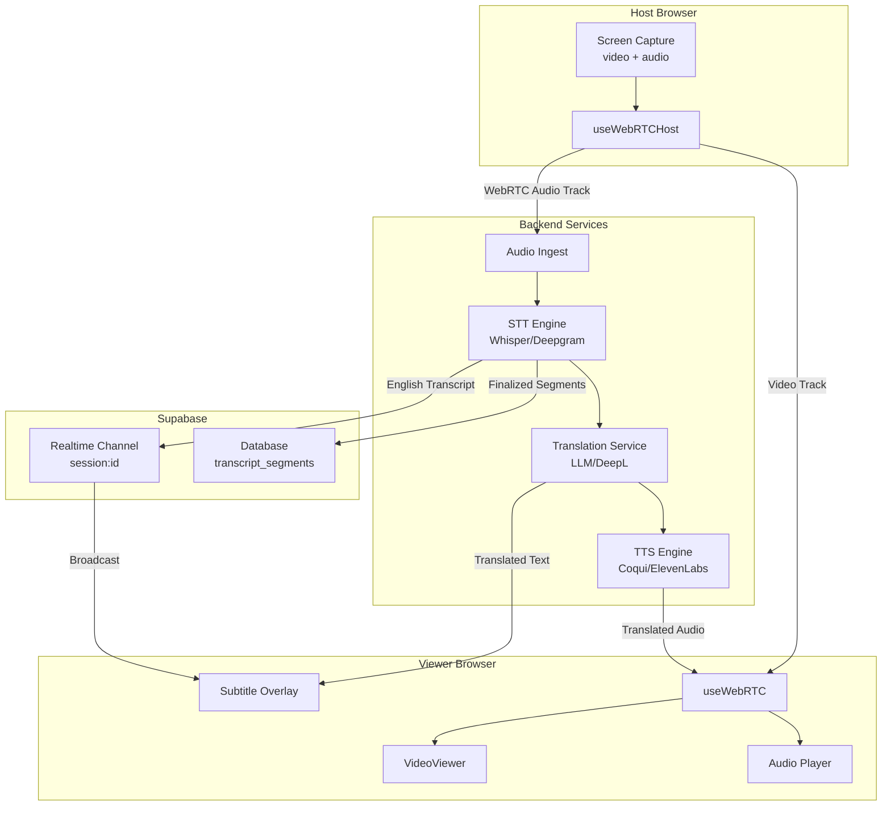

# PRD: Real-Time Multilingual Subtitles & Spoken Audio Translation

**Version:** 2.0
**Date:** January 2025
**Status:** Draft
**Product:** PairUX

---

## 1. Overview

This PRD defines requirements for adding accessibility and multilingual communication features to PairUX, a WebRTC-based real-time screen sharing application with remote control.

The system supports:

- Live English subtitles from host audio
- Live translated subtitles (per viewer language)
- Optional live spoken audio translation (speech-to-speech)

The design prioritizes transcription accuracy, translation quality, and speaker clarity over cost and minimal latency.

---

## 2. Goals & Non-Goals

### Goals

- Highly accurate real-time speech recognition from host audio
- Natural, context-aware translations
- Clear speaker attribution (host identification)
- Per-viewer language selection
- Seamless integration with existing PairUX WebRTC architecture
- Self-hosted by default, with paid upgrades allowed
- Minimal changes to existing data channel and signaling infrastructure

### Non-Goals

- Perfect lip-sync dubbing
- Browser-only STT/TTS solutions
- Ultra-low latency at the expense of quality
- Multi-speaker diarization (host-only audio initially)

---

## 3. User Stories

### Subtitles

- As a viewer, I want to see accurate English subtitles of the host's speech in real time.
- As a viewer, I want subtitles translated into my preferred language.
- As a host, I want to enable or disable captions per session.

### Spoken Translation

- As a viewer, I want to hear the host translated into my language.
- As a viewer, I want to toggle original vs translated audio.
- As a host, I want to enable spoken translation for my session.

---

## 4. Functional Requirements

### 4.1 Audio Capture

- Extract audio track from host's screen capture MediaStream
- Current implementation already captures audio via `getDisplayMedia()` with:
  - Echo cancellation enabled
  - Noise suppression enabled
- Forward audio to backend transcription service
- Audio forwarding options:
  - WebRTC audio track to server (via SFU or dedicated connection)
  - WebSocket binary stream
  - Server-side capture from TURN relay

---

### 4.2 Live Subtitles (English)

- Perform streaming speech-to-text (STT) on host audio
- Emit:
  - Partial (interim) transcripts for immediate display
  - Finalized transcript segments with timestamps
- Attribute subtitles to host (single speaker initially)
- Display subtitles in `VideoViewer` component with minimal flicker
- Deliver transcripts via:
  - Existing Supabase Realtime channel (`session:{sessionId}`)
  - Or dedicated WebRTC data channel

---

### 4.3 Translated Subtitles

- Translate finalized English transcript segments
- Support multiple viewer languages simultaneously
- Cache translations per segment and language
- Display translated subtitles based on viewer's language preference
- Store language preference in viewer's local state

---

### 4.4 Live Spoken Audio Translation

- Convert finalized transcript segments into translated speech
- Generate audio per viewer language
- Deliver translated audio via:
  - Additional WebRTC audio track
  - Or audio injection into existing stream
- Allow viewer to:
  - Hear original audio only
  - Hear translated audio only
  - Hear both (original audio ducked)

---

## 5. System Architecture

### 5.1 Integration with PairUX Architecture

PairUX uses:

- **Sessions** (not rooms) as the primary organizational unit
- **Supabase Realtime** for signaling (`session:{sessionId}` channel)
- **WebRTC PeerConnections** between host and each viewer
- **Data channel** named `'control'` for input and cursor events
- **Host/Viewer model**: Host streams, viewers receive

### 5.2 Audio Processing Flow

```
Host Screen Capture (MediaStream with audio)
→ Audio track extraction
→ Server-side ingest (via WebRTC/WebSocket)
→ Streaming STT
→ Transcript segments
```

### 5.3 Subtitle Flow

```
Transcript (English)
→ Supabase Realtime broadcast OR data channel
→ Subtitle renderer in VideoViewer
→ Optional translation service → translated subtitles
```

### 5.4 Spoken Translation Flow

```
Transcript (English)
→ Translation service
→ Text-to-Speech
→ WebRTC audio track → viewer
```

### 5.5 Architecture Diagram



---

## 6. Technology Choices

### 6.1 Speech-to-Text (STT)

#### Default (Self-Hosted)

- **Whisper Large / Whisper.cpp**
  - High accuracy
  - Multilingual support
  - Chunked streaming implementation via faster-whisper

#### Optional Paid Engines

- Deepgram Streaming STT
- OpenAI Realtime API
- Google Speech-to-Text
- AssemblyAI

The STT engine must be configurable per deployment via environment variables.

---

### 6.2 Translation

#### Preferred

- LLM-based translation for conversational accuracy (GPT-4, Claude)

#### Alternatives

- MarianMT / NLLB (self-hosted, open source)
- DeepL API (high quality, paid)
- Google Translate API (paid)

Only finalized transcript segments are translated to avoid instability.

---

### 6.3 Text-to-Speech (TTS)

#### Default (Self-Hosted)

- Coqui TTS
- Piper (fast, lightweight)
- XTTS (voice cloning capable)

#### Optional Paid Engines

- ElevenLabs (high-quality multilingual voices)
- Google Cloud TTS
- Azure Cognitive Services TTS
- OpenAI TTS

TTS must support streaming or chunked audio output for low latency.

---

## 7. Latency Targets

| Feature              | Target Latency |
| -------------------- | -------------- |
| English subtitles    | ≤ 500 ms       |
| Translated subtitles | ≤ 800 ms       |
| Spoken translation   | ≤ 1.2 s        |

Latency may increase slightly in favor of accuracy.

---

## 8. Data Model

### 8.1 New Database Tables

#### `transcript_segments`

```sql
CREATE TABLE public.transcript_segments (
  id UUID PRIMARY KEY DEFAULT gen_random_uuid(),
  session_id UUID NOT NULL REFERENCES public.sessions(id) ON DELETE CASCADE,
  speaker_id UUID REFERENCES public.session_participants(id),
  start_ms INTEGER NOT NULL,
  end_ms INTEGER NOT NULL,
  text_en TEXT NOT NULL,
  confidence DECIMAL(3,2),
  is_final BOOLEAN NOT NULL DEFAULT false,
  created_at TIMESTAMPTZ NOT NULL DEFAULT NOW()
);

CREATE INDEX idx_transcript_segments_session ON transcript_segments(session_id);
CREATE INDEX idx_transcript_segments_time ON transcript_segments(session_id, start_ms);
```

#### `transcript_translations`

```sql
CREATE TABLE public.transcript_translations (
  id UUID PRIMARY KEY DEFAULT gen_random_uuid(),
  segment_id UUID NOT NULL REFERENCES public.transcript_segments(id) ON DELETE CASCADE,
  lang VARCHAR(10) NOT NULL,
  text TEXT NOT NULL,
  created_at TIMESTAMPTZ NOT NULL DEFAULT NOW(),
  UNIQUE(segment_id, lang)
);

CREATE INDEX idx_transcript_translations_segment ON transcript_translations(segment_id);
```

### 8.2 Session Settings Extension

Add to `sessions.settings` JSONB:

```json
{
  "quality": "medium",
  "allowControl": true,
  "maxParticipants": 5,
  "captions": {
    "enabled": false,
    "spokenTranslation": false,
    "allowedLanguages": ["en", "es", "fr", "de", "zh", "ja"]
  }
}
```

### 8.3 Realtime Message Types

#### Transcript Message (via Supabase Realtime)

```typescript
interface TranscriptMessage {
  type: 'transcript';
  segmentId: string;
  sessionId: string;
  speakerId: string;
  startMs: number;
  endMs: number;
  textEn: string;
  confidence: number;
  isFinal: boolean;
}
```

#### Translation Message

```typescript
interface TranslationMessage {
  type: 'translation';
  segmentId: string;
  lang: string;
  text: string;
}
```

---

## 9. Audio Translation Delivery

### Options

1. **Additional WebRTC Audio Track**
   - Host sends translated audio as separate track
   - Viewer selects which track to play
   - Requires server-side mixing or SFU support

2. **Data Channel Audio Chunks**
   - Send PCM/Opus audio chunks via data channel
   - Viewer decodes and plays via Web Audio API
   - More latency but simpler architecture

3. **Server-Side Audio Mixing**
   - Server mixes original + translated audio
   - Single stream to viewer
   - Highest complexity

### Recommended Approach

Use **separate audio track via WebRTC** for best quality and lowest latency. Leverage existing `useWebRTCHost` architecture to add additional audio track per language.

---

## 10. UI/UX Requirements

### Viewer Controls (in VideoViewer)

- **Subtitles Toggle:**
  - Off
  - English (original)
  - Auto-translate → language selector dropdown

- **Audio Translation Toggle** (when enabled):
  - Original audio only
  - Translated audio only
  - Both (original ducked to 20%)

- **Subtitle Position:**
  - Bottom center (default)
  - Top center (option)

### Host Controls (in Host Page)

- Enable/disable captions for session
- Enable/disable spoken translation
- View active viewer language preferences
- Display resource usage warnings (GPU/CPU for STT)

### Subtitle Renderer Component

Location: `apps/web/src/components/video/SubtitleOverlay.tsx`

```tsx
interface SubtitleOverlayProps {
  sessionId: string;
  language: string; // 'en' or target language code
  position: 'bottom' | 'top';
  enabled: boolean;
}
```

---

## 11. Scaling Considerations

- STT runs once per session (host audio only)
- Translation runs once per segment per requested language
- TTS runs once per language stream
- Cache transcripts in database for session duration
- Cache translations per segment/language pair
- Use Supabase Realtime for efficient broadcast to all viewers

---

## 12. Privacy & Compliance

- Audio is processed transiently by default
- Transcripts stored only if `sessions.settings.captions.storeTranscripts` is true
- Clear visual indicator when captions/translation are active
- Transcripts deleted when session ends (configurable retention)
- GDPR consideration: transcript data is PII

---

## 13. Configuration

### Environment Variables

```bash
# STT Configuration
STT_ENGINE=whisper          # whisper | deepgram | google | openai
STT_MODEL=large-v3          # Model name for self-hosted
DEEPGRAM_API_KEY=           # If using Deepgram
OPENAI_API_KEY=             # If using OpenAI

# Translation Configuration
TRANSLATION_ENGINE=llm      # llm | deepl | google | nllb
DEEPL_API_KEY=              # If using DeepL

# TTS Configuration
TTS_ENGINE=piper            # piper | coqui | elevenlabs | google
ELEVENLABS_API_KEY=         # If using ElevenLabs

# Feature Flags
CAPTIONS_ENABLED=true
SPOKEN_TRANSLATION_ENABLED=false
```

### Session Settings Schema

```typescript
interface CaptionSettings {
  enabled: boolean;
  spokenTranslation: boolean;
  storeTranscripts: boolean;
  allowedLanguages: string[];
  sttEngine?: 'whisper' | 'deepgram' | 'google' | 'openai';
  ttsEngine?: 'piper' | 'coqui' | 'elevenlabs';
}
```

---

## 14. Implementation Phases

### Phase 1: English Subtitles

1. Add audio forwarding from host to backend
2. Implement STT service with Whisper
3. Create `SubtitleOverlay` component
4. Broadcast transcripts via Supabase Realtime
5. Add host toggle in session settings

### Phase 2: Translated Subtitles

1. Add translation service integration
2. Implement language selector UI
3. Cache translations in database
4. Broadcast translations to viewers

### Phase 3: Spoken Translation

1. Add TTS service integration
2. Implement audio track injection
3. Add viewer audio controls
4. Optimize for latency

---

## 15. Success Metrics

- ≥95% perceived transcription accuracy
- ≥90% translation quality satisfaction
- Subtitle delay <1s perceived
- <2% session instability caused by translation features
- <5% increase in session bandwidth usage

---

## 16. Future Enhancements

- Speaker diarization for multi-speaker sessions
- Speaker voice cloning for translated audio
- Domain-specific vocabulary tuning
- Session recording with dubbed playback
- Caption search and export
- AI-generated session summaries
- Live translation for chat messages

---

## 17. Dependencies on Existing Architecture

| Component         | Current             | Required Changes                                          |
| ----------------- | ------------------- | --------------------------------------------------------- |
| `useWebRTCHost`   | Streams video+audio | Add audio track extraction for STT                        |
| `useWebRTC`       | Receives stream     | Handle subtitle messages, optional translated audio track |
| `VideoViewer`     | Displays video      | Add `SubtitleOverlay` child component                     |
| Supabase Realtime | Signaling only      | Add transcript/translation broadcast                      |
| `sessions` table  | Basic settings      | Extend settings JSONB for captions                        |
| Data channel      | Control messages    | Optionally add transcript messages                        |

---

## 18. Related Files

| Purpose         | Path                                            |
| --------------- | ----------------------------------------------- |
| Host WebRTC     | `apps/web/src/hooks/useWebRTCHost.ts`           |
| Viewer WebRTC   | `apps/web/src/hooks/useWebRTC.ts`               |
| Screen Capture  | `apps/web/src/hooks/useScreenCapture.ts`        |
| Video Viewer    | `apps/web/src/components/video/VideoViewer.tsx` |
| Session Types   | `packages/shared-types/src/session.ts`          |
| Signaling Types | `packages/shared-types/src/signaling.ts`        |
| Database Schema | `supabase/migrations/`                          |

---

_Document Version: 2.0_
