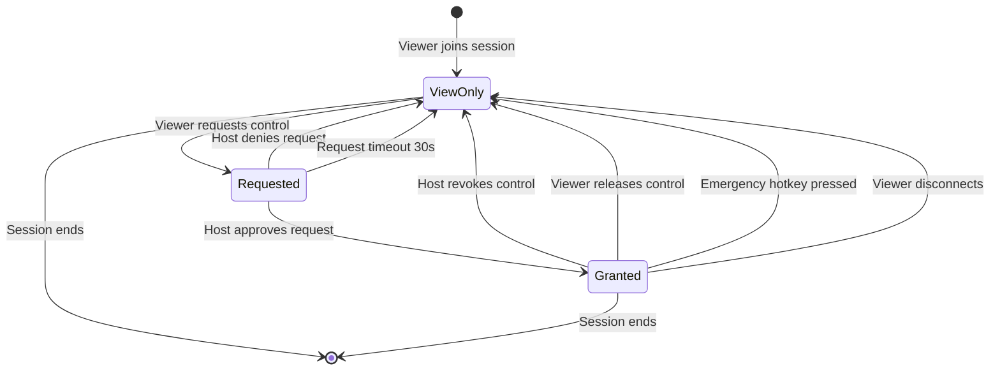
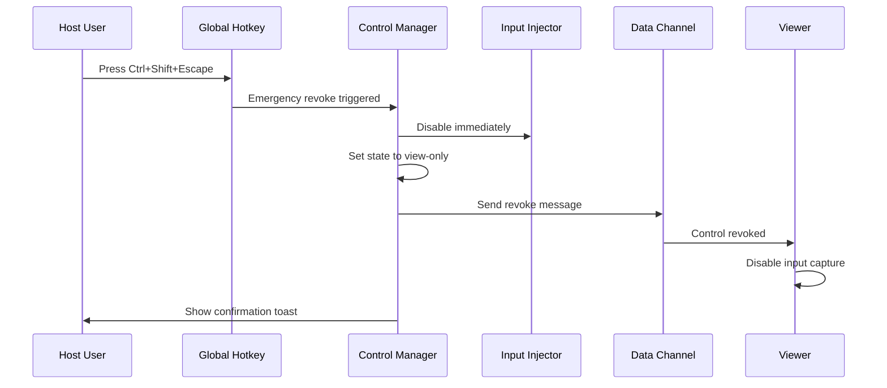

# PairUX Remote Control System

## Overview

This document details the remote control system for PairUX, including the control state machine, input event handling, and input injection via nut.js.

---

## Control State Machine

### States



### State Definitions

| State       | Description     | Viewer Capabilities    | Host Capabilities        |
| ----------- | --------------- | ---------------------- | ------------------------ |
| `view-only` | Default state   | View screen only       | Full control, can grant  |
| `requested` | Control pending | View screen, waiting   | Approve or deny          |
| `granted`   | Control active  | Mouse + keyboard input | Full control, can revoke |

### State Transitions

```typescript
type ControlState = 'view-only' | 'requested' | 'granted';

interface ControlTransition {
  from: ControlState;
  to: ControlState;
  trigger: string;
  guard?: () => boolean;
}

const transitions: ControlTransition[] = [
  { from: 'view-only', to: 'requested', trigger: 'REQUEST_CONTROL' },
  { from: 'requested', to: 'view-only', trigger: 'DENY_REQUEST' },
  { from: 'requested', to: 'view-only', trigger: 'REQUEST_TIMEOUT' },
  { from: 'requested', to: 'granted', trigger: 'APPROVE_REQUEST' },
  { from: 'granted', to: 'view-only', trigger: 'REVOKE_CONTROL' },
  { from: 'granted', to: 'view-only', trigger: 'RELEASE_CONTROL' },
  { from: 'granted', to: 'view-only', trigger: 'EMERGENCY_REVOKE' },
  { from: 'granted', to: 'view-only', trigger: 'VIEWER_DISCONNECT' },
];
```

### State Machine Implementation

```typescript
class ControlStateMachine {
  private state: ControlState = 'view-only';
  private requestTimeout: NodeJS.Timeout | null = null;
  private readonly REQUEST_TIMEOUT_MS = 30000;

  constructor(
    private readonly onStateChange: (state: ControlState) => void,
    private readonly onNotify: (message: string) => void
  ) {}

  getState(): ControlState {
    return this.state;
  }

  requestControl(): boolean {
    if (this.state !== 'view-only') {
      return false;
    }

    this.setState('requested');
    this.startRequestTimeout();
    return true;
  }

  approveRequest(): boolean {
    if (this.state !== 'requested') {
      return false;
    }

    this.clearRequestTimeout();
    this.setState('granted');
    this.onNotify('Control granted to viewer');
    return true;
  }

  denyRequest(): boolean {
    if (this.state !== 'requested') {
      return false;
    }

    this.clearRequestTimeout();
    this.setState('view-only');
    this.onNotify('Control request denied');
    return true;
  }

  revokeControl(): boolean {
    if (this.state !== 'granted') {
      return false;
    }

    this.setState('view-only');
    this.onNotify('Control revoked');
    return true;
  }

  releaseControl(): boolean {
    if (this.state !== 'granted') {
      return false;
    }

    this.setState('view-only');
    this.onNotify('Viewer released control');
    return true;
  }

  emergencyRevoke(): void {
    // Always works, regardless of current state
    this.clearRequestTimeout();
    this.setState('view-only');
    this.onNotify('Emergency: All control revoked');
  }

  private setState(newState: ControlState): void {
    const oldState = this.state;
    this.state = newState;
    console.log(`Control state: ${oldState} -> ${newState}`);
    this.onStateChange(newState);
  }

  private startRequestTimeout(): void {
    this.requestTimeout = setTimeout(() => {
      if (this.state === 'requested') {
        this.setState('view-only');
        this.onNotify('Control request timed out');
      }
    }, this.REQUEST_TIMEOUT_MS);
  }

  private clearRequestTimeout(): void {
    if (this.requestTimeout) {
      clearTimeout(this.requestTimeout);
      this.requestTimeout = null;
    }
  }
}
```

---

## Input Event Protocol

### Event Types

```typescript
// Mouse events
interface MouseMoveEvent {
  type: 'mouse';
  action: 'move';
  x: number; // 0-1 relative to screen
  y: number; // 0-1 relative to screen
}

interface MouseButtonEvent {
  type: 'mouse';
  action: 'down' | 'up' | 'click' | 'dblclick';
  button: 'left' | 'right' | 'middle';
  x: number;
  y: number;
}

interface MouseScrollEvent {
  type: 'mouse';
  action: 'scroll';
  deltaX: number;
  deltaY: number;
  x: number;
  y: number;
}

// Keyboard events
interface KeyboardEvent {
  type: 'keyboard';
  action: 'down' | 'up' | 'press';
  key: string; // e.g., 'a', 'Enter', 'Escape'
  code: string; // e.g., 'KeyA', 'Enter', 'Escape'
  modifiers: {
    ctrl: boolean;
    alt: boolean;
    shift: boolean;
    meta: boolean; // Cmd on macOS, Win on Windows
  };
}

// Union type
type InputEvent = MouseMoveEvent | MouseButtonEvent | MouseScrollEvent | KeyboardEvent;
```

### Event Message Format

```typescript
interface InputMessage {
  type: 'input';
  timestamp: number;
  sequence: number; // For ordering
  event: InputEvent;
}

// Example mouse move
const mouseMoveMessage: InputMessage = {
  type: 'input',
  timestamp: Date.now(),
  sequence: 42,
  event: {
    type: 'mouse',
    action: 'move',
    x: 0.5, // Center of screen
    y: 0.5,
  },
};

// Example keyboard event
const keyboardMessage: InputMessage = {
  type: 'input',
  timestamp: Date.now(),
  sequence: 43,
  event: {
    type: 'keyboard',
    action: 'press',
    key: 'a',
    code: 'KeyA',
    modifiers: {
      ctrl: false,
      alt: false,
      shift: false,
      meta: false,
    },
  },
};
```

---

## Input Capture (Viewer Side)

### Mouse Event Capture

```typescript
class MouseCapture {
  private canvas: HTMLElement;
  private enabled: boolean = false;
  private lastPosition = { x: 0, y: 0 };

  constructor(
    canvas: HTMLElement,
    private readonly onEvent: (event: InputEvent) => void
  ) {
    this.canvas = canvas;
    this.setupListeners();
  }

  enable(): void {
    this.enabled = true;
    this.canvas.style.cursor = 'none'; // Hide local cursor
  }

  disable(): void {
    this.enabled = false;
    this.canvas.style.cursor = 'default';
  }

  private setupListeners(): void {
    this.canvas.addEventListener('mousemove', this.handleMouseMove.bind(this));
    this.canvas.addEventListener('mousedown', this.handleMouseDown.bind(this));
    this.canvas.addEventListener('mouseup', this.handleMouseUp.bind(this));
    this.canvas.addEventListener('click', this.handleClick.bind(this));
    this.canvas.addEventListener('dblclick', this.handleDblClick.bind(this));
    this.canvas.addEventListener('wheel', this.handleWheel.bind(this));
    this.canvas.addEventListener('contextmenu', this.handleContextMenu.bind(this));
  }

  private getRelativePosition(e: MouseEvent): { x: number; y: number } {
    const rect = this.canvas.getBoundingClientRect();
    return {
      x: (e.clientX - rect.left) / rect.width,
      y: (e.clientY - rect.top) / rect.height,
    };
  }

  private getButton(e: MouseEvent): 'left' | 'right' | 'middle' {
    switch (e.button) {
      case 0:
        return 'left';
      case 1:
        return 'middle';
      case 2:
        return 'right';
      default:
        return 'left';
    }
  }

  private handleMouseMove(e: MouseEvent): void {
    if (!this.enabled) return;

    const pos = this.getRelativePosition(e);

    // Throttle: only send if moved significantly
    const dx = Math.abs(pos.x - this.lastPosition.x);
    const dy = Math.abs(pos.y - this.lastPosition.y);
    if (dx < 0.001 && dy < 0.001) return;

    this.lastPosition = pos;

    this.onEvent({
      type: 'mouse',
      action: 'move',
      x: pos.x,
      y: pos.y,
    });
  }

  private handleMouseDown(e: MouseEvent): void {
    if (!this.enabled) return;
    e.preventDefault();

    const pos = this.getRelativePosition(e);
    this.onEvent({
      type: 'mouse',
      action: 'down',
      button: this.getButton(e),
      x: pos.x,
      y: pos.y,
    });
  }

  private handleMouseUp(e: MouseEvent): void {
    if (!this.enabled) return;
    e.preventDefault();

    const pos = this.getRelativePosition(e);
    this.onEvent({
      type: 'mouse',
      action: 'up',
      button: this.getButton(e),
      x: pos.x,
      y: pos.y,
    });
  }

  private handleClick(e: MouseEvent): void {
    // Handled by down/up
  }

  private handleDblClick(e: MouseEvent): void {
    if (!this.enabled) return;
    e.preventDefault();

    const pos = this.getRelativePosition(e);
    this.onEvent({
      type: 'mouse',
      action: 'dblclick',
      button: this.getButton(e),
      x: pos.x,
      y: pos.y,
    });
  }

  private handleWheel(e: WheelEvent): void {
    if (!this.enabled) return;
    e.preventDefault();

    const pos = this.getRelativePosition(e);
    this.onEvent({
      type: 'mouse',
      action: 'scroll',
      deltaX: e.deltaX,
      deltaY: e.deltaY,
      x: pos.x,
      y: pos.y,
    });
  }

  private handleContextMenu(e: MouseEvent): void {
    if (this.enabled) {
      e.preventDefault();
    }
  }
}
```

### Keyboard Event Capture

```typescript
class KeyboardCapture {
  private enabled: boolean = false;

  constructor(private readonly onEvent: (event: InputEvent) => void) {
    this.setupListeners();
  }

  enable(): void {
    this.enabled = true;
  }

  disable(): void {
    this.enabled = false;
  }

  private setupListeners(): void {
    document.addEventListener('keydown', this.handleKeyDown.bind(this));
    document.addEventListener('keyup', this.handleKeyUp.bind(this));
  }

  private handleKeyDown(e: KeyboardEvent): void {
    if (!this.enabled) return;

    // Allow some browser shortcuts
    if (this.isAllowedShortcut(e)) return;

    e.preventDefault();

    this.onEvent({
      type: 'keyboard',
      action: 'down',
      key: e.key,
      code: e.code,
      modifiers: {
        ctrl: e.ctrlKey,
        alt: e.altKey,
        shift: e.shiftKey,
        meta: e.metaKey,
      },
    });
  }

  private handleKeyUp(e: KeyboardEvent): void {
    if (!this.enabled) return;

    if (this.isAllowedShortcut(e)) return;

    e.preventDefault();

    this.onEvent({
      type: 'keyboard',
      action: 'up',
      key: e.key,
      code: e.code,
      modifiers: {
        ctrl: e.ctrlKey,
        alt: e.altKey,
        shift: e.shiftKey,
        meta: e.metaKey,
      },
    });
  }

  private isAllowedShortcut(e: KeyboardEvent): boolean {
    // Allow browser refresh, dev tools, etc.
    if (e.key === 'F5') return true;
    if (e.key === 'F12') return true;
    if ((e.ctrlKey || e.metaKey) && e.key === 'r') return true;
    if ((e.ctrlKey || e.metaKey) && e.shiftKey && e.key === 'I') return true;
    return false;
  }
}
```

---

## Input Injection (Host Side)

### nut.js Setup

```typescript
import { mouse, keyboard, screen, Button, Key, Point } from '@nut-tree/nut-js';

// Configure nut.js
keyboard.config.autoDelayMs = 0;
mouse.config.autoDelayMs = 0;
mouse.config.mouseSpeed = 2000; // Pixels per second
```

### Input Injector Implementation

```typescript
class InputInjector {
  private screenWidth: number = 0;
  private screenHeight: number = 0;
  private enabled: boolean = false;

  async initialize(): Promise<void> {
    const screenSize = await screen.width();
    this.screenWidth = await screen.width();
    this.screenHeight = await screen.height();
  }

  enable(): void {
    this.enabled = true;
  }

  disable(): void {
    this.enabled = false;
  }

  async handleEvent(event: InputEvent): Promise<void> {
    if (!this.enabled) return;

    switch (event.type) {
      case 'mouse':
        await this.handleMouseEvent(event);
        break;
      case 'keyboard':
        await this.handleKeyboardEvent(event);
        break;
    }
  }

  private async handleMouseEvent(
    event: MouseMoveEvent | MouseButtonEvent | MouseScrollEvent
  ): Promise<void> {
    // Convert relative coordinates to absolute
    const x = Math.round(event.x * this.screenWidth);
    const y = Math.round(event.y * this.screenHeight);

    switch (event.action) {
      case 'move':
        await mouse.setPosition(new Point(x, y));
        break;

      case 'down':
        await mouse.setPosition(new Point(x, y));
        await mouse.pressButton(this.toNutButton((event as MouseButtonEvent).button));
        break;

      case 'up':
        await mouse.setPosition(new Point(x, y));
        await mouse.releaseButton(this.toNutButton((event as MouseButtonEvent).button));
        break;

      case 'click':
        await mouse.setPosition(new Point(x, y));
        await mouse.click(this.toNutButton((event as MouseButtonEvent).button));
        break;

      case 'dblclick':
        await mouse.setPosition(new Point(x, y));
        await mouse.doubleClick(this.toNutButton((event as MouseButtonEvent).button));
        break;

      case 'scroll':
        const scrollEvent = event as MouseScrollEvent;
        await mouse.setPosition(new Point(x, y));
        // nut.js scroll: positive = down, negative = up
        if (scrollEvent.deltaY !== 0) {
          await mouse.scrollDown(Math.round(scrollEvent.deltaY / 100));
        }
        if (scrollEvent.deltaX !== 0) {
          // Horizontal scroll not directly supported, may need workaround
        }
        break;
    }
  }

  private async handleKeyboardEvent(event: KeyboardEvent): Promise<void> {
    const nutKey = this.toNutKey(event.code);
    if (!nutKey) {
      console.warn(`Unknown key: ${event.code}`);
      return;
    }

    // Handle modifiers
    const modifiers: Key[] = [];
    if (event.modifiers.ctrl) modifiers.push(Key.LeftControl);
    if (event.modifiers.alt) modifiers.push(Key.LeftAlt);
    if (event.modifiers.shift) modifiers.push(Key.LeftShift);
    if (event.modifiers.meta) modifiers.push(Key.LeftSuper);

    switch (event.action) {
      case 'down':
        // Press modifiers first
        for (const mod of modifiers) {
          await keyboard.pressKey(mod);
        }
        await keyboard.pressKey(nutKey);
        break;

      case 'up':
        await keyboard.releaseKey(nutKey);
        // Release modifiers
        for (const mod of modifiers.reverse()) {
          await keyboard.releaseKey(mod);
        }
        break;

      case 'press':
        if (modifiers.length > 0) {
          // Press with modifiers
          for (const mod of modifiers) {
            await keyboard.pressKey(mod);
          }
          await keyboard.pressKey(nutKey);
          await keyboard.releaseKey(nutKey);
          for (const mod of modifiers.reverse()) {
            await keyboard.releaseKey(mod);
          }
        } else {
          await keyboard.pressKey(nutKey);
          await keyboard.releaseKey(nutKey);
        }
        break;
    }
  }

  private toNutButton(button: 'left' | 'right' | 'middle'): Button {
    switch (button) {
      case 'left':
        return Button.LEFT;
      case 'right':
        return Button.RIGHT;
      case 'middle':
        return Button.MIDDLE;
    }
  }

  private toNutKey(code: string): Key | null {
    // Map web key codes to nut.js keys
    const keyMap: Record<string, Key> = {
      // Letters
      KeyA: Key.A,
      KeyB: Key.B,
      KeyC: Key.C,
      KeyD: Key.D,
      KeyE: Key.E,
      KeyF: Key.F,
      KeyG: Key.G,
      KeyH: Key.H,
      KeyI: Key.I,
      KeyJ: Key.J,
      KeyK: Key.K,
      KeyL: Key.L,
      KeyM: Key.M,
      KeyN: Key.N,
      KeyO: Key.O,
      KeyP: Key.P,
      KeyQ: Key.Q,
      KeyR: Key.R,
      KeyS: Key.S,
      KeyT: Key.T,
      KeyU: Key.U,
      KeyV: Key.V,
      KeyW: Key.W,
      KeyX: Key.X,
      KeyY: Key.Y,
      KeyZ: Key.Z,

      // Numbers
      Digit0: Key.Num0,
      Digit1: Key.Num1,
      Digit2: Key.Num2,
      Digit3: Key.Num3,
      Digit4: Key.Num4,
      Digit5: Key.Num5,
      Digit6: Key.Num6,
      Digit7: Key.Num7,
      Digit8: Key.Num8,
      Digit9: Key.Num9,

      // Function keys
      F1: Key.F1,
      F2: Key.F2,
      F3: Key.F3,
      F4: Key.F4,
      F5: Key.F5,
      F6: Key.F6,
      F7: Key.F7,
      F8: Key.F8,
      F9: Key.F9,
      F10: Key.F10,
      F11: Key.F11,
      F12: Key.F12,

      // Special keys
      Enter: Key.Enter,
      Escape: Key.Escape,
      Backspace: Key.Backspace,
      Tab: Key.Tab,
      Space: Key.Space,
      Delete: Key.Delete,
      Insert: Key.Insert,
      Home: Key.Home,
      End: Key.End,
      PageUp: Key.PageUp,
      PageDown: Key.PageDown,

      // Arrow keys
      ArrowUp: Key.Up,
      ArrowDown: Key.Down,
      ArrowLeft: Key.Left,
      ArrowRight: Key.Right,

      // Modifiers (for reference, usually handled separately)
      ShiftLeft: Key.LeftShift,
      ShiftRight: Key.RightShift,
      ControlLeft: Key.LeftControl,
      ControlRight: Key.RightControl,
      AltLeft: Key.LeftAlt,
      AltRight: Key.RightAlt,
      MetaLeft: Key.LeftSuper,
      MetaRight: Key.RightSuper,

      // Punctuation
      Minus: Key.Minus,
      Equal: Key.Equal,
      BracketLeft: Key.LeftBracket,
      BracketRight: Key.RightBracket,
      Backslash: Key.Backslash,
      Semicolon: Key.Semicolon,
      Quote: Key.Quote,
      Backquote: Key.Grave,
      Comma: Key.Comma,
      Period: Key.Period,
      Slash: Key.Slash,
    };

    return keyMap[code] || null;
  }
}
```

---

## Emergency Revoke System

### Global Hotkey Registration

```typescript
import { globalShortcut } from 'electron';

class EmergencyRevoke {
  private readonly DEFAULT_HOTKEY = 'CommandOrControl+Shift+Escape';
  private hotkey: string;
  private callback: () => void;

  constructor(callback: () => void, customHotkey?: string) {
    this.callback = callback;
    this.hotkey = customHotkey || this.DEFAULT_HOTKEY;
  }

  register(): boolean {
    const success = globalShortcut.register(this.hotkey, () => {
      console.log('Emergency revoke triggered!');
      this.callback();
    });

    if (!success) {
      console.error(`Failed to register hotkey: ${this.hotkey}`);
    }

    return success;
  }

  unregister(): void {
    globalShortcut.unregister(this.hotkey);
  }

  changeHotkey(newHotkey: string): boolean {
    this.unregister();
    this.hotkey = newHotkey;
    return this.register();
  }

  isRegistered(): boolean {
    return globalShortcut.isRegistered(this.hotkey);
  }
}
```

### Emergency Revoke Flow



---

## Simultaneous Input Handling

### Design Principle

Both host and viewer can provide input simultaneously. Host input is never blocked.

### Implementation

```typescript
class SimultaneousInputHandler {
  private hostInputActive: boolean = false;
  private viewerInputActive: boolean = false;
  private lastHostInput: number = 0;
  private lastViewerInput: number = 0;

  // Host input detection (via OS hooks or polling)
  onHostInput(): void {
    this.hostInputActive = true;
    this.lastHostInput = Date.now();

    // Reset after brief period
    setTimeout(() => {
      if (Date.now() - this.lastHostInput > 100) {
        this.hostInputActive = false;
      }
    }, 100);
  }

  // Viewer input from data channel
  async onViewerInput(event: InputEvent): Promise<void> {
    this.viewerInputActive = true;
    this.lastViewerInput = Date.now();

    // Always process viewer input (host can override)
    await this.injector.handleEvent(event);

    setTimeout(() => {
      if (Date.now() - this.lastViewerInput > 100) {
        this.viewerInputActive = false;
      }
    }, 100);
  }

  // Get current input source for UI indicator
  getActiveSource(): 'host' | 'viewer' | 'both' | 'none' {
    if (this.hostInputActive && this.viewerInputActive) return 'both';
    if (this.hostInputActive) return 'host';
    if (this.viewerInputActive) return 'viewer';
    return 'none';
  }
}
```

---

## Multi-Cursor Display

### Cursor Position Sync

```typescript
// Viewer sends cursor position
class CursorSync {
  private lastSent: number = 0;
  private readonly THROTTLE_MS = 16; // ~60fps

  constructor(private readonly dataChannel: RTCDataChannel) {}

  sendPosition(x: number, y: number): void {
    const now = Date.now();
    if (now - this.lastSent < this.THROTTLE_MS) return;

    this.lastSent = now;

    const message: CursorPositionMessage = {
      type: 'cursor',
      x,
      y,
      visible: true,
    };

    this.dataChannel.send(JSON.stringify(message));
  }

  sendHidden(): void {
    const message: CursorPositionMessage = {
      type: 'cursor',
      x: 0,
      y: 0,
      visible: false,
    };

    this.dataChannel.send(JSON.stringify(message));
  }
}
```

### Cursor Overlay Rendering

```typescript
// Host renders viewer cursor overlay
class CursorOverlay {
  private canvas: HTMLCanvasElement;
  private ctx: CanvasRenderingContext2D;
  private cursors: Map<string, CursorState> = new Map();

  private readonly CURSOR_COLORS = [
    '#3B82F6', // Blue
    '#10B981', // Green
    '#8B5CF6', // Purple
    '#F59E0B', // Orange
  ];

  constructor(container: HTMLElement) {
    this.canvas = document.createElement('canvas');
    this.canvas.style.position = 'absolute';
    this.canvas.style.top = '0';
    this.canvas.style.left = '0';
    this.canvas.style.pointerEvents = 'none';
    container.appendChild(this.canvas);

    this.ctx = this.canvas.getContext('2d')!;
    this.startRenderLoop();
  }

  updateCursor(viewerId: string, x: number, y: number, visible: boolean, name: string): void {
    if (!visible) {
      this.cursors.delete(viewerId);
      return;
    }

    const colorIndex = Array.from(this.cursors.keys()).indexOf(viewerId);
    const color = this.CURSOR_COLORS[colorIndex % this.CURSOR_COLORS.length];

    this.cursors.set(viewerId, { x, y, name, color });
  }

  private startRenderLoop(): void {
    const render = () => {
      this.render();
      requestAnimationFrame(render);
    };
    requestAnimationFrame(render);
  }

  private render(): void {
    this.ctx.clearRect(0, 0, this.canvas.width, this.canvas.height);

    for (const [id, cursor] of this.cursors) {
      this.drawCursor(cursor);
    }
  }

  private drawCursor(cursor: CursorState): void {
    const x = cursor.x * this.canvas.width;
    const y = cursor.y * this.canvas.height;

    // Draw cursor arrow
    this.ctx.fillStyle = cursor.color;
    this.ctx.beginPath();
    this.ctx.moveTo(x, y);
    this.ctx.lineTo(x + 12, y + 10);
    this.ctx.lineTo(x + 4, y + 10);
    this.ctx.lineTo(x + 4, y + 16);
    this.ctx.lineTo(x, y + 12);
    this.ctx.closePath();
    this.ctx.fill();

    // Draw name label
    this.ctx.fillStyle = cursor.color;
    this.ctx.fillRect(x + 14, y + 8, cursor.name.length * 7 + 8, 18);
    this.ctx.fillStyle = 'white';
    this.ctx.font = '12px sans-serif';
    this.ctx.fillText(cursor.name, x + 18, y + 21);
  }
}

interface CursorState {
  x: number;
  y: number;
  name: string;
  color: string;
}
```

---

## Platform-Specific Considerations

### macOS

**Accessibility Permission Required**:

```typescript
import { systemPreferences } from 'electron';

async function checkAccessibilityPermission(): Promise<boolean> {
  // Check if we have accessibility permission
  const trusted = systemPreferences.isTrustedAccessibilityClient(false);

  if (!trusted) {
    // Prompt user to grant permission
    const promptResult = systemPreferences.isTrustedAccessibilityClient(true);
    return promptResult;
  }

  return true;
}
```

**Screen Recording Permission**:

```typescript
import { systemPreferences } from 'electron';

async function checkScreenRecordingPermission(): Promise<boolean> {
  const status = systemPreferences.getMediaAccessStatus('screen');
  return status === 'granted';
}
```

### Windows

**No Special Permissions**: Windows allows input injection without special permissions for desktop apps.

**UAC Considerations**: If the target application is running as admin, PairUX may need to run as admin too.

### Linux

**X11**: Works with standard X11 APIs via nut.js.

**Wayland Limitations**:

- Screen capture requires PipeWire portal
- Input injection may be restricted
- Consider X11 fallback or XWayland

```typescript
// Detect display server
function getDisplayServer(): 'x11' | 'wayland' | 'unknown' {
  const xdgSession = process.env.XDG_SESSION_TYPE;
  if (xdgSession === 'wayland') return 'wayland';
  if (xdgSession === 'x11') return 'x11';
  if (process.env.WAYLAND_DISPLAY) return 'wayland';
  if (process.env.DISPLAY) return 'x11';
  return 'unknown';
}
```

---

## Security Considerations

### Input Validation

```typescript
function validateInputEvent(event: InputEvent): boolean {
  // Validate coordinates are in range
  if (event.type === 'mouse') {
    if (event.x < 0 || event.x > 1 || event.y < 0 || event.y > 1) {
      return false;
    }
  }

  // Validate key codes
  if (event.type === 'keyboard') {
    if (!isValidKeyCode(event.code)) {
      return false;
    }
  }

  return true;
}
```

### Rate Limiting

```typescript
class InputRateLimiter {
  private eventCount: number = 0;
  private windowStart: number = Date.now();
  private readonly MAX_EVENTS_PER_SECOND = 1000;

  shouldAllow(): boolean {
    const now = Date.now();

    if (now - this.windowStart > 1000) {
      this.eventCount = 0;
      this.windowStart = now;
    }

    this.eventCount++;
    return this.eventCount <= this.MAX_EVENTS_PER_SECOND;
  }
}
```

### Dangerous Key Combinations

```typescript
const BLOCKED_COMBINATIONS = [
  // System shortcuts that could be dangerous
  { ctrl: true, alt: true, key: 'Delete' }, // Task manager / logout
  { meta: true, key: 'l' }, // Lock screen
];

function isDangerousCombination(event: KeyboardEvent): boolean {
  return BLOCKED_COMBINATIONS.some((combo) => {
    return (
      (!combo.ctrl || event.modifiers.ctrl) &&
      (!combo.alt || event.modifiers.alt) &&
      (!combo.shift || event.modifiers.shift) &&
      (!combo.meta || event.modifiers.meta) &&
      combo.key.toLowerCase() === event.key.toLowerCase()
    );
  });
}
```

---

## Testing Remote Control

### Unit Tests

```typescript
describe('ControlStateMachine', () => {
  let machine: ControlStateMachine;

  beforeEach(() => {
    machine = new ControlStateMachine(jest.fn(), jest.fn());
  });

  test('starts in view-only state', () => {
    expect(machine.getState()).toBe('view-only');
  });

  test('transitions to requested on request', () => {
    machine.requestControl();
    expect(machine.getState()).toBe('requested');
  });

  test('transitions to granted on approve', () => {
    machine.requestControl();
    machine.approveRequest();
    expect(machine.getState()).toBe('granted');
  });

  test('emergency revoke always works', () => {
    machine.requestControl();
    machine.approveRequest();
    machine.emergencyRevoke();
    expect(machine.getState()).toBe('view-only');
  });
});
```

### Integration Tests

```typescript
describe('InputInjector', () => {
  let injector: InputInjector;

  beforeAll(async () => {
    injector = new InputInjector();
    await injector.initialize();
  });

  test('moves mouse to correct position', async () => {
    await injector.handleEvent({
      type: 'mouse',
      action: 'move',
      x: 0.5,
      y: 0.5,
    });

    const position = await mouse.getPosition();
    // Verify position is approximately center of screen
  });
});
```
