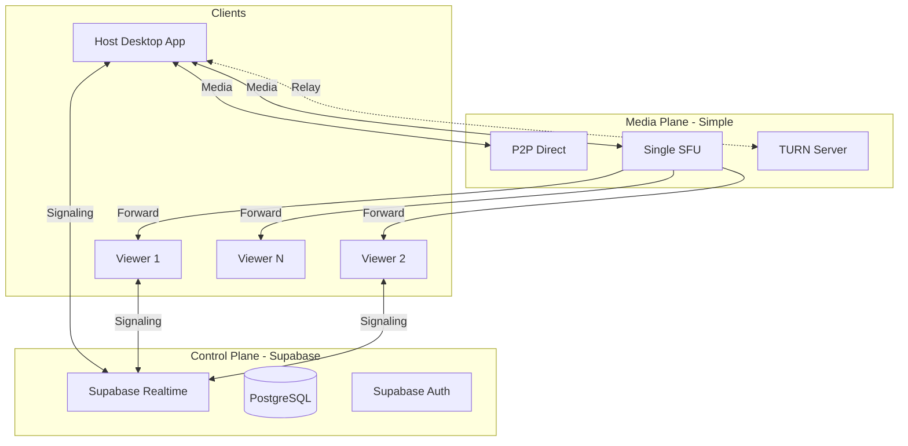
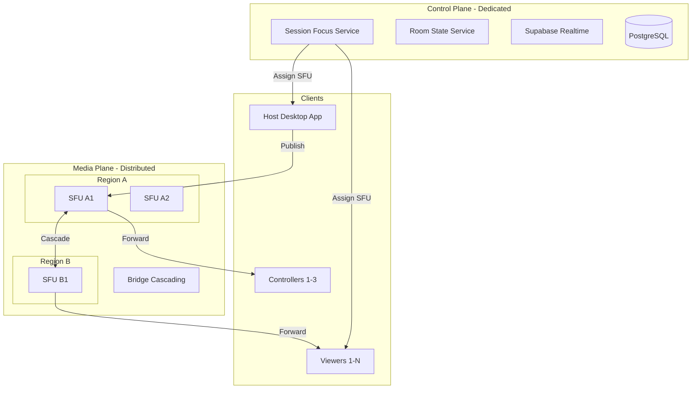
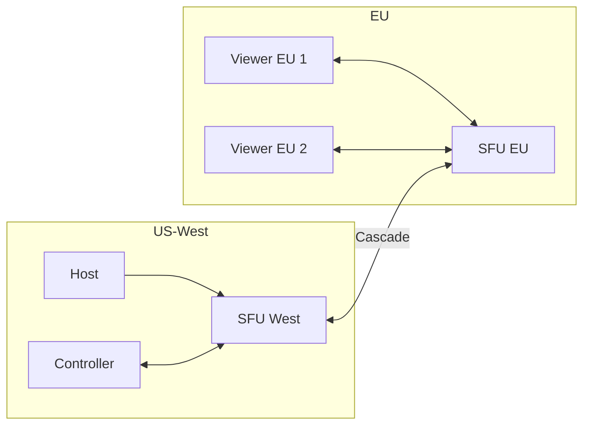

# SquadX Live Scaling Architecture

## Overview

This document outlines SquadX Live's scaling strategy, inspired by Jitsi's battle-tested architecture. The key principle: **start simple, scale when needed**.

### Philosophy

1. **Don't over-engineer early** - P2P works great for most use cases
2. **Separate concerns** - Media routing and session control are different problems
3. **Scale horizontally** - Add capacity, don't make single components bigger
4. **Encrypt by default** - Security shouldn't be an afterthought
5. **Roles matter** - Not everyone needs the same capabilities

### When to Use What

| Scenario                    | Recommended Mode | Why                                      |
| --------------------------- | ---------------- | ---------------------------------------- |
| 1:1 pair programming        | P2P              | Lowest latency, zero infrastructure cost |
| Small team review (2-5)     | P2P              | Still manageable, direct connections     |
| Demo to team (5-15)         | P2P or SFU       | SFU reduces host load                    |
| Presentation (15-50)        | SFU              | Host can't handle 50 direct streams      |
| Large event (50-500)        | Multi-SFU        | Single SFU becomes bottleneck            |
| Enterprise broadcast (500+) | Cascaded SFUs    | Regional distribution required           |

---

## Architecture at a Glance

### MVP Architecture



### Scaled Architecture



### Component Mapping

| Component         | MVP               | Scaled                  |
| ----------------- | ----------------- | ----------------------- |
| Signaling         | Supabase Realtime | Supabase Realtime       |
| Room State        | Supabase DB       | Dedicated State Service |
| Topology Decision | Client-side       | Session Focus Service   |
| Media Routing     | P2P / Single SFU  | Regional SFU Pools      |
| SFU Selection     | Manual toggle     | Automatic assignment    |
| Encryption        | DTLS/SRTP         | Optional E2EE layer     |

---

## The 5 Critical Decisions

---

## Decision 1: Media Plane vs Control Plane Separation

> **Principle**: Keep media routing separate from session orchestration. They scale differently.

### Why This Matters

- Media is bandwidth-heavy, latency-sensitive
- Control is lightweight, consistency-sensitive
- Coupling them means you can't scale one without the other
- Jitsi learned this: JVB (media) vs Jicofo/Prosody (control)

### MVP Implementation

**Media Plane:**

- P2P direct connections (default)
- Single SFU instance for larger sessions
- Self-hosted TURN for NAT traversal

**Control Plane:**

- Supabase Realtime for signaling (offer/answer/ICE)
- Supabase DB for room state (participants, roles, settings)
- Client-side logic decides P2P vs SFU

```typescript
// MVP: Client decides topology
interface SessionConfig {
  mode: 'p2p' | 'sfu';
  sfuEndpoint?: string;
}

// Control plane: Supabase handles signaling
const channel = supabase.channel(`session:${sessionId}`);
channel.on('broadcast', { event: 'signal' }, handleSignal);
```

**What you get:**

- Simple deployment (Supabase + optional SFU)
- No custom backend services
- Works for 90% of use cases

### Scaled Implementation

**Media Plane:**

- Regional SFU pools (LiveKit Cloud or self-hosted)
- Load balancer distributes sessions across SFUs
- Bridge cascading for cross-region sessions

**Control Plane:**

- Supabase Realtime still handles signaling
- Dedicated "Room State Service" for complex state
- Session Focus service assigns SFUs

```typescript
// Scaled: Server assigns SFU
interface SFUAssignment {
  sfuId: string;
  region: string;
  endpoint: string;
  token: string;
}

// Session Focus service
async function assignSFU(sessionId: string, participantRegion: string): Promise<SFUAssignment> {
  const availableSFUs = await getSFUsByRegion(participantRegion);
  const bestSFU = selectByLoad(availableSFUs);
  return {
    sfuId: bestSFU.id,
    region: bestSFU.region,
    endpoint: bestSFU.endpoint,
    token: await generateSFUToken(sessionId, bestSFU.id),
  };
}
```

### Migration Triggers

Move from MVP to Scaled when:

- [ ] Single SFU CPU consistently >70%
- [ ] Users in multiple geographic regions complain about latency
- [ ] Need >100 concurrent sessions
- [ ] Need automatic failover

---

## Decision 2: Session Controller / Orchestrator

> **Principle**: A server-side brain should decide topology, not clients.

### Why This Matters

- Clients don't know global state (other sessions, SFU load)
- Consistent decisions prevent split-brain scenarios
- Enables automatic optimization and failover
- Jitsi's Jicofo is the "conference focus" - it conducts the orchestra

### MVP Implementation

**Client-Side Decisions:**

- Host chooses P2P or SFU mode at session start
- Mode is fixed for session lifetime
- No automatic switching

```typescript
// MVP: Host makes the call
interface CreateSessionRequest {
  mode: 'p2p' | 'sfu';
  maxControllers: number;
  maxViewers: number;
}

// Simple safeguards
function validateJoin(session: Session, currentCount: number): boolean {
  if (session.mode === 'p2p' && currentCount >= 25) {
    return false; // Soft limit for P2P
  }
  return true;
}
```

**What you get:**

- No additional backend services
- Predictable behavior
- Host has full control

### Scaled Implementation

**Session Focus Service:**

- Server-side service that manages all active sessions
- Assigns SFUs based on load, region, and session requirements
- Handles SFU failover and rebalancing
- Manages host transfer and role changes

```typescript
// Session Focus Service
interface SessionFocus {
  sessionId: string;
  assignedSFU: string;
  participants: Map<string, ParticipantAssignment>;
  mode: 'p2p' | 'sfu' | 'cascaded';
}

class SessionFocusService {
  private sessions: Map<string, SessionFocus> = new Map();

  async onParticipantJoin(
    sessionId: string,
    participantId: string,
    region: string
  ): Promise<JoinResponse> {
    const session = this.sessions.get(sessionId);

    // Decide if we need to upgrade to SFU
    if (session.mode === 'p2p' && session.participants.size >= 10) {
      await this.upgradeToSFU(sessionId);
    }

    // Assign participant to best SFU
    const assignment = await this.assignParticipant(session, participantId, region);

    return {
      sfuEndpoint: assignment.endpoint,
      token: assignment.token,
      mode: session.mode,
    };
  }

  async onSFUFailure(sfuId: string): Promise<void> {
    const affectedSessions = this.getSessionsBySFU(sfuId);
    for (const session of affectedSessions) {
      await this.migrateSession(session.sessionId);
    }
  }
}
```

### Migration Triggers

Move from MVP to Scaled when:

- [ ] Need automatic P2P → SFU upgrades
- [ ] Need SFU failover without user intervention
- [ ] Need cross-region optimization
- [ ] Managing >50 concurrent sessions manually becomes painful

---

## Decision 3: Horizontal SFU Scaling

> **Principle**: Scale out with multiple SFUs, not up with bigger servers.

### Why This Matters

- Single SFU has CPU/bandwidth limits (~500-1000 participants max)
- Geographic distribution reduces latency
- Redundancy enables failover
- Jitsi uses multiple JVBs with Octor for cascading

### MVP Implementation

**Single SFU Pool:**

- One SFU instance (or small cluster)
- Manual region selection if needed
- Soft limits prevent overload

```typescript
// MVP: Single SFU configuration
const sfuConfig = {
  endpoint: process.env.SFU_ENDPOINT,
  maxParticipantsPerRoom: 100,
  maxConcurrentRooms: 50,
};

// Simple load check
async function canAcceptSession(): Promise<boolean> {
  const stats = await getSFUStats();
  return stats.currentRooms < sfuConfig.maxConcurrentRooms;
}
```

**SFU Options for MVP:**
| Option | Pros | Cons |
|--------|------|------|
| LiveKit Cloud | Managed, easy setup | Cost scales with usage |
| Self-hosted LiveKit | Full control, predictable cost | Ops overhead |
| mediasoup | Lightweight, flexible | More DIY required |

### Scaled Implementation

**Multi-Region SFU Pools:**

- SFU clusters in each major region
- Load balancer per region
- Bridge cascading for cross-region sessions

```typescript
// Scaled: Regional SFU management
interface SFUPool {
  region: string;
  instances: SFUInstance[];
  loadBalancer: string;
}

interface SFUInstance {
  id: string;
  endpoint: string;
  currentLoad: number; // 0-100
  maxCapacity: number;
  healthy: boolean;
}

class SFUManager {
  private pools: Map<string, SFUPool> = new Map();

  async selectSFU(region: string, sessionSize: number): Promise<SFUInstance> {
    const pool = this.pools.get(region) ?? this.pools.get('default');

    // Filter healthy instances with capacity
    const available = pool.instances.filter((sfu) => sfu.healthy && sfu.currentLoad < 80);

    // Select least loaded
    return available.sort((a, b) => a.currentLoad - b.currentLoad)[0];
  }

  async setupCascade(primarySFU: string, secondarySFU: string, sessionId: string): Promise<void> {
    // Connect two SFUs for cross-region forwarding
    await this.connectBridges(primarySFU, secondarySFU, sessionId);
  }
}
```

**Bridge Cascading:**



### Migration Triggers

Move from MVP to Scaled when:

- [ ] Single SFU CPU consistently >60%
- [ ] Users in 2+ geographic regions
- [ ] Need >100 viewers per session
- [ ] Require 99.9% uptime SLA

---

## Decision 4: End-to-End Encryption (E2EE)

> **Principle**: Offer E2EE as an option for sensitive sessions without breaking SFU scalability.

### Why This Matters

- Default WebRTC encryption (DTLS/SRTP) protects transport
- But SFU can see media content (it decrypts to route)
- True E2EE means even SFU can't read media
- Jitsi implements this with WebRTC Insertable Streams

### MVP Implementation

**Transport Encryption Only:**

- DTLS/SRTP encrypts all WebRTC traffic
- SFU can see media (required for routing)
- Sufficient for most use cases

```typescript
// MVP: Standard WebRTC encryption
const peerConnection = new RTCPeerConnection({
  iceServers: [...],
  // DTLS/SRTP enabled by default
});

// No additional encryption layer needed
// Media is encrypted in transit but SFU can process it
```

**What you get:**

- Zero additional complexity
- Full SFU feature support (simulcast, bandwidth estimation)
- Works in all browsers

**When this is enough:**

- Internal team collaboration
- Non-sensitive content
- Trust your infrastructure

### Scaled Implementation

**Insertable Streams E2EE:**

- Encrypt media frames before sending to SFU
- SFU forwards encrypted packets without decryption
- Only participants with key can decrypt

```typescript
// Scaled: E2EE with Insertable Streams
interface E2EEConfig {
  enabled: boolean;
  keyRotationInterval: number; // milliseconds
}

class E2EEManager {
  private encryptionKey: CryptoKey | null = null;

  async enableE2EE(sender: RTCRtpSender): Promise<void> {
    // Check browser support
    if (!('transform' in RTCRtpSender.prototype)) {
      throw new Error('E2EE not supported in this browser');
    }

    // Generate encryption key
    this.encryptionKey = await crypto.subtle.generateKey({ name: 'AES-GCM', length: 256 }, true, [
      'encrypt',
      'decrypt',
    ]);

    // Set up transform stream
    const senderStreams = (sender as any).createEncodedStreams();
    const transformStream = new TransformStream({
      transform: async (frame, controller) => {
        const encryptedFrame = await this.encryptFrame(frame);
        controller.enqueue(encryptedFrame);
      },
    });

    senderStreams.readable.pipeThrough(transformStream).pipeTo(senderStreams.writable);
  }

  private async encryptFrame(frame: RTCEncodedVideoFrame): Promise<RTCEncodedVideoFrame> {
    const iv = crypto.getRandomValues(new Uint8Array(12));
    const encrypted = await crypto.subtle.encrypt(
      { name: 'AES-GCM', iv },
      this.encryptionKey!,
      frame.data
    );

    // Prepend IV to encrypted data
    const newData = new Uint8Array(iv.length + encrypted.byteLength);
    newData.set(iv);
    newData.set(new Uint8Array(encrypted), iv.length);

    frame.data = newData.buffer;
    return frame;
  }
}
```

**Browser Support Matrix:**

| Browser      | Insertable Streams | Status        |
| ------------ | ------------------ | ------------- |
| Chrome 86+   | ✅                 | Full support  |
| Edge 86+     | ✅                 | Full support  |
| Firefox      | ❌                 | Not supported |
| Safari 15.4+ | ✅                 | Full support  |

### Migration Triggers

Add E2EE when:

- [ ] Handling sensitive/confidential content
- [ ] Enterprise customers require it
- [ ] Compliance requirements (HIPAA, etc.)
- [ ] Users explicitly request it

**Note:** E2EE is a feature toggle, not a migration. You can offer both modes.

---

## Decision 5: Role-Based Participant Model

> **Principle**: Different roles have different capabilities and resource allocations.

### Why This Matters

- Not everyone needs to send high-quality video
- Controllers need low latency; viewers can tolerate more
- Explicit roles prevent "everyone sends everything" chaos
- Enables cost optimization (viewers are cheaper than publishers)

### MVP Implementation

**Three Simple Roles:**

| Role       | Capabilities                  | Limits            |
| ---------- | ----------------------------- | ----------------- |
| Host       | Screen share, grant control   | 1 per session     |
| Controller | View, request/receive control | Max 3 per session |
| Viewer     | View only                     | ~25 P2P, 100+ SFU |

```typescript
// MVP: Simple role model
type ParticipantRole = 'host' | 'controller' | 'viewer';

interface Participant {
  id: string;
  role: ParticipantRole;
  controlState: 'none' | 'requested' | 'granted';
}

// Role-based permissions
const rolePermissions: Record<ParticipantRole, Permission[]> = {
  host: ['share_screen', 'grant_control', 'revoke_control', 'end_session'],
  controller: ['view', 'request_control', 'send_input'],
  viewer: ['view'],
};

function canPerformAction(participant: Participant, action: string): boolean {
  return rolePermissions[participant.role].includes(action as Permission);
}
```

**What you get:**

- Clear permission boundaries
- Simple UI (role determines what you see)
- Predictable resource usage

### Scaled Implementation

**Dynamic Roles with Quality Tiers:**

```typescript
// Scaled: Dynamic roles with quality allocation
interface ParticipantConfig {
  role: ParticipantRole;
  qualityTier: 'high' | 'standard' | 'low';
  maxBitrate: number;
  priority: number;
}

const roleConfigs: Record<ParticipantRole, ParticipantConfig> = {
  host: {
    role: 'host',
    qualityTier: 'high',
    maxBitrate: 4_000_000, // 4 Mbps
    priority: 1,
  },
  controller: {
    role: 'controller',
    qualityTier: 'high',
    maxBitrate: 4_000_000,
    priority: 2,
  },
  viewer: {
    role: 'viewer',
    qualityTier: 'standard',
    maxBitrate: 2_000_000, // 2 Mbps
    priority: 3,
  },
};

// Bandwidth allocation under congestion
class BandwidthAllocator {
  allocate(participants: Participant[], availableBandwidth: number): Map<string, number> {
    const allocations = new Map<string, number>();

    // Sort by priority
    const sorted = [...participants].sort(
      (a, b) => roleConfigs[a.role].priority - roleConfigs[b.role].priority
    );

    let remaining = availableBandwidth;
    for (const p of sorted) {
      const config = roleConfigs[p.role];
      const allocation = Math.min(config.maxBitrate, remaining / sorted.length);
      allocations.set(p.id, allocation);
      remaining -= allocation;
    }

    return allocations;
  }
}
```

**Host Transfer:**

```typescript
// Scaled: Dynamic host transfer
async function transferHost(sessionId: string, newHostId: string): Promise<void> {
  const session = await getSession(sessionId);
  const currentHost = session.participants.find((p) => p.role === 'host');
  const newHost = session.participants.find((p) => p.id === newHostId);

  if (!newHost || newHost.role === 'viewer') {
    throw new Error('New host must be a controller');
  }

  // Update roles
  await updateParticipantRole(sessionId, currentHost.id, 'controller');
  await updateParticipantRole(sessionId, newHostId, 'host');

  // Notify all participants
  await broadcastRoleChange(sessionId, {
    previousHost: currentHost.id,
    newHost: newHostId,
  });

  // New host needs to start screen sharing
  // (handled client-side after notification)
}
```

### Migration Triggers

Move from MVP to Scaled when:

- [ ] Need dynamic host transfer
- [ ] Need quality differentiation by role
- [ ] Need bandwidth allocation policies
- [ ] Enterprise customers need custom roles

---

## Cost Implications

### Tier 1: MVP - P2P Focus

**Monthly Cost: ~$50-150**

| Component     | Service              | Cost        |
| ------------- | -------------------- | ----------- |
| Control Plane | Supabase Pro         | $25/month   |
| TURN Server   | DigitalOcean Droplet | $24/month   |
| Web Hosting   | Railway/Vercel       | $0-20/month |
| Domain + SSL  | Cloudflare           | $10/year    |

**What you're paying for:**

- Supabase handles auth, DB, and realtime signaling
- TURN server for NAT traversal (only used when P2P fails)
- No SFU costs - media goes directly between peers

**Best for:**

- <1,000 monthly active users
- <50 concurrent sessions
- Sessions with <10 participants each

**What you can skip:**

- SFU infrastructure
- Multi-region deployment
- Dedicated orchestrator

---

### Tier 2: SFU-Enabled

**Monthly Cost: ~$200-600**

| Component     | Service                      | Cost           |
| ------------- | ---------------------------- | -------------- |
| Control Plane | Supabase Pro                 | $25/month      |
| SFU           | LiveKit Cloud or self-hosted | $100-400/month |
| TURN Server   | DigitalOcean Droplet         | $24/month      |
| Web Hosting   | Railway                      | $20/month      |

**SFU Cost Breakdown:**

| Option                  | Pricing Model          | Estimated Cost          |
| ----------------------- | ---------------------- | ----------------------- |
| LiveKit Cloud           | Per participant-minute | ~$0.004/min             |
| Self-hosted LiveKit     | Server cost            | $100-200/month (4 vCPU) |
| mediasoup (self-hosted) | Server cost            | $100-200/month          |

**What you're paying for:**

- SFU offloads host bandwidth
- Supports larger sessions (50-100 viewers)
- Better quality consistency

**Best for:**

- 1,000-10,000 monthly active users
- <200 concurrent sessions
- Sessions with 10-100 participants

**What you can skip:**

- Multi-region SFUs
- Bridge cascading
- Dedicated orchestrator

---

### Tier 3: Multi-Region

**Monthly Cost: ~$1,000-3,000**

| Component     | Service                       | Cost             |
| ------------- | ----------------------------- | ---------------- |
| Control Plane | Supabase Pro + Edge Functions | $50-100/month    |
| SFU Pools     | 2-3 regions × 2 instances     | $600-1,500/month |
| Session Focus | Railway service               | $50-100/month    |
| TURN Servers  | 2-3 regions                   | $75-150/month    |
| Monitoring    | Datadog/Grafana               | $100-200/month   |

**What you're paying for:**

- Low latency for global users
- Automatic failover
- Server-side orchestration
- Professional monitoring

**Best for:**

- 10,000-100,000 monthly active users
- Global user base
- 99.9% uptime requirements

**What you can skip:**

- Bridge cascading (unless single sessions span regions)
- E2EE (unless required)
- Custom SFU modifications

---

### Tier 4: Enterprise Scale

**Monthly Cost: $5,000+**

| Component           | Service                  | Cost          |
| ------------------- | ------------------------ | ------------- |
| Control Plane       | Dedicated infrastructure | $500+/month   |
| SFU Pools           | 5+ regions, auto-scaling | $2,000+/month |
| Bridge Cascading    | Cross-region mesh        | $500+/month   |
| E2EE Infrastructure | Key management           | $200+/month   |
| 24/7 Monitoring     | Full observability stack | $500+/month   |
| Support             | On-call engineering      | Variable      |

**What you're paying for:**

- Massive scale (1000+ concurrent sessions)
- Enterprise SLAs
- E2EE for compliance
- Dedicated support

**Best for:**

- 100,000+ monthly active users
- Enterprise customers
- Compliance requirements (HIPAA, SOC2)

---

### Cost Optimization Tips

1. **Start with P2P** - It's free and works for most sessions
2. **Use SFU selectively** - Only for sessions that need it
3. **Right-size SFU instances** - Don't over-provision
4. **Monitor actual usage** - Scale based on data, not fear
5. **Consider LiveKit Cloud** - Pay-per-use beats fixed costs at low scale
6. **Self-host at scale** - Fixed costs beat per-minute at high scale

---

## Implementation Roadmap

### Phase 1: MVP (Current)

**Architecture:**

- P2P default, SFU toggle
- Supabase for everything
- Single TURN server

**Capabilities:**

- 1 host + up to 25 viewers (P2P)
- 1 host + up to 100 viewers (SFU)
- Manual mode selection

**Focus:**

- Get core functionality working
- Validate product-market fit
- Keep infrastructure simple

---

### Phase 2: SFU Hardening

**Trigger:** Consistent demand for >10 viewer sessions

**Changes:**

- Deploy dedicated SFU (LiveKit recommended)
- Add SFU health monitoring
- Implement automatic P2P → SFU suggestion

**New Capabilities:**

- Reliable 100+ viewer sessions
- Better quality consistency
- Basic analytics

---

### Phase 3: Multi-Region

**Trigger:** Users in multiple continents, latency complaints

**Changes:**

- Deploy SFU in 2-3 regions
- Add Session Focus service
- Implement automatic region selection

**New Capabilities:**

- <100ms latency globally
- Automatic failover
- Region-aware routing

---

### Phase 4: E2EE Option

**Trigger:** Enterprise customers, compliance requirements

**Changes:**

- Implement Insertable Streams encryption
- Add key exchange protocol
- Create E2EE toggle in UI

**New Capabilities:**

- True end-to-end encryption
- Compliance-ready
- Privacy-focused option

---

### Phase 5: Large-Scale Events

**Trigger:** Demand for 500+ viewer sessions

**Changes:**

- Implement bridge cascading
- Add dynamic scaling
- Optimize for broadcast scenarios

**New Capabilities:**

- 1000+ viewer sessions
- Cross-region single sessions
- Broadcast mode

---

## What NOT to Build Until Needed

| Feature               | Build When                   | Not Before                 |
| --------------------- | ---------------------------- | -------------------------- |
| Multi-region SFU      | Users in 2+ continents       | Single region works        |
| Session Focus service | >50 concurrent sessions      | Manual works               |
| Bridge cascading      | >500 viewers per session     | Single SFU works           |
| E2EE                  | Enterprise/compliance demand | Transport encryption works |
| Custom SFU            | Unique requirements          | LiveKit/mediasoup work     |
| Auto-scaling          | Unpredictable load spikes    | Fixed capacity works       |

---

## Appendix: SFU Comparison

### LiveKit

**Pros:**

- Modern, well-documented
- Cloud offering available
- Good TypeScript SDK
- Active development

**Cons:**

- Newer, smaller community
- Cloud pricing can add up

**Best for:** Teams wanting managed option with self-host path

### mediasoup

**Pros:**

- Lightweight, flexible
- Large community
- Battle-tested
- No licensing costs

**Cons:**

- More DIY required
- Node.js only (C++ addon)
- Steeper learning curve

**Best for:** Teams with WebRTC expertise wanting full control

### Janus

**Pros:**

- Very mature
- Plugin architecture
- Supports many protocols

**Cons:**

- C codebase
- Complex configuration
- Heavier weight

**Best for:** Complex multi-protocol scenarios

### Recommendation

**Start with LiveKit** - best balance of ease and capability. Migrate to self-hosted mediasoup if you need more control or cost optimization at scale.

---

## Related Documentation

- [ARCHITECTURE.md](./ARCHITECTURE.md) - Overall system architecture
- [WEBRTC-FLOW.md](./WEBRTC-FLOW.md) - WebRTC implementation details
- [SECURITY.md](./SECURITY.md) - Security model and practices
