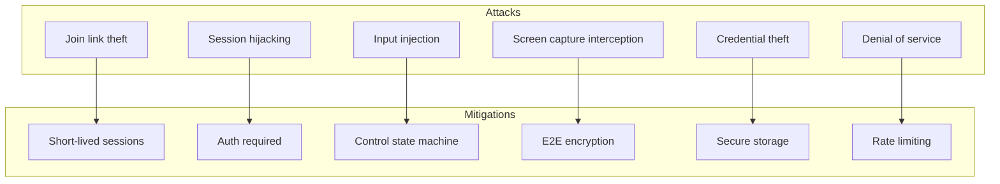
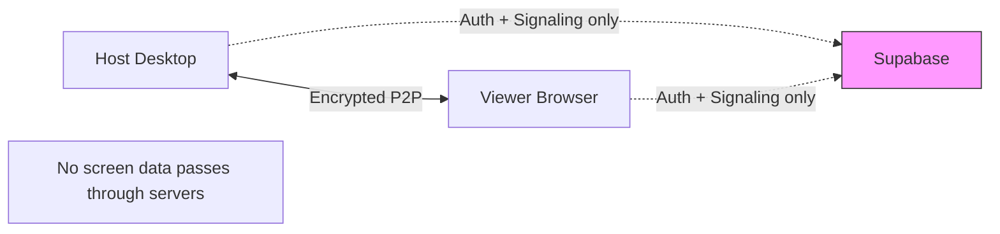

# PairUX Security Model

## Overview

This document details the security architecture, threat model, and security controls for PairUX. Security is a core design principle given the sensitive nature of screen sharing and remote control.

---

## Security Principles

1. **Explicit Consent**: All control requires explicit host approval
2. **Minimal Trust**: Viewers are untrusted by default
3. **Defense in Depth**: Multiple layers of security controls
4. **Transparency**: Clear visual indicators of security state
5. **No Server-Side Data**: Media never passes through servers
6. **End-to-End Encryption**: All WebRTC traffic is encrypted

---

## Threat Model

### Assets to Protect

| Asset            | Sensitivity | Protection Priority |
| ---------------- | ----------- | ------------------- |
| Screen content   | High        | Critical            |
| Keyboard input   | High        | Critical            |
| User credentials | High        | Critical            |
| Session metadata | Medium      | High                |
| User identity    | Medium      | High                |

### Threat Actors

| Actor              | Capability       | Motivation                  |
| ------------------ | ---------------- | --------------------------- |
| Malicious viewer   | Has join link    | Unauthorized access/control |
| Network attacker   | MITM position    | Eavesdropping, injection    |
| Compromised server | Backend access   | Data exfiltration           |
| Malicious host     | Runs desktop app | Social engineering          |

### Attack Vectors



---

## Authentication Security

### Supabase Auth Configuration

```typescript
// Recommended Supabase auth settings
const authConfig = {
  // Password requirements
  passwordMinLength: 8,
  passwordRequireUppercase: true,
  passwordRequireNumber: true,

  // Session settings
  sessionExpirySeconds: 3600, // 1 hour
  refreshTokenRotation: true,

  // Rate limiting
  maxLoginAttempts: 5,
  lockoutDurationMinutes: 15,
};
```

### Token Storage

**Desktop App (Electron)**:

```typescript
import { safeStorage } from 'electron';

class SecureTokenStorage {
  private readonly KEY = 'pairux_auth_token';

  async store(token: string): Promise<void> {
    if (!safeStorage.isEncryptionAvailable()) {
      throw new Error('Secure storage not available');
    }

    const encrypted = safeStorage.encryptString(token);
    // Store encrypted buffer in electron-store or similar
    await this.storage.set(this.KEY, encrypted.toString('base64'));
  }

  async retrieve(): Promise<string | null> {
    const encrypted = await this.storage.get(this.KEY);
    if (!encrypted) return null;

    const buffer = Buffer.from(encrypted, 'base64');
    return safeStorage.decryptString(buffer);
  }

  async clear(): Promise<void> {
    await this.storage.delete(this.KEY);
  }
}
```

**Web App**:

```typescript
// Use httpOnly cookies set by Supabase
// Never store tokens in localStorage for sensitive apps
```

### Session Validation

```typescript
class SessionValidator {
  async validateSession(sessionId: string, userId: string): Promise<boolean> {
    // Check session exists and is active
    const { data: session } = await supabase
      .from('sessions')
      .select('*')
      .eq('id', sessionId)
      .eq('status', 'active')
      .single();

    if (!session) return false;

    // Check user is host or authorized participant
    if (session.host_user_id === userId) return true;

    const { data: participant } = await supabase
      .from('session_participants')
      .select('*')
      .eq('session_id', sessionId)
      .eq('user_id', userId)
      .single();

    return !!participant;
  }
}
```

---

## WebRTC Security

### DTLS-SRTP Encryption

WebRTC provides mandatory encryption:

- **DTLS**: Encrypts data channel communication
- **SRTP**: Encrypts media (video/audio) streams
- **Key Exchange**: Performed during DTLS handshake

```typescript
// WebRTC encryption is automatic, but verify configuration
const pc = new RTCPeerConnection({
  iceServers: [...],
  // These are defaults but explicit for clarity
  bundlePolicy: 'max-bundle',
  rtcpMuxPolicy: 'require',
});

// Verify encryption is active
pc.onconnectionstatechange = () => {
  if (pc.connectionState === 'connected') {
    // Get stats to verify encryption
    pc.getStats().then(stats => {
      stats.forEach(report => {
        if (report.type === 'transport') {
          console.log('DTLS state:', report.dtlsState);
          console.log('SRTP cipher:', report.srtpCipher);
        }
      });
    });
  }
};
```

### Fingerprint Verification (Optional)

For high-security scenarios, verify DTLS fingerprints:

```typescript
// Host generates fingerprint from local description
function getLocalFingerprint(pc: RTCPeerConnection): string | null {
  const sdp = pc.localDescription?.sdp;
  if (!sdp) return null;

  const match = sdp.match(/a=fingerprint:sha-256 ([A-F0-9:]+)/i);
  return match ? match[1] : null;
}

// Display fingerprint for out-of-band verification
// Users can compare fingerprints verbally or via secure channel
```

### TURN Server Security

```ini
# coturn configuration for security
# /etc/turnserver.conf

# Use TLS
tls-listening-port=5349
cert=/etc/ssl/turn.pem
pkey=/etc/ssl/turn.key

# Authentication
lt-cred-mech
use-auth-secret
static-auth-secret=YOUR_STRONG_SECRET

# Restrict relay
min-port=49152
max-port=65535
no-multicast-peers

# Logging for audit
log-file=/var/log/turnserver.log
verbose

# Rate limiting
user-quota=12
total-quota=1200
max-bps=1000000
```

### Time-Limited TURN Credentials

```typescript
import crypto from 'crypto';

function generateTurnCredentials(
  username: string,
  secret: string,
  ttlSeconds: number = 3600
): { username: string; credential: string } {
  const timestamp = Math.floor(Date.now() / 1000) + ttlSeconds;
  const turnUsername = `${timestamp}:${username}`;

  const hmac = crypto.createHmac('sha1', secret);
  hmac.update(turnUsername);
  const credential = hmac.digest('base64');

  return { username: turnUsername, credential };
}
```

---

## Control Security

### Control State Enforcement

```typescript
class SecureControlManager {
  private controlState: ControlState = 'view-only';
  private inputInjector: InputInjector;

  constructor(inputInjector: InputInjector) {
    this.inputInjector = inputInjector;
    // Ensure injector starts disabled
    this.inputInjector.disable();
  }

  grantControl(): void {
    this.controlState = 'granted';
    this.inputInjector.enable();
    this.logSecurityEvent('control_granted');
  }

  revokeControl(): void {
    this.controlState = 'view-only';
    this.inputInjector.disable();
    this.logSecurityEvent('control_revoked');
  }

  handleInputEvent(event: InputEvent): void {
    // Double-check state before processing
    if (this.controlState !== 'granted') {
      this.logSecurityEvent('unauthorized_input_attempt', event);
      return;
    }

    // Validate event
    if (!this.validateEvent(event)) {
      this.logSecurityEvent('invalid_input_event', event);
      return;
    }

    // Rate limit
    if (!this.rateLimiter.allow()) {
      this.logSecurityEvent('rate_limit_exceeded');
      return;
    }

    this.inputInjector.handleEvent(event);
  }

  private validateEvent(event: InputEvent): boolean {
    // Coordinate bounds check
    if (event.type === 'mouse') {
      if (event.x < 0 || event.x > 1 || event.y < 0 || event.y > 1) {
        return false;
      }
    }

    // Block dangerous key combinations
    if (event.type === 'keyboard') {
      if (this.isDangerousKeyCombination(event)) {
        return false;
      }
    }

    return true;
  }

  private isDangerousKeyCombination(event: KeyboardEvent): boolean {
    // Block Ctrl+Alt+Delete, Win+L, etc.
    const dangerous = [
      { ctrl: true, alt: true, key: 'Delete' },
      { meta: true, key: 'l' },
      { ctrl: true, alt: true, key: 'F4' },
    ];

    return dangerous.some(
      (combo) =>
        event.modifiers.ctrl === (combo.ctrl || false) &&
        event.modifiers.alt === (combo.alt || false) &&
        event.modifiers.meta === (combo.meta || false) &&
        event.key.toLowerCase() === combo.key.toLowerCase()
    );
  }

  private logSecurityEvent(type: string, data?: any): void {
    console.log(`[SECURITY] ${type}`, data);
    // In production, send to logging service
  }
}
```

### Emergency Revoke

```typescript
class EmergencyRevokeSystem {
  private readonly HOTKEY = 'CommandOrControl+Shift+Escape';
  private controlManager: SecureControlManager;

  register(): void {
    // Register global hotkey that cannot be overridden
    globalShortcut.register(this.HOTKEY, () => {
      this.emergencyRevoke();
    });

    // Also listen for physical panic button if available
    this.setupHardwarePanicButton();
  }

  private emergencyRevoke(): void {
    // Immediately disable all input
    this.controlManager.revokeControl();

    // Close data channel to prevent further input
    this.dataChannel?.close();

    // Show prominent notification
    this.showEmergencyNotification();

    // Log security event
    this.logSecurityEvent('emergency_revoke');
  }

  private showEmergencyNotification(): void {
    // Show system notification
    new Notification('PairUX', {
      body: 'Remote control has been revoked',
      urgency: 'critical',
    });

    // Also show in-app notification
    this.emit('emergency-revoke');
  }
}
```

---

## OS Permission Security

### macOS Permissions

```typescript
import { systemPreferences } from 'electron';

class MacOSPermissions {
  async checkAllPermissions(): Promise<PermissionStatus> {
    return {
      screenRecording: await this.checkScreenRecording(),
      accessibility: this.checkAccessibility(),
    };
  }

  private async checkScreenRecording(): Promise<boolean> {
    const status = systemPreferences.getMediaAccessStatus('screen');
    return status === 'granted';
  }

  private checkAccessibility(): boolean {
    return systemPreferences.isTrustedAccessibilityClient(false);
  }

  async requestPermissions(): Promise<void> {
    // Screen recording - must be granted in System Preferences
    if (!(await this.checkScreenRecording())) {
      // Open System Preferences
      shell.openExternal(
        'x-apple.systempreferences:com.apple.preference.security?Privacy_ScreenCapture'
      );
    }

    // Accessibility - can prompt
    if (!this.checkAccessibility()) {
      systemPreferences.isTrustedAccessibilityClient(true);
    }
  }
}

interface PermissionStatus {
  screenRecording: boolean;
  accessibility: boolean;
}
```

### Windows Security

```typescript
class WindowsSecurity {
  // Check if running as admin (may be needed for some apps)
  isAdmin(): boolean {
    try {
      execSync('net session', { stdio: 'ignore' });
      return true;
    } catch {
      return false;
    }
  }

  // Windows Defender may flag the app
  async checkDefenderExclusion(): Promise<boolean> {
    // Check if app is excluded from Windows Defender
    // This requires admin privileges
    return false; // Implement based on needs
  }
}
```

### Linux Security

```typescript
class LinuxSecurity {
  getDisplayServer(): 'x11' | 'wayland' | 'unknown' {
    if (process.env.XDG_SESSION_TYPE === 'wayland') return 'wayland';
    if (process.env.XDG_SESSION_TYPE === 'x11') return 'x11';
    if (process.env.WAYLAND_DISPLAY) return 'wayland';
    if (process.env.DISPLAY) return 'x11';
    return 'unknown';
  }

  checkWaylandSupport(): boolean {
    // Wayland has stricter security - may limit functionality
    const displayServer = this.getDisplayServer();
    if (displayServer === 'wayland') {
      console.warn('Wayland detected - some features may be limited');
      return false;
    }
    return true;
  }
}
```

---

## Data Security

### No Server-Side Media Storage



### Session Data Retention

```sql
-- Minimal data retention policy
-- sessions table
CREATE TABLE sessions (
  id UUID PRIMARY KEY,
  host_user_id UUID REFERENCES auth.users,
  status TEXT,
  created_at TIMESTAMPTZ DEFAULT NOW(),
  ended_at TIMESTAMPTZ,
  -- No screen content stored
  -- No input events stored
);

-- Auto-delete old sessions
CREATE OR REPLACE FUNCTION cleanup_old_sessions()
RETURNS void AS $$
BEGIN
  DELETE FROM sessions
  WHERE ended_at < NOW() - INTERVAL '30 days';
END;
$$ LANGUAGE plpgsql;
```

### Secure Logging

```typescript
class SecureLogger {
  // Never log sensitive data
  private readonly REDACTED_FIELDS = [
    'password',
    'token',
    'credential',
    'sdp', // Contains ICE credentials
  ];

  log(level: string, message: string, data?: any): void {
    const sanitized = this.sanitize(data);
    console.log(`[${level}] ${message}`, sanitized);
  }

  private sanitize(data: any): any {
    if (!data) return data;
    if (typeof data !== 'object') return data;

    const result = { ...data };
    for (const field of this.REDACTED_FIELDS) {
      if (field in result) {
        result[field] = '[REDACTED]';
      }
    }
    return result;
  }
}
```

---

## Visual Security Indicators

### Control State Indicators

```typescript
// Always show clear visual indicator when control is active
class SecurityIndicator {
  private indicator: BrowserWindow | null = null;

  showControlActive(): void {
    // Create always-on-top indicator
    this.indicator = new BrowserWindow({
      width: 200,
      height: 40,
      x: 10,
      y: 10,
      frame: false,
      alwaysOnTop: true,
      skipTaskbar: true,
      transparent: true,
      focusable: false,
    });

    this.indicator.loadURL(`data:text/html,
      <div style="
        background: #EF4444;
        color: white;
        padding: 8px 16px;
        border-radius: 8px;
        font-family: system-ui;
        font-weight: bold;
      ">
        🔴 Remote Control Active
      </div>
    `);
  }

  hideControlActive(): void {
    this.indicator?.close();
    this.indicator = null;
  }
}
```

### Tray Icon States

| State           | Icon     | Tooltip                        |
| --------------- | -------- | ------------------------------ |
| Idle            | Default  | PairUX - No active session     |
| Session active  | Blue dot | PairUX - Sharing screen        |
| Control granted | Red dot  | PairUX - Remote control active |

---

## Security Audit Checklist

### Pre-Release Checklist

- [ ] All WebRTC connections use DTLS-SRTP
- [ ] TURN server uses TLS and authentication
- [ ] Tokens stored securely (safeStorage on desktop)
- [ ] No sensitive data in logs
- [ ] Control state machine properly enforced
- [ ] Emergency revoke hotkey works globally
- [ ] Visual indicators show when control is active
- [ ] Rate limiting on input events
- [ ] Dangerous key combinations blocked
- [ ] Session cleanup implemented
- [ ] Code signing configured for all platforms

### Penetration Testing Areas

1. **Authentication bypass**
   - Session token theft
   - Join link enumeration
2. **Control bypass**
   - Input injection without grant
   - State machine manipulation
3. **Data interception**
   - WebRTC traffic analysis
   - Signaling message tampering
4. **Denial of service**
   - Input flooding
   - Connection exhaustion

---

## Incident Response

### Security Event Types

| Event                      | Severity | Response          |
| -------------------------- | -------- | ----------------- |
| Unauthorized input attempt | Medium   | Log, alert host   |
| Rate limit exceeded        | Low      | Temporary block   |
| Invalid session access     | High     | Terminate session |
| Emergency revoke triggered | Info     | Log for audit     |

### Incident Handling

```typescript
class IncidentHandler {
  async handleSecurityIncident(incident: SecurityIncident): Promise<void> {
    // Log incident
    await this.logIncident(incident);

    // Take immediate action based on severity
    switch (incident.severity) {
      case 'critical':
        await this.terminateSession(incident.sessionId);
        await this.notifyHost(incident);
        break;
      case 'high':
        await this.revokeControl(incident.sessionId);
        await this.notifyHost(incident);
        break;
      case 'medium':
        await this.notifyHost(incident);
        break;
      case 'low':
        // Log only
        break;
    }
  }
}
```

---

## Compliance Considerations

### GDPR

- Minimal data collection
- Clear consent for screen sharing
- Data deletion on session end
- No cross-border data transfer (P2P)

### SOC 2

- Access controls (authentication)
- Encryption in transit (WebRTC)
- Audit logging
- Incident response procedures

### HIPAA (if applicable)

- End-to-end encryption
- Access controls
- Audit trails
- BAA with Supabase if storing PHI
