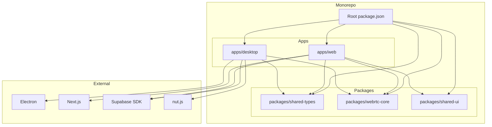

# SquadX Live Technology Stack

## Overview

This document details the technology choices for SquadX Live and the rationale behind each decision.

---

## Monorepo Tooling

### Package Manager: pnpm

**Choice**: pnpm v8+

**Rationale**:

- Efficient disk space usage via content-addressable storage
- Strict dependency resolution prevents phantom dependencies
- Native workspace support
- Faster than npm/yarn for monorepos
- Works well with Turborepo

**Alternatives Considered**:
| Tool | Rejected Because |
|------|------------------|
| npm | Slower, no workspace hoisting control |
| yarn | Berry complexity, pnpm is faster |

### Build System: Turborepo

**Choice**: Turborepo v2+

**Rationale**:

- Incremental builds with caching
- Parallel task execution
- Simple configuration
- Works seamlessly with pnpm workspaces
- Remote caching available (optional)

**Configuration** (`turbo.json`):

```json
{
  "$schema": "https://turbo.build/schema.json",
  "tasks": {
    "build": {
      "dependsOn": ["^build"],
      "outputs": ["dist/**", ".next/**"]
    },
    "dev": {
      "cache": false,
      "persistent": true
    },
    "lint": {},
    "test": {
      "dependsOn": ["build"]
    }
  }
}
```

**Alternatives Considered**:
| Tool | Rejected Because |
|------|------------------|
| Nx | More complex, overkill for this project size |
| Lerna | Deprecated in favor of native workspace tools |
| Rush | Microsoft-specific, steeper learning curve |

---

## Desktop Application

### Framework: Electron

**Choice**: Electron v28+ (latest stable)

**Rationale**:

- Required for native screen capture APIs
- Required for system-level input injection
- Cross-platform (macOS, Windows, Linux)
- Mature ecosystem
- Good TypeScript support
- Built-in auto-updater

**Key Electron APIs Used**:

- `desktopCapturer` - Screen/window capture
- `systemPreferences` - Permission checks
- `globalShortcut` - Emergency revoke hotkey
- `Tray` - System tray integration
- `safeStorage` - Secure credential storage
- `autoUpdater` - App updates

**Alternatives Considered**:
| Tool | Rejected Because |
|------|------------------|
| Tauri | No mature screen capture API, Rust complexity |
| NW.js | Less active development, smaller ecosystem |
| Flutter Desktop | No native screen capture, immature |

### Input Injection: nut.js

**Choice**: nut.js v4+

**Rationale**:

- Cross-platform mouse/keyboard automation
- Active maintenance
- TypeScript support
- Handles screen coordinate translation
- Supports all required input types

**Capabilities**:

```typescript
import { mouse, keyboard, screen } from '@nut-tree/nut-js';

// Mouse control
await mouse.move([{ x: 100, y: 200 }]);
await mouse.click(Button.LEFT);
await mouse.scroll(0, -5); // Scroll up

// Keyboard control
await keyboard.type('Hello');
await keyboard.pressKey(Key.Enter);
await keyboard.releaseKey(Key.Enter);
```

**Alternatives Considered**:
| Tool | Rejected Because |
|------|------------------|
| robotjs | Unmaintained, build issues |
| node-key-sender | Windows only |
| Native modules | Too much platform-specific code |

### Desktop UI: React + Vite

**Choice**: React 18 + Vite for Electron renderer

**Rationale**:

- Fast HMR during development
- Modern build tooling
- Consistent with web app (code sharing)
- Large ecosystem

**Note**: The PRD mentions React 16.2.1 for the web app. We'll use React 18 for the desktop app since it's isolated, but can downgrade if strict consistency is required.

---

## Web Application

### Framework: Next.js

**Choice**: Next.js 16.2 (latest stable)

**Rationale**:

- Server-side rendering for SEO
- App Router for modern patterns
- API routes if needed
- Image optimization
- Built-in performance optimizations
- Vercel deployment integration

**Key Features Used**:

- App Router (`/app` directory)
- Server Components (marketing pages)
- Client Components (viewer UI)
- Metadata API (SEO)
- Static generation (marketing pages)

### Styling: Tailwind CSS

**Choice**: Tailwind CSS v3+

**Rationale**:

- Utility-first approach
- Consistent design system
- Small production bundle (purged)
- Works well with React
- Easy responsive design

**Configuration**:

```javascript
// tailwind.config.js
module.exports = {
  content: ['./src/**/*.{js,ts,jsx,tsx}'],
  theme: {
    extend: {
      colors: {
        primary: '#3B82F6',
        secondary: '#10B981',
      },
    },
  },
  plugins: [],
};
```

### UI Components: shadcn/ui

**Choice**: shadcn/ui (copy-paste components)

**Rationale**:

- Not a dependency, just source code
- Built on Radix UI primitives
- Accessible by default
- Customizable
- Tailwind-based

**Components to Use**:

- Button, Input, Dialog
- Dropdown, Tabs
- Toast notifications
- Card layouts

---

## WebRTC

### Implementation: Native Browser APIs

**Choice**: Native WebRTC APIs (RTCPeerConnection)

**Rationale**:

- No additional dependencies
- Full control over configuration
- Works in Electron and browsers
- Standard, well-documented

**Key APIs**:

```typescript
// Peer connection
const pc = new RTCPeerConnection({
  iceServers: [
    { urls: 'stun:stun.l.google.com:19302' },
    { urls: 'turn:turn.squadx-live.com:3478', username: '...', credential: '...' },
  ],
});

// Media track (screen share)
const stream = await navigator.mediaDevices.getDisplayMedia({
  video: { cursor: 'always' },
  audio: false,
});
pc.addTrack(stream.getVideoTracks()[0], stream);

// Data channel (input events)
const dc = pc.createDataChannel('input', { ordered: true });
```

### Wrapper Library: simple-peer (Optional)

**Choice**: Consider simple-peer for simplified API

**Rationale**:

- Abstracts WebRTC complexity
- Handles offer/answer exchange
- Simpler event handling
- Well-tested

**Trade-off**: Less control, but faster development

---

## Backend Services

### Platform: Supabase Cloud

**Choice**: Supabase (managed)

**Rationale**:

- Integrated auth + database + realtime
- PostgreSQL underneath
- Row Level Security
- Realtime subscriptions for signaling
- Generous free tier
- Self-hostable if needed later

**Services Used**:

| Service  | Purpose                     |
| -------- | --------------------------- |
| Auth     | User authentication         |
| Database | Session/participant storage |
| Realtime | WebRTC signaling            |
| Storage  | (Future) Session recordings |

### Signaling: Supabase Realtime

**Choice**: Supabase Realtime Channels

**Rationale**:

- No custom signaling server needed
- Built-in presence
- Scales automatically
- Integrated with auth

**Channel Structure**:

```typescript
// Session channel
const channel = supabase.channel(`session:${sessionId}`);

// Broadcast signaling messages
channel.send({
  type: 'broadcast',
  event: 'signal',
  payload: { type: 'offer', sdp: '...' },
});

// Listen for signals
channel.on('broadcast', { event: 'signal' }, (payload) => {
  // Handle offer/answer/ice-candidate
});
```

---

## TURN Server

### Software: coturn

**Choice**: Self-hosted coturn

**Rationale**:

- Open source, battle-tested
- Full control over infrastructure
- No per-minute costs
- Already familiar (bittorrented.com)

**Deployment**:

- Docker container or bare metal
- TLS certificates required
- Firewall rules for UDP/TCP ports

**Configuration** (`turnserver.conf`):

```ini
listening-port=3478
tls-listening-port=5349
realm=squadx-live.com
server-name=turn.squadx-live.com

# Authentication
lt-cred-mech
user=squadx-live:password

# TLS
cert=/etc/ssl/turn.pem
pkey=/etc/ssl/turn.key

# Logging
log-file=/var/log/turnserver.log
```

**Alternatives Considered**:
| Service | Rejected Because |
|---------|------------------|
| Twilio TURN | Per-minute costs add up |
| Xirsys | Same cost concerns |
| Metered.ca | Less control |

---

## Development Tools

### Language: TypeScript

**Choice**: TypeScript 5+

**Rationale**:

- Type safety across codebase
- Better IDE support
- Catches errors at compile time
- Self-documenting code
- Required for shared packages

**Configuration** (`tsconfig.json` base):

```json
{
  "compilerOptions": {
    "target": "ES2022",
    "module": "ESNext",
    "moduleResolution": "bundler",
    "strict": true,
    "esModuleInterop": true,
    "skipLibCheck": true,
    "declaration": true
  }
}
```

### Linting: ESLint + Prettier

**Choice**: ESLint v8 + Prettier

**Rationale**:

- Industry standard
- Consistent code style
- Catches common errors
- Auto-fixable

**Plugins**:

- `@typescript-eslint`
- `eslint-plugin-react`
- `eslint-plugin-react-hooks`
- `eslint-config-prettier`

### Testing

**Unit Tests**: Vitest

- Fast, Vite-native
- Jest-compatible API
- TypeScript support

**E2E Tests**: Playwright

- Cross-browser testing
- Electron support
- Visual regression

**Component Tests**: React Testing Library

- User-centric testing
- Works with Vitest

---

## CI/CD

### Platform: GitHub Actions

**Choice**: GitHub Actions

**Rationale**:

- Integrated with GitHub
- Matrix builds for cross-platform
- Good caching support
- Free for public repos

**Key Workflows**:

1. PR checks (lint, build, test)
2. Web deploy (Vercel)
3. Desktop release (electron-builder)
4. Package manager updates

### Desktop Packaging: electron-builder

**Choice**: electron-builder

**Rationale**:

- All-in-one packaging solution
- Code signing support
- Auto-update support
- Multiple output formats

**Output Formats**:
| Platform | Formats |
|----------|---------|
| macOS | DMG, PKG |
| Windows | MSI, NSIS |
| Linux | DEB, RPM, AppImage |

---

## Shared Packages

### packages/shared-types

**Purpose**: TypeScript type definitions

**Contents**:

```typescript
// Session types
export interface Session { ... }
export interface Participant { ... }

// WebRTC types
export interface SignalMessage { ... }
export interface InputEvent { ... }

// Control types
export type ControlState = 'view-only' | 'requested' | 'granted' | 'revoked';
```

### packages/shared-ui (Optional)

**Purpose**: Shared React components

**Contents**:

- Button, Input components
- Status indicators
- Loading states

**Note**: May not be needed if web and desktop UIs diverge significantly.

### packages/webrtc-core

**Purpose**: WebRTC utilities

**Contents**:

```typescript
// Connection management
export class PeerConnectionManager { ... }

// Signaling helpers
export function createOffer(): Promise<RTCSessionDescriptionInit>;
export function handleAnswer(answer: RTCSessionDescriptionInit): void;

// Input event serialization
export function serializeInputEvent(event: InputEvent): string;
export function deserializeInputEvent(data: string): InputEvent;
```

---

## Version Summary

| Technology       | Version | Notes                                |
| ---------------- | ------- | ------------------------------------ |
| Node.js          | 24+     | Runtime                              |
| pnpm             | 9+      | Package manager                      |
| Turborepo        | 2+      | Build system                         |
| TypeScript       | 5+      | Language                             |
| Electron         | 28+     | Desktop framework                    |
| React            | 19+     | UI library (bundled with Next.js 16) |
| Next.js          | 16.2    | Web framework                        |
| Tailwind CSS     | 4+      | Styling                              |
| shadcn/ui        | Latest  | UI components                        |
| Supabase         | Latest  | Backend                              |
| nut.js           | 4+      | Input injection                      |
| electron-builder | 24+     | Packaging                            |
| Vitest           | 1+      | Testing                              |
| Playwright       | 1+      | E2E testing                          |

---

## Dependency Graph


