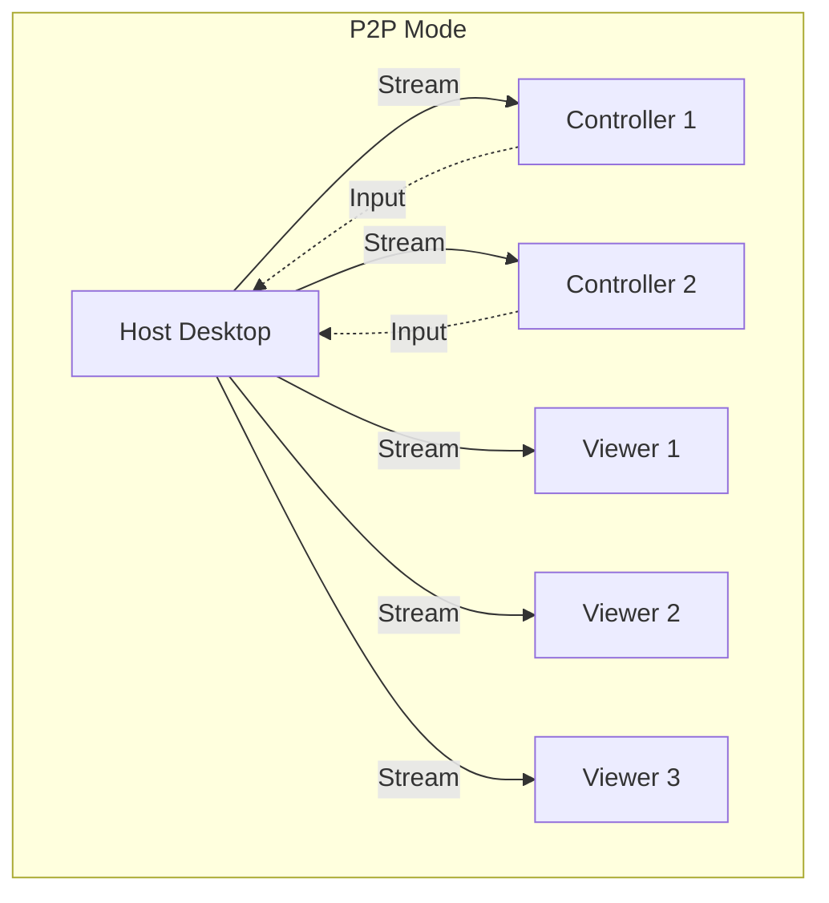
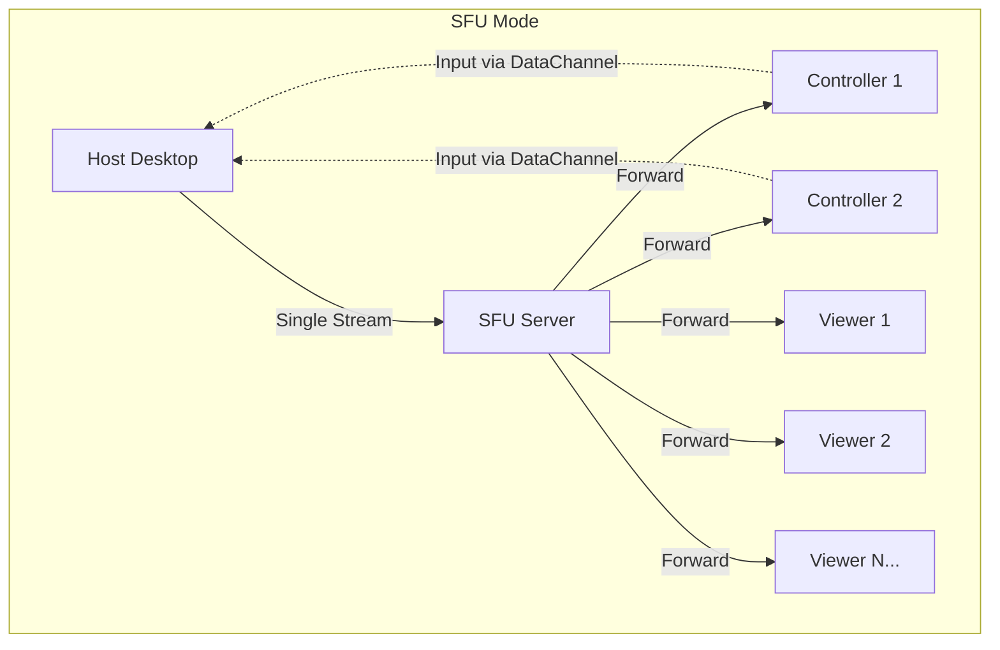
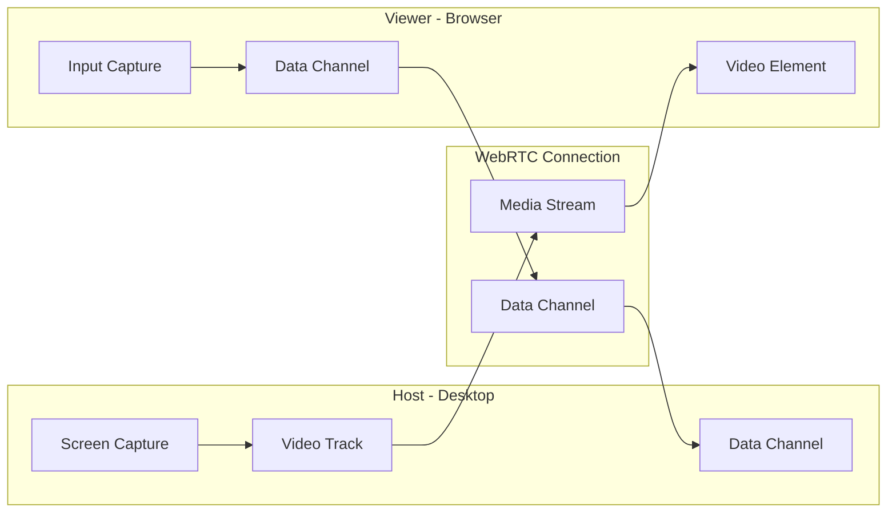
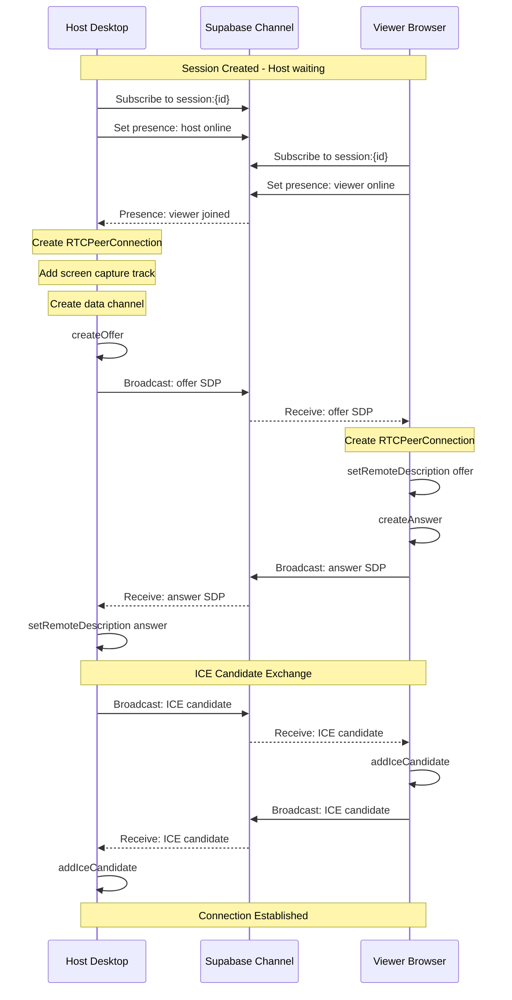
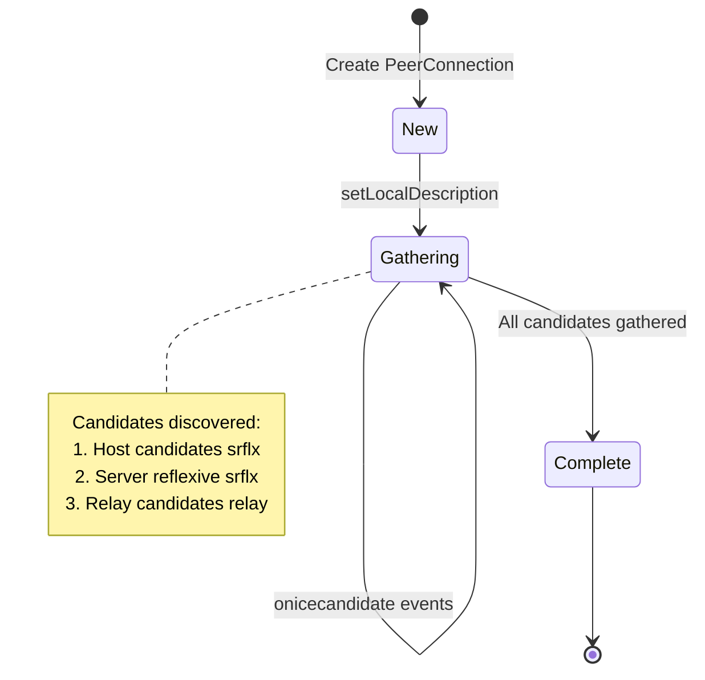
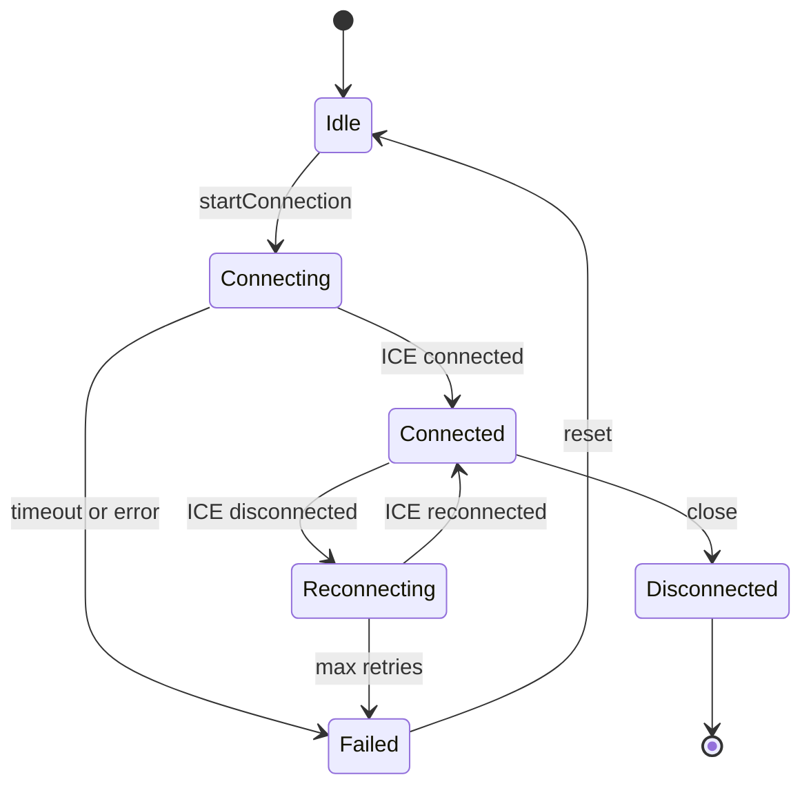
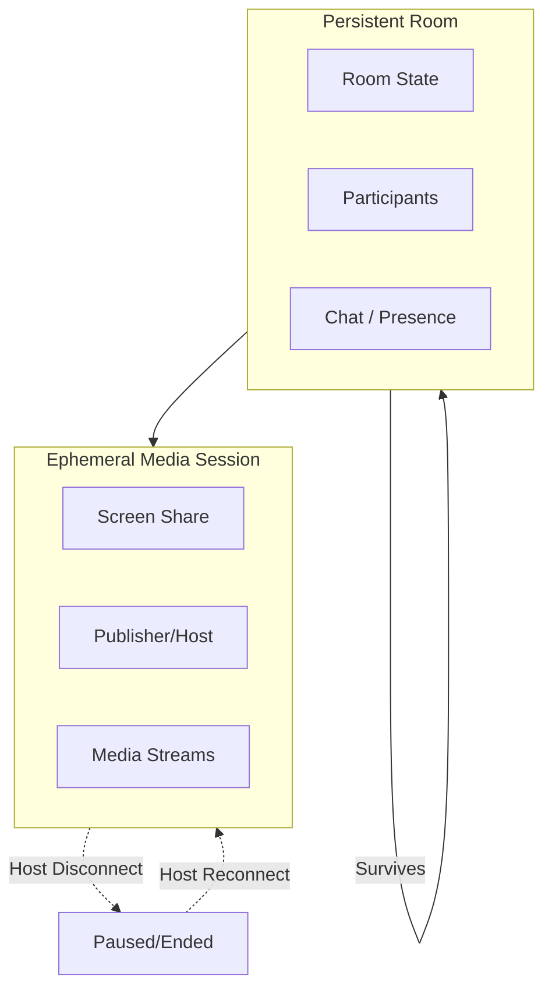
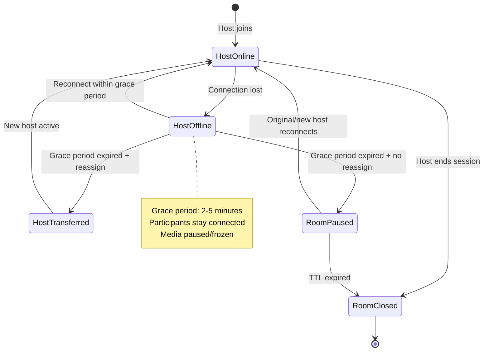
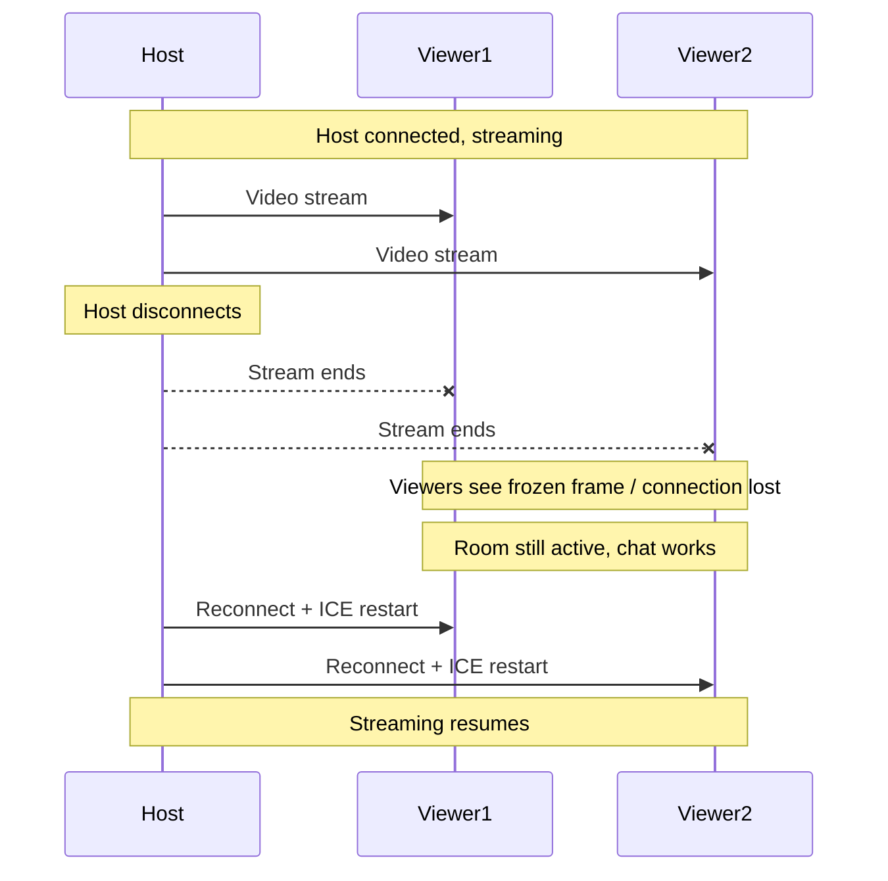
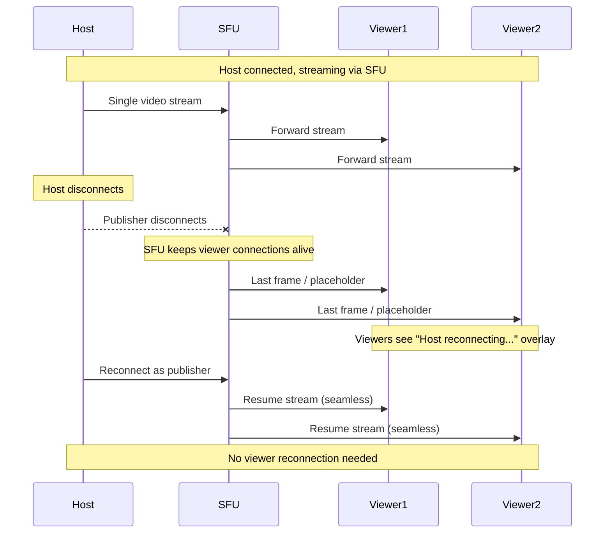

# SquadX Live WebRTC Flow

## Overview

This document details the WebRTC implementation for SquadX Live, including signaling, media streaming, and data channel communication.

---

## Connection Architecture

### Peer Roles

| Role           | Application | Responsibilities                                |
| -------------- | ----------- | ----------------------------------------------- |
| **Host**       | Desktop App | Captures screen, sends video, receives input    |
| **Controller** | Web Browser | Receives video, sends input events, can control |
| **Viewer**     | Web Browser | Receives video only, view-only mode             |

---

## SFU Configuration (Host-Controlled)

The host MUST be able to choose whether a screen sharing session uses **direct peer-to-peer (P2P)** connections or a **Selective Forwarding Unit (SFU)** for media distribution.

### Configuration Option

- The host SHALL have a session-level toggle:
  - `P2P (Direct)` - Default mode
  - `SFU (Broadcast / Scale Mode)`
- The selected mode applies for the lifetime of the session.
- The mode MUST be visible to the host at session start and during the session.

### Mode Selection UI

```typescript
type SessionMode = 'p2p' | 'sfu';

interface SessionConfig {
  mode: SessionMode;
  maxControllers: number; // Limit controllers in both modes
  maxViewers: number; // Soft limit for P2P, higher for SFU
}

// Default configuration
const defaultConfig: SessionConfig = {
  mode: 'p2p',
  maxControllers: 3,
  maxViewers: 15,
};
```

### P2P Mode (Default)

- Host streams directly to each participant.
- Optimized for:
  - Low latency
  - Small groups
  - Pairing and collaborative control
- Recommended limits:
  - 1 host
  - Up to 3 controllers
  - Up to 15–25 viewers depending on quality settings



### SFU Mode (Scale / Broadcast)

- Host sends a single media stream to an SFU.
- SFU forwards the stream to all viewers.
- Optimized for:
  - Large audiences
  - Stable host performance
  - Predictable scaling
- Host workload remains roughly constant regardless of viewer count.



### Controller vs Viewer Behavior

| Aspect           | Controller              | Viewer                |
| ---------------- | ----------------------- | --------------------- |
| Media Reception  | Via P2P or SFU          | Via P2P or SFU        |
| Input Capability | Can send mouse/keyboard | View-only             |
| Priority         | Higher quality layers   | Standard quality      |
| Limit            | Max 3 per session       | Unlimited in SFU mode |
| Data Channel     | Required for input      | Optional for chat     |

### Mode Comparison

| Aspect         | P2P Mode            | SFU Mode                     |
| -------------- | ------------------- | ---------------------------- |
| Latency        | Lowest              | Slightly higher              |
| Host CPU       | Scales with viewers | Constant                     |
| Host Bandwidth | Scales with viewers | Constant                     |
| Max Viewers    | ~15-25              | 100+                         |
| Best For       | Pair programming    | Demos, presentations         |
| Encryption     | E2E                 | E2E (SFU forwards encrypted) |

### Automatic Safeguards (Optional)

```typescript
interface SafeguardConfig {
  p2pViewerWarningThreshold: number; // Warn when exceeded
  p2pViewerHardLimit: number; // Block new joins
  suggestSfuThreshold: number; // Suggest switching
}

const safeguards: SafeguardConfig = {
  p2pViewerWarningThreshold: 10,
  p2pViewerHardLimit: 25,
  suggestSfuThreshold: 15,
};

function checkViewerLimit(currentViewers: number, mode: SessionMode): SafeguardAction {
  if (mode === 'p2p') {
    if (currentViewers >= safeguards.p2pViewerHardLimit) {
      return { action: 'block', message: 'P2P limit reached. Switch to SFU mode.' };
    }
    if (currentViewers >= safeguards.suggestSfuThreshold) {
      return {
        action: 'suggest',
        message: 'Consider switching to SFU mode for better performance.',
      };
    }
    if (currentViewers >= safeguards.p2pViewerWarningThreshold) {
      return { action: 'warn', message: 'Approaching P2P viewer limit.' };
    }
  }
  return { action: 'allow' };
}
```

- The system MAY warn the host when viewer count exceeds safe limits in P2P mode.
- The system MAY recommend switching to SFU mode when thresholds are exceeded.
- Automatic switching is NOT required for v1.

### Security & Privacy

- Media MUST remain end-to-end encrypted in both modes.
- SFU MUST forward encrypted packets without re-encoding.
- No media is stored server-side in either mode.
- SFU has no access to decrypted media content.

### UX Requirements

- Clear explanation of each mode at selection time.
- Visual indicator of active mode during the session.
- Mode selection MUST be explicit and never implicit.
- Mode cannot be changed mid-session (requires new session).

### Session Creation with Mode

```typescript
interface CreateSessionRequest {
  hostUserId: string;
  mode: SessionMode;
  config: Partial<SessionConfig>;
}

// API: POST /api/sessions
async function createSession(request: CreateSessionRequest): Promise<Session> {
  const session = await supabase
    .from('sessions')
    .insert({
      host_user_id: request.hostUserId,
      mode: request.mode,
      max_controllers: request.config.maxControllers ?? 3,
      max_viewers: request.mode === 'sfu' ? 100 : 25,
      status: 'waiting',
    })
    .select()
    .single();

  return session.data;
}
```

### Success Criteria

- Host can reliably choose between low-latency collaboration (P2P) and high-scale viewing (SFU).
- Switching modes changes scaling behavior without altering session semantics.
- Host performance remains stable in SFU mode with large viewer counts.
- Controllers always have direct data channel to host for input.

---

### Connection Topology



---

## Signaling Flow

### Signaling via Supabase Realtime

SquadX Live uses Supabase Realtime Channels for WebRTC signaling instead of a custom signaling server.



### Signaling Message Types

```typescript
// Base signaling message
interface SignalMessage {
  type: 'offer' | 'answer' | 'ice-candidate' | 'control-request' | 'control-response';
  senderId: string;
  timestamp: number;
}

// SDP Offer
interface OfferMessage extends SignalMessage {
  type: 'offer';
  sdp: string;
}

// SDP Answer
interface AnswerMessage extends SignalMessage {
  type: 'answer';
  sdp: string;
}

// ICE Candidate
interface IceCandidateMessage extends SignalMessage {
  type: 'ice-candidate';
  candidate: RTCIceCandidateInit;
}
```

### Channel Implementation

```typescript
// Host: Create and manage signaling channel
class SignalingChannel {
  private channel: RealtimeChannel;
  private supabase: SupabaseClient;

  constructor(supabase: SupabaseClient, sessionId: string) {
    this.supabase = supabase;
    this.channel = supabase.channel(`session:${sessionId}`, {
      config: {
        broadcast: { self: false }, // Don't receive own messages
        presence: { key: 'user_id' },
      },
    });
  }

  async connect(): Promise<void> {
    await this.channel
      .on('broadcast', { event: 'signal' }, this.handleSignal.bind(this))
      .on('presence', { event: 'join' }, this.handleJoin.bind(this))
      .on('presence', { event: 'leave' }, this.handleLeave.bind(this))
      .subscribe();
  }

  async sendSignal(message: SignalMessage): Promise<void> {
    await this.channel.send({
      type: 'broadcast',
      event: 'signal',
      payload: message,
    });
  }

  private handleSignal(payload: { payload: SignalMessage }) {
    const message = payload.payload;
    switch (message.type) {
      case 'offer':
        this.emit('offer', message);
        break;
      case 'answer':
        this.emit('answer', message);
        break;
      case 'ice-candidate':
        this.emit('ice-candidate', message);
        break;
    }
  }
}
```

---

## ICE Configuration

### STUN/TURN Servers

```typescript
const iceServers: RTCIceServer[] = [
  // Public STUN servers (fallback)
  { urls: 'stun:stun.l.google.com:19302' },
  { urls: 'stun:stun1.l.google.com:19302' },

  // Self-hosted TURN server
  {
    urls: [
      'turn:turn.squadx-live.com:3478?transport=udp',
      'turn:turn.squadx-live.com:3478?transport=tcp',
      'turns:turn.squadx-live.com:5349?transport=tcp',
    ],
    username: 'squadx-live',
    credential: 'secret', // Should be time-limited credential
  },
];
```

### ICE Gathering Process



### ICE Candidate Types

| Type    | Description             | When Used                |
| ------- | ----------------------- | ------------------------ |
| `host`  | Local IP address        | Same network             |
| `srflx` | Server reflexive (STUN) | NAT traversal            |
| `relay` | TURN relay              | Restrictive NAT/firewall |

### Connection Priority

1. **Direct P2P** (host candidates) - Lowest latency
2. **STUN-assisted** (srflx) - NAT traversal
3. **TURN relay** - Fallback for restrictive networks

---

## Screen Capture

### Electron Screen Capture

```typescript
// Main process: Get available sources
import { desktopCapturer } from 'electron';

async function getScreenSources(): Promise<DesktopCapturerSource[]> {
  return await desktopCapturer.getSources({
    types: ['screen', 'window'],
    thumbnailSize: { width: 320, height: 180 },
    fetchWindowIcons: true,
  });
}

// Renderer process: Capture selected source
async function captureScreen(sourceId: string): Promise<MediaStream> {
  const stream = await navigator.mediaDevices.getUserMedia({
    audio: false,
    video: {
      mandatory: {
        chromeMediaSource: 'desktop',
        chromeMediaSourceId: sourceId,
        maxWidth: 1920,
        maxHeight: 1080,
        maxFrameRate: 30,
      },
    } as any,
  });

  return stream;
}
```

### Browser Screen Capture (Viewer Testing)

```typescript
// For testing viewer as host (not production)
async function captureScreenBrowser(): Promise<MediaStream> {
  return await navigator.mediaDevices.getDisplayMedia({
    video: {
      cursor: 'always',
      displaySurface: 'monitor',
    },
    audio: false,
  });
}
```

### Video Constraints

```typescript
const videoConstraints = {
  width: { ideal: 1920, max: 2560 },
  height: { ideal: 1080, max: 1440 },
  frameRate: { ideal: 30, max: 60 },
  cursor: 'always',
};
```

---

## Media Stream Management

### Adding Tracks to Connection

```typescript
class WebRTCHost {
  private pc: RTCPeerConnection;
  private videoSender: RTCRtpSender | null = null;

  async startSharing(stream: MediaStream): Promise<void> {
    const videoTrack = stream.getVideoTracks()[0];

    // Add track to peer connection
    this.videoSender = this.pc.addTrack(videoTrack, stream);

    // Configure encoding parameters
    const params = this.videoSender.getParameters();
    params.encodings = [
      {
        maxBitrate: 4_000_000, // 4 Mbps
        maxFramerate: 30,
        scaleResolutionDownBy: 1.0,
      },
    ];
    await this.videoSender.setParameters(params);
  }

  async changeSource(newStream: MediaStream): Promise<void> {
    const newTrack = newStream.getVideoTracks()[0];

    if (this.videoSender) {
      await this.videoSender.replaceTrack(newTrack);
    }
  }

  stopSharing(): void {
    if (this.videoSender) {
      this.pc.removeTrack(this.videoSender);
      this.videoSender = null;
    }
  }
}
```

### Receiving Video (Viewer)

```typescript
class WebRTCViewer {
  private pc: RTCPeerConnection;
  private videoElement: HTMLVideoElement;

  constructor(videoElement: HTMLVideoElement) {
    this.videoElement = videoElement;
    this.pc = new RTCPeerConnection({ iceServers });

    this.pc.ontrack = this.handleTrack.bind(this);
  }

  private handleTrack(event: RTCTrackEvent): void {
    const [stream] = event.streams;

    if (event.track.kind === 'video') {
      this.videoElement.srcObject = stream;
      this.videoElement.play().catch(console.error);
    }
  }
}
```

---

## Data Channel

### Channel Configuration

```typescript
// Host creates data channel
const dataChannel = pc.createDataChannel('control', {
  ordered: true, // Guarantee order for input events
  maxRetransmits: 3, // Retry failed messages
});

// Viewer receives data channel
pc.ondatachannel = (event) => {
  const channel = event.channel;
  channel.onmessage = handleMessage;
  channel.onopen = () => console.log('Data channel open');
  channel.onclose = () => console.log('Data channel closed');
};
```

### Message Protocol

```typescript
// All data channel messages
type DataChannelMessage =
  | InputEventMessage
  | ControlRequestMessage
  | ControlResponseMessage
  | CursorPositionMessage
  | PingMessage;

interface InputEventMessage {
  type: 'input';
  event: InputEvent;
}

interface ControlRequestMessage {
  type: 'control-request';
  requestId: string;
}

interface ControlResponseMessage {
  type: 'control-response';
  requestId: string;
  granted: boolean;
}

interface CursorPositionMessage {
  type: 'cursor';
  x: number; // 0-1 relative
  y: number; // 0-1 relative
  visible: boolean;
}

interface PingMessage {
  type: 'ping' | 'pong';
  timestamp: number;
}
```

### Message Serialization

```typescript
// Send message
function sendMessage(channel: RTCDataChannel, message: DataChannelMessage): void {
  if (channel.readyState === 'open') {
    channel.send(JSON.stringify(message));
  }
}

// Receive message
function handleMessage(event: MessageEvent): void {
  const message: DataChannelMessage = JSON.parse(event.data);

  switch (message.type) {
    case 'input':
      handleInputEvent(message.event);
      break;
    case 'control-request':
      handleControlRequest(message.requestId);
      break;
    case 'cursor':
      updateRemoteCursor(message.x, message.y);
      break;
    case 'ping':
      sendPong(message.timestamp);
      break;
  }
}
```

---

## Connection State Management

### Connection States



### State Machine Implementation

```typescript
type ConnectionState =
  | 'idle'
  | 'connecting'
  | 'connected'
  | 'reconnecting'
  | 'failed'
  | 'disconnected';

class ConnectionManager {
  private state: ConnectionState = 'idle';
  private pc: RTCPeerConnection | null = null;
  private reconnectAttempts = 0;
  private maxReconnectAttempts = 3;

  constructor() {
    this.setupEventHandlers();
  }

  private setupEventHandlers(): void {
    if (!this.pc) return;

    this.pc.oniceconnectionstatechange = () => {
      const iceState = this.pc!.iceConnectionState;

      switch (iceState) {
        case 'checking':
          this.setState('connecting');
          break;
        case 'connected':
        case 'completed':
          this.setState('connected');
          this.reconnectAttempts = 0;
          break;
        case 'disconnected':
          this.handleDisconnect();
          break;
        case 'failed':
          this.handleFailure();
          break;
        case 'closed':
          this.setState('disconnected');
          break;
      }
    };
  }

  private async handleDisconnect(): Promise<void> {
    if (this.reconnectAttempts < this.maxReconnectAttempts) {
      this.setState('reconnecting');
      this.reconnectAttempts++;

      // Try ICE restart
      await this.restartIce();
    } else {
      this.setState('failed');
    }
  }

  private async restartIce(): Promise<void> {
    if (!this.pc) return;

    const offer = await this.pc.createOffer({ iceRestart: true });
    await this.pc.setLocalDescription(offer);

    // Send new offer via signaling
    this.signaling.sendSignal({
      type: 'offer',
      sdp: offer.sdp!,
      senderId: this.userId,
      timestamp: Date.now(),
    });
  }
}
```

---

## Host Disconnection & Room Persistence

### Core Principle

> **A room is a durable object. A host is just a role.**

If the host drops:

- The **room stays alive**
- Participants stay connected (UI, chat, presence)
- The session can recover, pause, or transfer ownership
- No automatic participant kick

### Room-Centric Architecture



### Room vs Media Session

| Aspect                   | Room                         | Media Session           |
| ------------------------ | ---------------------------- | ----------------------- |
| Lifecycle                | Persistent                   | Ephemeral               |
| Survives host disconnect | ✅ Yes                       | ❌ No (pauses/ends)     |
| Created by               | Explicit action              | Host starts sharing     |
| Ended by                 | Explicit close or TTL        | Host stops/disconnects  |
| Contains                 | Participants, chat, settings | Streams, publisher info |

### Disconnection State Machine



### What Happens When Host Disconnects

#### Immediate Behavior

1. **Room remains open** - No state change to room itself
2. **Viewers stay connected** to:
   - UI and controls
   - Chat and presence channel
   - SFU (if applicable)
3. **Screen share pauses** gracefully:
   - P2P: Streams drop, last frame may freeze
   - SFU: Viewers see last frame or placeholder
4. **No hard kick** unless room is explicitly closed

#### UX Messaging

```typescript
interface HostDisconnectUI {
  overlay: true;
  message: 'Host disconnected. Waiting for reconnection…';
  showReconnectTimer: true;
  gracePeriodSeconds: 300; // 5 minutes
  allowLeaveButton: true;
}

// State indicators
type HostStatus = 'online' | 'reconnecting' | 'offline' | 'transferred';

function getStatusMessage(status: HostStatus, secondsRemaining?: number): string {
  switch (status) {
    case 'online':
      return 'Host is sharing screen';
    case 'reconnecting':
      return `Host reconnecting... (${secondsRemaining}s remaining)`;
    case 'offline':
      return 'Host is offline. Waiting for reconnection or transfer.';
    case 'transferred':
      return 'Session transferred to new host';
  }
}
```

### Reconnection Logic

#### Grace Period Implementation

```typescript
interface ReconnectionConfig {
  gracePeriodMs: number; // Default: 300000 (5 minutes)
  heartbeatIntervalMs: number; // Default: 30000 (30 seconds)
  offlineThresholdMs: number; // Default: 60000 (1 minute without heartbeat)
}

const defaultConfig: ReconnectionConfig = {
  gracePeriodMs: 5 * 60 * 1000,
  heartbeatIntervalMs: 30 * 1000,
  offlineThresholdMs: 60 * 1000,
};

class HostReconnectionManager {
  private config: ReconnectionConfig;
  private gracePeriodTimer: NodeJS.Timeout | null = null;
  private hostLastSeen: number = Date.now();

  onHostDisconnect(): void {
    // Start grace period
    this.gracePeriodTimer = setTimeout(() => {
      this.handleGracePeriodExpired();
    }, this.config.gracePeriodMs);

    // Notify participants
    this.broadcast({
      type: 'host-status',
      status: 'reconnecting',
      gracePeriodEndsAt: Date.now() + this.config.gracePeriodMs,
    });
  }

  onHostReconnect(): void {
    // Cancel grace period
    if (this.gracePeriodTimer) {
      clearTimeout(this.gracePeriodTimer);
      this.gracePeriodTimer = null;
    }

    // Resume session
    this.broadcast({
      type: 'host-status',
      status: 'online',
    });

    // Trigger ICE restart for P2P connections
    this.restartIceForAllPeers();
  }

  private handleGracePeriodExpired(): void {
    // Options: reassign host, pause room, or close
    if (this.hasDesignatedBackupHost()) {
      this.transferToBackupHost();
    } else if (this.hasEligibleController()) {
      this.promptControllerPromotion();
    } else {
      this.pauseRoom();
    }
  }
}
```

#### ICE Restart on Reconnect

```typescript
async function restartIceForPeer(
  pc: RTCPeerConnection,
  signaling: SignalingChannel
): Promise<void> {
  // Create new offer with ICE restart flag
  const offer = await pc.createOffer({ iceRestart: true });
  await pc.setLocalDescription(offer);

  // Send via signaling
  await signaling.sendSignal({
    type: 'offer',
    sdp: offer.sdp!,
    senderId: hostUserId,
    timestamp: Date.now(),
    isReconnect: true,
  });
}
```

### Host Reassignment

#### Option A: Pre-designated Backup Host

```typescript
interface SessionSettings {
  backupHostId?: string; // User ID of designated backup
  allowControllerPromotion: boolean;
  autoCloseOnHostTimeout: boolean;
}

async function transferToBackupHost(sessionId: string, backupHostId: string): Promise<void> {
  // Update session
  await supabase
    .from('sessions')
    .update({
      current_host_id: backupHostId,
      host_transferred_at: new Date().toISOString(),
    })
    .eq('id', sessionId);

  // Update participant roles
  await supabase
    .from('session_participants')
    .update({
      role: 'host',
    })
    .eq('session_id', sessionId)
    .eq('user_id', backupHostId);

  // Notify all participants
  channel.send({
    type: 'broadcast',
    event: 'host-transfer',
    payload: { newHostId: backupHostId },
  });
}
```

#### Option B: Controller Promotion

```typescript
async function promoteController(sessionId: string, controllerId: string): Promise<void> {
  // Verify controller has granted control state
  const { data: participant } = await supabase
    .from('session_participants')
    .select('*')
    .eq('session_id', sessionId)
    .eq('user_id', controllerId)
    .eq('control_state', 'granted')
    .single();

  if (!participant) {
    throw new Error('Controller not eligible for promotion');
  }

  // Promote to host
  await transferToBackupHost(sessionId, controllerId);
}
```

### SFU vs P2P: Disconnection Behavior

#### P2P Mode



**P2P Behavior:**

- Media streams drop immediately
- Room stays alive for chat/presence
- Reconnect requires full SDP renegotiation
- ICE restart needed for each peer
- Participants NOT kicked

#### SFU Mode (Recommended for Resilience)



**SFU Advantages:**

- Viewer connections remain stable
- No ICE restart needed for viewers
- Seamless publisher handoff possible
- Last frame preserved (not black screen)
- Dramatically smoother UX

### Presence & Heartbeats

```typescript
class PresenceManager {
  private heartbeatInterval: NodeJS.Timeout | null = null;
  private readonly HEARTBEAT_MS = 30000;
  private readonly OFFLINE_THRESHOLD_MS = 60000;

  startHeartbeat(channel: RealtimeChannel, userId: string): void {
    this.heartbeatInterval = setInterval(async () => {
      await channel.track({
        user_id: userId,
        online_at: new Date().toISOString(),
        last_heartbeat: Date.now(),
      });
    }, this.HEARTBEAT_MS);
  }

  // Called on presence sync
  checkParticipantStatus(presenceState: Record<string, any[]>): ParticipantStatus[] {
    const now = Date.now();

    return Object.entries(presenceState).map(([key, presences]) => {
      const latest = presences[0];
      const lastHeartbeat = latest?.last_heartbeat ?? 0;
      const isOnline = now - lastHeartbeat < this.OFFLINE_THRESHOLD_MS;

      return {
        userId: key,
        isOnline,
        lastSeen: lastHeartbeat,
        role: latest?.role,
      };
    });
  }
}
```

### UX Rules (Non-Negotiable)

1. **Room never auto-closes** because one user disconnects
2. Only explicit actions close rooms:
   - Host clicks "End Session"
   - Room TTL expires (e.g., 24h inactive)
3. Clear visual role indicators at all times
4. Clear "host offline" state with countdown
5. Participants can leave voluntarily but aren't kicked
6. Chat and presence continue during host offline period

---

## Bandwidth Adaptation

### Monitoring Connection Quality

```typescript
class QualityMonitor {
  private pc: RTCPeerConnection;
  private interval: NodeJS.Timeout | null = null;

  startMonitoring(): void {
    this.interval = setInterval(async () => {
      const stats = await this.pc.getStats();

      stats.forEach((report) => {
        if (report.type === 'outbound-rtp' && report.kind === 'video') {
          this.analyzeVideoStats(report);
        }
        if (report.type === 'candidate-pair' && report.state === 'succeeded') {
          this.analyzeConnectionStats(report);
        }
      });
    }, 1000);
  }

  private analyzeVideoStats(report: RTCOutboundRtpStreamStats): void {
    const bitrate = report.bytesSent; // Calculate delta
    const frameRate = report.framesPerSecond;
    const packetsLost = report.packetsLost;

    // Emit quality metrics
    this.emit('quality', { bitrate, frameRate, packetsLost });
  }

  private analyzeConnectionStats(report: RTCIceCandidatePairStats): void {
    const rtt = report.currentRoundTripTime * 1000; // Convert to ms

    // Emit latency
    this.emit('latency', rtt);
  }
}
```

### Adaptive Bitrate

```typescript
class AdaptiveBitrate {
  private sender: RTCRtpSender;
  private currentBitrate: number = 4_000_000; // 4 Mbps default

  private readonly presets = {
    low: { bitrate: 1_000_000, resolution: 0.5 }, // 720p
    medium: { bitrate: 2_500_000, resolution: 0.75 }, // 900p
    high: { bitrate: 4_000_000, resolution: 1.0 }, // 1080p
    ultra: { bitrate: 8_000_000, resolution: 1.0 }, // 1080p high
  };

  async adjustQuality(metrics: QualityMetrics): Promise<void> {
    let targetPreset: keyof typeof this.presets;

    if (metrics.packetLoss > 10 || metrics.rtt > 300) {
      targetPreset = 'low';
    } else if (metrics.packetLoss > 5 || metrics.rtt > 150) {
      targetPreset = 'medium';
    } else if (metrics.rtt < 50 && metrics.packetLoss < 1) {
      targetPreset = 'ultra';
    } else {
      targetPreset = 'high';
    }

    await this.applyPreset(targetPreset);
  }

  private async applyPreset(preset: keyof typeof this.presets): Promise<void> {
    const { bitrate, resolution } = this.presets[preset];

    const params = this.sender.getParameters();
    params.encodings[0].maxBitrate = bitrate;
    params.encodings[0].scaleResolutionDownBy = 1 / resolution;

    await this.sender.setParameters(params);
    this.currentBitrate = bitrate;
  }
}
```

---

## Error Handling

### Common Errors

| Error                | Cause               | Recovery                        |
| -------------------- | ------------------- | ------------------------------- |
| `NotAllowedError`    | Permission denied   | Prompt user to grant permission |
| `NotFoundError`      | No capture source   | Show source selector            |
| `ICE failed`         | Network issues      | Attempt ICE restart             |
| `DTLS failed`        | TLS handshake error | Recreate connection             |
| `Data channel error` | Channel closed      | Reopen channel                  |

### Error Recovery

```typescript
class ErrorHandler {
  async handleError(error: Error, context: string): Promise<void> {
    console.error(`[${context}]`, error);

    if (error.name === 'NotAllowedError') {
      this.emit('permission-denied', context);
      return;
    }

    if (error.message.includes('ICE')) {
      await this.attemptIceRestart();
      return;
    }

    if (error.message.includes('DTLS')) {
      await this.recreateConnection();
      return;
    }

    // Unknown error - notify user
    this.emit('error', { message: error.message, recoverable: false });
  }
}
```

---

## Performance Optimization

### Reducing Latency

1. **Prefer UDP over TCP** for TURN
2. **Use hardware encoding** when available
3. **Minimize signaling round trips**
4. **Pre-gather ICE candidates**
5. **Use trickle ICE** (send candidates as discovered)

### Memory Management

```typescript
// Clean up resources
function cleanup(): void {
  // Stop all tracks
  localStream?.getTracks().forEach((track) => track.stop());

  // Close data channel
  dataChannel?.close();

  // Close peer connection
  peerConnection?.close();

  // Clear references
  localStream = null;
  dataChannel = null;
  peerConnection = null;
}
```

### Frame Rate Optimization

```typescript
// Reduce frame rate when viewer is idle
function optimizeFrameRate(isViewerActive: boolean): void {
  const params = videoSender.getParameters();
  params.encodings[0].maxFramerate = isViewerActive ? 30 : 15;
  videoSender.setParameters(params);
}
```

---

## Testing WebRTC

### Local Testing Setup

```typescript
// Create loopback connection for testing
async function createLoopback(): Promise<void> {
  const pc1 = new RTCPeerConnection();
  const pc2 = new RTCPeerConnection();

  // Connect ICE candidates
  pc1.onicecandidate = (e) => e.candidate && pc2.addIceCandidate(e.candidate);
  pc2.onicecandidate = (e) => e.candidate && pc1.addIceCandidate(e.candidate);

  // Add track to pc1
  const stream = await navigator.mediaDevices.getDisplayMedia({ video: true });
  stream.getTracks().forEach((track) => pc1.addTrack(track, stream));

  // Receive on pc2
  pc2.ontrack = (e) => {
    videoElement.srcObject = e.streams[0];
  };

  // Exchange SDP
  const offer = await pc1.createOffer();
  await pc1.setLocalDescription(offer);
  await pc2.setRemoteDescription(offer);

  const answer = await pc2.createAnswer();
  await pc2.setLocalDescription(answer);
  await pc1.setRemoteDescription(answer);
}
```

### Network Simulation

Use Chrome DevTools Network Throttling or `tc` (Linux) to simulate:

- High latency (200ms+)
- Packet loss (5-10%)
- Limited bandwidth (1 Mbps)
