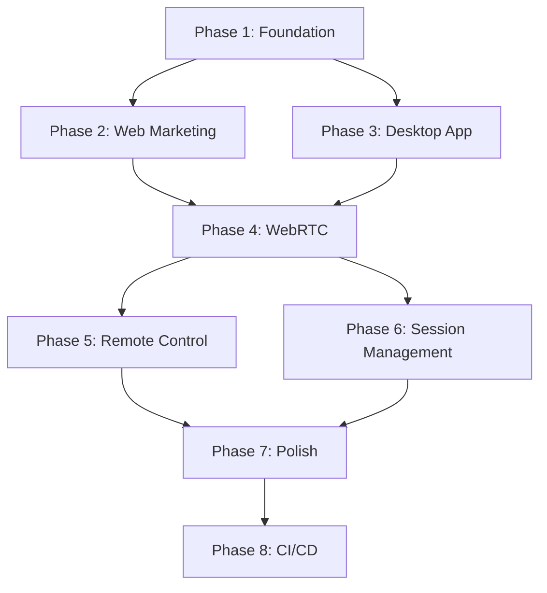

# SquadX Live Implementation Plan

## Overview

This document provides a phased implementation plan for SquadX Live. Each phase builds upon the previous one, allowing for incremental development and testing.

---

## Phase 1: Project Foundation

### 1.1 Monorepo Setup

- [ ] Initialize pnpm workspace with `pnpm-workspace.yaml`
- [ ] Create root `package.json` with workspace scripts
- [ ] Configure Turborepo with `turbo.json`
- [ ] Set up TypeScript base configuration `tsconfig.base.json`
- [ ] Configure ESLint and Prettier at root level
- [ ] Create `.gitignore` with appropriate patterns
- [ ] Set up Husky for pre-commit hooks

### 1.2 Shared Packages

- [ ] Create `packages/shared-types` package
  - [ ] Define database types (Session, Participant, Profile)
  - [ ] Define signaling message types
  - [ ] Define input event types
  - [ ] Define control state types
  - [ ] Export all types with proper barrel files

- [ ] Create `packages/webrtc-core` package
  - [ ] Implement `PeerConnectionManager` class
  - [ ] Implement signaling message serialization
  - [ ] Implement ICE candidate handling utilities
  - [ ] Implement connection state management
  - [ ] Add unit tests

### 1.3 Environment Configuration

- [ ] Create `.env.example` files for each app
- [ ] Document required environment variables
- [ ] Set up environment validation with zod

---

## Phase 2: Web Application (Marketing Site)

### 2.1 Next.js Setup

- [ ] Initialize Next.js app in `apps/web`
- [ ] Configure App Router structure
- [ ] Set up Tailwind CSS
- [ ] Install and configure shadcn/ui
- [ ] Set up Supabase client

### 2.2 Marketing Pages

- [ ] Create layout component with header/footer
- [ ] Implement Landing page
  - [ ] Hero section with CTA
  - [ ] Features overview
  - [ ] How it works section
  - [ ] Testimonials placeholder
- [ ] Implement Features page
  - [ ] Feature cards with icons
  - [ ] Comparison table
- [ ] Implement How It Works page
  - [ ] Step-by-step guide
  - [ ] Animated illustrations
- [ ] Implement Download page
  - [ ] OS detection logic
  - [ ] Package manager commands
  - [ ] Direct download links
- [ ] Implement Docs/FAQ page
  - [ ] Getting started guide
  - [ ] FAQ accordion
  - [ ] Troubleshooting section

### 2.3 SEO & Meta

- [ ] Configure metadata for all pages
- [ ] Add OpenGraph images
- [ ] Create sitemap.xml
- [ ] Create robots.txt
- [ ] Add structured data (JSON-LD)

### 2.4 Authentication (Web)

- [ ] Set up Supabase Auth provider
- [ ] Create sign-in page
- [ ] Create sign-up page
- [ ] Implement OAuth (Google, GitHub)
- [ ] Create auth callback handler
- [ ] Implement session management

---

## Phase 3: Desktop Application (Electron)

### 3.1 Electron Setup

- [ ] Initialize Electron app in `apps/desktop`
- [ ] Configure Vite for renderer process
- [ ] Set up electron-builder configuration
- [ ] Configure preload scripts
- [ ] Set up IPC communication patterns

### 3.2 Main Process

- [ ] Implement window management
- [ ] Implement system tray
- [ ] Implement global shortcuts (emergency revoke)
- [ ] Implement auto-updater
- [ ] Implement secure token storage (safeStorage)

### 3.3 Screen Capture

- [ ] Implement screen source enumeration
- [ ] Create screen/window picker UI
- [ ] Implement capture stream management
- [ ] Handle multi-monitor setups
- [ ] Implement capture settings (resolution, fps)

### 3.4 Authentication (Desktop)

- [ ] Implement Supabase Auth in Electron
- [ ] Create login window/flow
- [ ] Implement token persistence
- [ ] Handle token refresh
- [ ] Implement logout

### 3.5 Desktop UI

- [ ] Create main window layout
- [ ] Implement dashboard/home screen
- [ ] Create session management UI
- [ ] Implement participant list
- [ ] Create settings panel
- [ ] Implement status indicators

---

## Phase 4: WebRTC Implementation

### 4.1 Signaling

- [ ] Implement Supabase Realtime channel management
- [ ] Create signaling message handlers
- [ ] Implement offer/answer exchange
- [ ] Implement ICE candidate exchange
- [ ] Handle reconnection scenarios

### 4.2 Host (Desktop)

- [ ] Implement `WebRTCHost` class
- [ ] Add screen capture track to peer connection
- [ ] Create data channel for input events
- [ ] Implement adaptive bitrate
- [ ] Handle connection state changes
- [ ] Implement graceful disconnection

### 4.3 Viewer (Web)

- [ ] Create join page with session lookup
- [ ] Implement `WebRTCViewer` class
- [ ] Create video element for remote stream
- [ ] Handle incoming data channel
- [ ] Implement connection quality indicator
- [ ] Handle reconnection UI

### 4.4 TURN Server

- [ ] Document coturn setup
- [ ] Create Docker compose for local testing
- [ ] Implement time-limited credential generation
- [ ] Test NAT traversal scenarios

---

## Phase 5: Remote Control

### 5.1 Control State Machine

- [ ] Implement `ControlStateMachine` class
- [ ] Add state transition handlers
- [ ] Implement request timeout
- [ ] Add state change notifications

### 5.2 Input Capture (Viewer)

- [ ] Implement `MouseCapture` class
- [ ] Implement `KeyboardCapture` class
- [ ] Add input event serialization
- [ ] Implement throttling for mouse moves
- [ ] Handle browser shortcut passthrough

### 5.3 Input Injection (Host)

- [ ] Set up nut.js
- [ ] Implement `InputInjector` class
- [ ] Map web key codes to nut.js keys
- [ ] Handle coordinate translation
- [ ] Implement rate limiting
- [ ] Block dangerous key combinations

### 5.4 Emergency Revoke

- [ ] Register global hotkey
- [ ] Implement immediate revoke logic
- [ ] Add visual confirmation
- [ ] Test hotkey reliability

### 5.5 Multi-Cursor

- [ ] Implement cursor position sync
- [ ] Create cursor overlay renderer
- [ ] Add participant labels
- [ ] Implement smooth interpolation

---

## Phase 6: Session Management

### 6.1 Database

- [ ] Create Supabase project
- [ ] Run initial migration
- [ ] Set up Row Level Security policies
- [ ] Create database functions
- [ ] Test RLS policies

### 6.2 Session Lifecycle

- [ ] Implement session creation
- [ ] Generate and display join links
- [ ] Implement session joining
- [ ] Handle participant leave
- [ ] Implement session end
- [ ] Add session cleanup job

### 6.3 Presence

- [ ] Implement presence tracking
- [ ] Show online participants
- [ ] Handle participant disconnect
- [ ] Update UI on presence changes

---

## Phase 7: Polish & Testing

### 7.1 Error Handling

- [ ] Implement global error boundaries
- [ ] Add error logging
- [ ] Create user-friendly error messages
- [ ] Handle network errors gracefully

### 7.2 Testing

- [ ] Write unit tests for shared packages
- [ ] Write unit tests for control state machine
- [ ] Write integration tests for WebRTC
- [ ] Set up Playwright for E2E tests
- [ ] Test cross-platform builds

### 7.3 Performance

- [ ] Profile WebRTC performance
- [ ] Optimize input event handling
- [ ] Reduce bundle sizes
- [ ] Implement lazy loading

### 7.4 Accessibility

- [ ] Add keyboard navigation
- [ ] Implement ARIA labels
- [ ] Test with screen readers
- [ ] Ensure color contrast

---

## Phase 8: CI/CD & Distribution

### 8.1 GitHub Actions

- [ ] Create PR checks workflow
- [ ] Create web deploy workflow
- [ ] Create desktop release workflow
- [ ] Create package manager update workflow
- [ ] Set up required secrets

### 8.2 Code Signing

- [ ] Obtain Apple Developer certificate
- [ ] Set up Azure Key Vault for Windows
- [ ] Generate GPG key for Linux
- [ ] Configure electron-builder signing

### 8.3 Package Managers

- [ ] Create Homebrew tap repository
- [ ] Prepare WinGet manifest template
- [ ] Set up APT repository
- [ ] Set up RPM repository
- [ ] Create AUR PKGBUILD

### 8.4 Release Process

- [ ] Document release checklist
- [ ] Create CHANGELOG template
- [ ] Test full release cycle
- [ ] Verify auto-updater

---

## Implementation Order

---

## MVP Milestone

The MVP includes:

- ✅ Marketing website with download page
- ✅ Desktop app for host (macOS, Windows, Linux)
- ✅ Web viewer for participants
- ✅ Screen sharing via WebRTC
- ✅ Remote control with request/grant/revoke
- ✅ Basic authentication
- ✅ 1 host + 1 viewer per session

**MVP Phases**: 1, 2, 3, 4, 5, 6 (core features only)

---

## Post-MVP Features

After MVP, prioritize:

1. Multi-viewer support
2. Session recording
3. Chat/annotations
4. Improved reconnection handling
5. Mobile viewer support

---

## Risk Mitigation

| Risk                       | Mitigation                         |
| -------------------------- | ---------------------------------- |
| macOS permission issues    | Early testing, clear user guidance |
| Windows AV false positives | Code signing, submit to AV vendors |
| Wayland limitations        | X11 fallback, document limitations |
| WebRTC complexity          | Use simple-peer if needed          |
| nut.js build issues        | Pin versions, test in CI           |

---

## Next Steps

1. Review this plan with stakeholders
2. Set up the monorepo structure
3. Begin Phase 1 implementation
4. Iterate based on feedback
